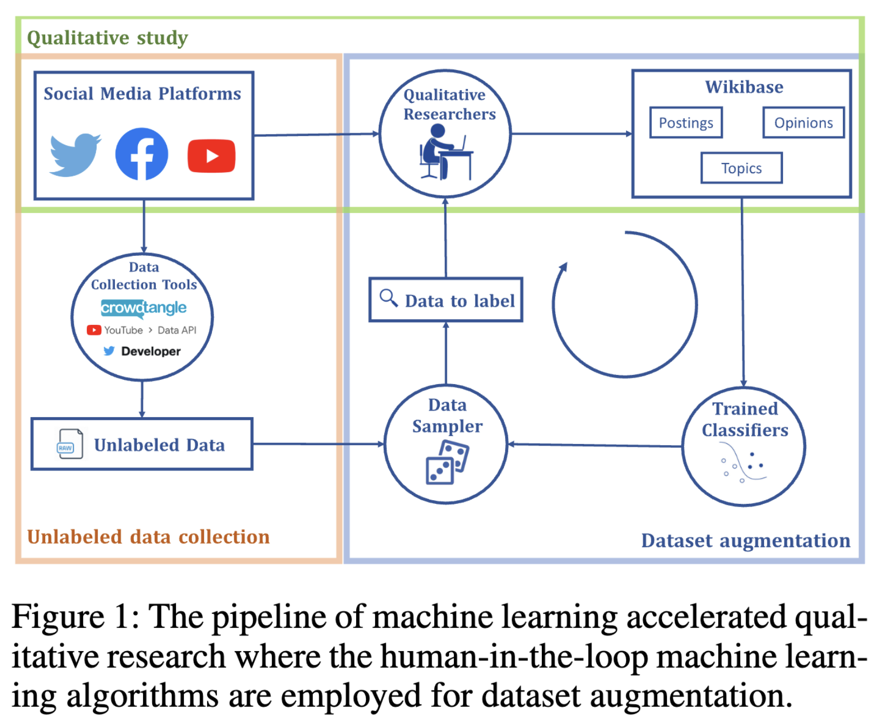
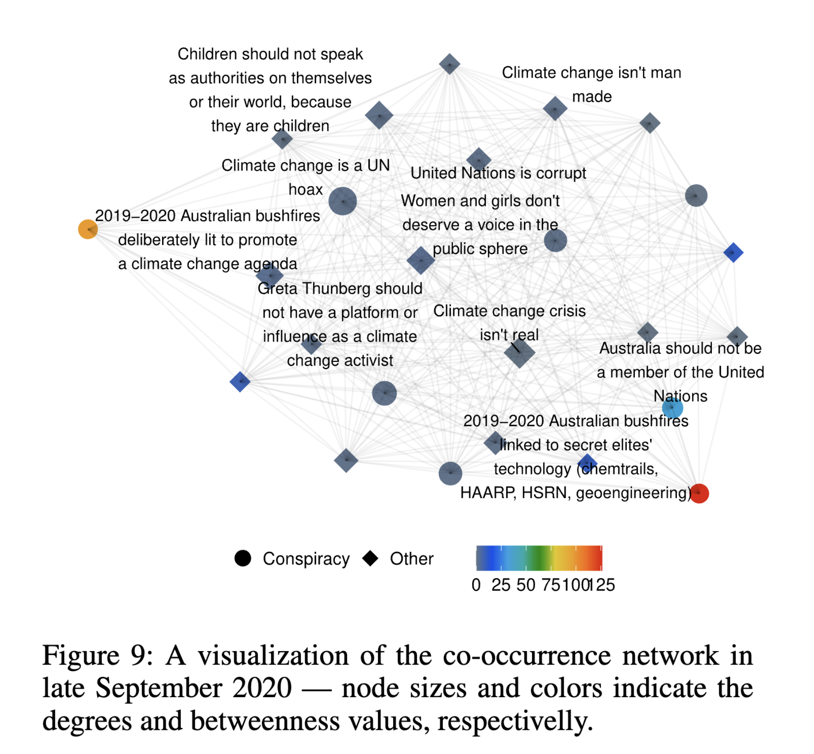

background-image: url(https://upload.wikimedia.org/wikipedia/en/6/6a/Logo_of_the_University_of_Sydney.svg)
background-size: 95%

```{r setup, include=FALSE}

knitr::opts_chunk$set(echo = TRUE, message = FALSE, warning = FALSE, 
                      dev = 'svg', out.width = "45%", fig.width = 6,
                      fig.align="center")

require(fontawesome)

```

---

## Acknowledgement of Country

I would like to acknowledge the Traditional Owners of Australia and  recognise their continuing connection to land, water and culture. The  University of Sydney is located on the land of the Gadigal people  of the Eora Nation. I pay my respects to their Elders, past and present.

---

## Me
	
Francesco Bailo (francesco.bailo@sydney.edu.au)

I am a Lecturer in the School of Social and Political Sciences (SSPS), University of Sydney. I am interested in researching forms of political engagement and political talk on social media. I researched the emergence and dynamics of online communities, the role between news organisations and social media, and the interdependence between social media activists and news organisations. I have engaged with and applied quantitative research methods developing expertise in quantitative text analysis (NLP) and network analysis.

In SSPS of I am teaching GOVT6139 Research Design, SSPS4102 Data Analytics in the Social Sciences, and SSPS6006 Data Analytics for Social Research.

---
class: segue-red

# PART I: Key concepts and definitions

# Publics, Platforms, Interfaces and Affordances

---
class: segue-yellow

## Publics

---
## From one Public Sphere to many Publics

### What is the Public Sphere?

> The term often connotes the realm of media, politics, and opinion processes ... 

> ... the public sphere rests upon the idea of universality, the norm that it must be accessible to all citizens of society. ...

> The public sphere is predicated on interaction between citizens ... and this interaction is of course shaped by social hierarchies, economics, work circumstances, welfare, and education [1].

.footnote[
[1] Dahlgren, P. (2001). The Public Sphere and the Net: Structure, Space and Communication. In W. L. Bennett & R. M. Entman (Eds.), *Mediated politics: Communication in the future of democracy* (pp. 33–55). Cambridge University Press.]

---
## From one Public Sphere to many Publics

### From Public Sphere to Public Spheres

> The Internet not only offers its users vast communicative spaces in which to travel, visit, and participate, but also allows them to collectively generate new spaces, by launching Web sites, news groups, chat rooms, networks, action groups, and so on. ...

> Many of the separate public spheres in the form of news groups and chat rooms remain very separate. They become spaces for bonding among like-minded individuals ... [1].

.footnote[
[1] Dahlgren, P. (2001). The Public Sphere and the Net: Structure, Space and Communication. In W. L. Bennett & R. M. Entman (Eds.), *Mediated politics: Communication in the future of democracy* (pp. 33–55). Cambridge University Press.
]

---
## From one Public Sphere to many Publics

### What do we mean by Publics?

> We understand ‘publics’ as emergent sociopolitical assemblages with shared or interlocking concerns who know themselves as, and act as, publics through media and communication ... [1].

.footnote[

[1] Burgess, J., & Matamoros-Fernández, A. (2016). Mapping sociocultural controversies across digital media platforms: One week of #gamergate on Twitter, YouTube, and Tumblr. *Communication Research and Practice*, 2(1), 79–96. https://doi.org/10.1080/22041451.2016.1155338
]

---
## From one Public Sphere to many Publics
### Are Publics public? 

Not, necessarily.  

> ... publics can mobilise in private, that they need not be explicitly co-present, and – crucially for the issue mapping method – may be called into being by the mere implication that others are engaging with the same media, cultural, or social experiences as we are, rather than through direct discursive interactions [1].

So, **publics**,

* Can be *private* (e.g. Whatsapp);

* Are not defined by direct engagement, but

* by engaging with the same experience.  

.footnote[
[1] Burgess, J., & Matamoros-Fernández, A. (2016). Mapping sociocultural controversies across digital media platforms: One week of #gamergate on Twitter, YouTube, and Tumblr. *Communication Research and Practice*, 2(1), 79–96. https://doi.org/10.1080/22041451.2016.1155338
]

---
class: segue-yellow

## Platforms


---
## What do we mean by Platforms?

> A platform may be defined as a standards-based technical-economic system that may simultaneously distribute interfaces into that system through their remote coordination and centralizes their integrated control through that same coordination ... [1].

Wait, what?

> ... we defined a platform as a programmable architecture designed to organize interactions between users.

> Many people think of platforms simply as technological tools that allow them to do things online ... But these online activities hide a system whose logic and logistics are about more than facilitating: they actually shape the way we live and how society is organized [2].


.footnote[
[1] Bratton, B. H. (2016). The Stack: On software and sovereignty. MIT Press. 
[2] Dijck, J. van, Poell, T., & Waal, M. de. (2018). The platform society. Oxford University Press.
]

---
background-image: url("assets/dijck-2018.png")
background-position: 100% 50%
background-size: 100% 90%

.footnote[Dijck, J. van, Poell, T., & Waal, M. de. (2018). *The platform society*. Oxford University Press.
]
---
class: segue-yellow

## Interfaces

---

## What do we mean by interfaces? 

Generally

> ... the interface is a **form of relation** that obtains between two or more distinct entities, conditions, or states such that it only comes into being as these distinct entities enter into an active relation with one another ... [1].

A *user* (human-machine) interface is a

>  is an interactive visual diagram that presents a visually coherent image of otherwise discontiguous and opaque processes and flows [2].

But interfaces are also *machine-machine* interfaces, notably with the **Application Programming Interfaces** (APIs). APIs mediated information-flows within and between platforms. 

.footnote[
[1] Hookway, B. (2014). *Interface.* MIT Press.
[2] Bratton, B. H. (2016). *The Stack: On software and sovereignty*. MIT Press. 

]

---
class: segue-yellow

## Affordances

---
## What do we mean by Affordances?

> Affordances are **not** technology features or functionalities [1].

Instead, 

> *Social media affordances* are the perceived actual or imagined **properties** of social media, **emerging through the relation** of technological, social, and contextual, that **enable and constrain** specific **uses** of the platforms [1].


.footnote[
[1] Ronzhyn, A., Cardenal, A. S., & Batlle Rubio, A. (2022). Defining affordances in social media research: A literature review. *New Media & Society*, 14614448221135187. https://doi.org/10.1177/14614448221135187

]

---

## Let's bring these concepts together

.pull-left[

* (Social media) **platforms** distribute and control their **interfaces**.

* **Publics** emerge from within **platforms** around issues or events and shared social media experiences.

* **Affordances** emerge from the dynamic relation between people (publics) and technology (platforms): they are the *properties* that *enable and constrain* uses of the platforms. 

]

.pull-right[<iframe src="https://giphy.com/embed/MTdHOLBVYpVOLY4gRN" width="480" height="339" frameBorder="0" class="giphy-embed" allowFullScreen></iframe>]

---

## Studying platforms 


.content-box-red[

Studying platforms imply studying **publics** and their **affordances**

]

.content-box-purple[

* If affordances **enable and constrain** how publics can use platforms, and

* if platforms control how information **enters and leaves** the platforms (through its interfaces),

* publics are *somehow* (de)limited by the platform boundaries.

]

---
class: segue-red

# PART II: Studying platforms, in practice

---

### My most recent studies on platforms

#### Facebook, YouTube, Twitter

Kong, Q., Booth, E., Bailo, F., Johns, A., & Rizoiu, M.-A. (2022). Slipping to the extreme: A mixed method to explain how extreme opinions infiltrate online discussions. *Proceedings of the International AAAI Conference on Web and Social Media*, 16(1), 524–535. https://doi.org/10.1609/icwsm.v16i1.19312

#### Twitter

Bailo, F., Johns, A., & Rizoiu, M.-A. (2023). Riding information crises: The performance of far-right Twitter users in Australia during the 2019-20 bushfires and the COVID-19 pandemic. *Information, Communication & Society*. https://doi.org/10.1080/1369118X.2023.2205479


---
class: segue-yellow

## Paper 1: Facebook, YouTube, Twitter

---

Kong, Q., Booth, E., Bailo, F., Johns, A., & Rizoiu, M.-A. (2022). Slipping to the extreme: A mixed method to explain how extreme opinions infiltrate online discussions. *Proceedings of the International AAAI Conference on Web and Social Media*, 16(1), 524–535. https://doi.org/10.1609/icwsm.v16i1.19312

* How do you study **publics** across platforms? 

* Methods: Qualitative -> Quantitative/Computational -> Qualitative -> ...

.center[

]

---

.center[

]

.footnote[
Kong, Q., Booth, E., Bailo, F., Johns, A., & Rizoiu, M.-A. (2022). Slipping to the extreme: A mixed method to explain how extreme opinions infiltrate online discussions. *Proceedings of the International AAAI Conference on Web and Social Media*, 16(1), 524–535. https://doi.org/10.1609/icwsm.v16i1.19312
]

---

.center[

]

.footnote[
Kong, Q., Booth, E., Bailo, F., Johns, A., & Rizoiu, M.-A. (2022). Slipping to the extreme: A mixed method to explain how extreme opinions infiltrate online discussions. *Proceedings of the International AAAI Conference on Web and Social Media*, 16(1), 524–535. https://doi.org/10.1609/icwsm.v16i1.19312
]

---
class: segue-yellow

## Paper 2: Twitter

---

Bailo, F., Johns, A., & Rizoiu, M.-A. (2023). Riding information crises: The performance of far-right Twitter users in Australia during the 2019-20 bushfires and the COVID-19 pandemic. *Information, Communication & Society*. https://doi.org/10.1080/1369118X.2023.2205479

* How do you study **publics** within a platform?

* Methods: Qualitative -> Quantitative + Quantitative (Network & Text analysis)

* RQ1: Did far-right accounts overperform within Twitter?

* RQ2: Do we observe a change in the degree of information disorder in the two conversations?

.center[

]

---

####  Riding information crises: The performance of far-right Twitter users in Australia during the 2019-20 bushfires and the COVID-19 pandemic (2023)

When we measure the performance of the three categories of accounts, we note that journalists and politicians clearly overperform relative to the control group, but also that far-right accounts overperform quite significantly, *but only at the onset of the pandemic*. Their performance was more limited during the bushfire crisis.

.center[

]

---

####  Riding information crises: The performance of far-right Twitter users in Australia during the 2019-20 bushfires and the COVID-19 pandemic (2023)

In support of stronger performance by far-right accounts, we observed that the far-right community maintained a peripheral position during the bushfire crisis ...

.center[

]

---

####  Riding information crises: The performance of far-right Twitter users in Australia during the 2019-20 bushfires and the COVID-19 pandemic (2023)

... and it was only during the pandemic that far-right accounts moved to a more central position in the Twitter conversation. 
 
 .center[

]

---

####  Riding information crises: The performance of far-right Twitter users in Australia during the 2019-20 bushfires and the COVID-19 pandemic (2023)

Our argument suggests that a factor causing the overperformance of the far-right community on Twitter during the pandemic, even following the introduction of stricter content moderation policies, was increased information disorder. 

.center[

]

We measure information disorder on two dimensions capturing the number of web domains that are linked and the proportion of links to authorative sources.

Our index points to a clear increase of information disorder *during the pandemic*.

---
class: sydney-blue
background-image: url(assets/USydLogo-white.svg)
background-size: 260px
background-position: 5% 95%

# Thanks!

.pull-right[.pull-down[

<a href="https://fraba.github.io/presentation/2023-ARIN3620">
.white[Slides: `r fa("link")` fraba.github.io/presentation/2023-ARIN3620]
</a>

<a href="mailto:francesco.bailo@sydney.edu.au">
.white[`r fa("paper-plane")` francesco.bailo@sydney.edu.au]
</a>

<a href="http://twitter.com/francescobailo">
.white[`r fa("twitter")` @francescobailo]
</a>

<a href="https://www.linkedin.com/in/frbailo">
.white[`r fa("linkedin")` @frbailo]
</a>

<br><br><br>

]]

