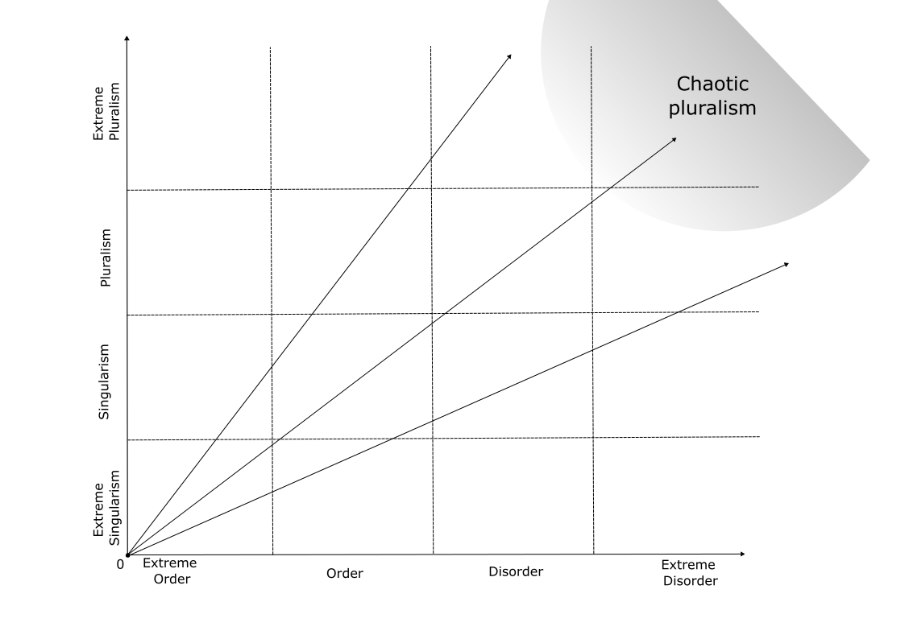

background-image: url(https://upload.wikimedia.org/wikipedia/en/6/6a/Logo_of_the_University_of_Sydney.svg)
background-size: 95%

---
class: inverse, center, middle

# Backstory

---

## Current Research project and team on information operations

I am currently involved with a multi-disciplinary research team

* Computer science
* Digital ethnography
* Security studies

--

Our current project is on foreign adversarial information operations (via social media).

* Detection; 
* Measurability; and 
* Forecasting (inshallah).

---

## Current Research project on information operations

Our research has been mostly applied so far.

But the goal is to develop a comprehensive theory that explores how politically charged knowledge is created, used, and spread on social media platforms.

Two key concepts: 

* Political epistemology

* Information disorder

---

### Most recent work on information disorder

Bailo, F., Johns, A., & Rizoiu, M.-A. (2023). Riding information crises: The performance of far-right Twitter users in Australia during the 2019-20 bushfires and the COVID-19 pandemic. *Information, Communication & Society*. https://doi.org/10.1080/1369118X.2023.2205479

* RQ1: Did far-right accounts overperform?

* RQ2: Do we observe a change in the degree of information disorder in the two conversations?


.center[

]

---

####  Riding information crises: The performance of far-right Twitter users in Australia during the 2019-20 bushfires and the COVID-19 pandemic (2023)

When we measure the performance of the three categories of accounts, we note that journalists and politicians clearly overperform relative to the control group, but also that far-right accounts overperform quite significantly, *but only at the onset of the pandemic*. Their performance was more limited during the bushfire crisis.

.center[

]

---

####  Riding information crises: The performance of far-right Twitter users in Australia during the 2019-20 bushfires and the COVID-19 pandemic (2023)

In support of stronger performance by far-right accounts, we observed that the far-right community maintained a peripheral position during the bushfire crisis ...

.center[

]

---

####  Riding information crises: The performance of far-right Twitter users in Australia during the 2019-20 bushfires and the COVID-19 pandemic (2023)

... and it was only during the pandemic that far-right accounts moved to a more central position in the Twitter conversation. 
 
 .center[

]

---

####  Riding information crises: The performance of far-right Twitter users in Australia during the 2019-20 bushfires and the COVID-19 pandemic (2023)

Our argument suggests that a factor causing the overperformance of the far-right community on Twitter during the pandemic, even following the introduction of stricter content moderation policies, was increased information disorder. 

.center[

]

We measure information disorder on two dimensions capturing the number of web domains that are linked and the proportion of links to authorative sources.

Our index points to a clear increase of information disorder *during the pandemic*.


---
class: inverse, center, middle

# Political epistemology

---

I refer to *Political epistemology* (vs *Social epistemology*)

#### Epistemology is 

> concerned with how people should go about the business of trying to determine what is true, or what are the facts of the matter, on selected topics"

#### Individual epistemology

> "person or agent in question who seeks the truth"

#### Social epistemology

> "how people can best pursue the truth (whichever truth is in question) *with the help* of, or *in the face* of, others."

Goldman, Alvin and Cailin O’Connor, "Social Epistemology", *The Stanford Encyclopedia of Philosophy* (Winter 2021 Edition), Edward N. Zalta (ed.), <https://plato.stanford.edu/archives/win2021/entries/epistemology-social/>.

---

#### Political epistemology: a definition 

* is about how people and groups pursue the truth; but also 

* is about how *this pursue* is used politically:

    * to govern;
    
    * (in a liberal democracy) to influence who governs and the public;
    
    * to challenge the political, cultural, scientific *status quo*.
    
Under a political epistemology framework, the concept of **epistemic crises** takes a different meaning. 

An **epistemic crisis** is not about irreconcilable interpretation of facts and knowledge within an epistemic system. 

Instead, an **epistemic crisis** is about 

* using *alternative interpretations* of facts and knowledge 

* to *challenge* the established authority of an epistemic system and the political order behind it.  

---
class: inverse, center, middle

# Political epistemology in action

> I shall not today attempt further to define the kinds of material I understand to be embraced within that shorthand description, and perhaps I could never succeed in intelligibly doing so. 

> But *I know it when I see it* ....

---

### Political epistemology in action: Example 1

.center[</img>]

---

### Political epistemology in action: Example 2

.center[</img>] 

---

class: inverse, center, middle

# Information disorder

---

## Why we need a practical definition of information disorder?

The battle against misinformation is fundamentally impossible to control and win.

Advances in communication and information technologies over the last decades have massified tools to create and a distribute information content. 

Recent advances in LLM have provided new sophisticated functionality in creating even more credible content.  


---

#### Information as truth: Floridi, L. (2010). *Information: A very short introduction*. Oxford University Press.

```{r echo = F, results = 'asis', out.width = '60%'}

library(DiagrammeR)
grViz("
digraph {

  # graph attributes
  graph [overlap = true]

  # node attributes
  node [shape = box,
        fontname = Helvetica,
        color = black]

  # edge attributes
  edge [color = gray]

  # node statements
  A [label = 'data\n(unstructured)']; 
  B [label = 'environmental']; 
  C [label = 'semantic\n(content)']; 
  D [label = 'instructional'];
  E [label = 'factual'];
  F [label = 'untrue'];
  G [label = 'true\n(information)', style = filled, fillcolor = 'orange']
  H [label = 'knowledge']
  I [label = 'unintentional\n(misinformation)']
  J [label = 'intentional\n(disinformation)']

  # edge statements
  A->B; A->C; C->D; C->E;
  E->F; E->G; G->H;
  F->I; F->J;
  
}
")

```

---

#### But ...

Information as truth is problematic, especially when it comes to social media content.  

* Truth is difficult/impossible to ascertain (e.g. fact-checking is laborious and available only hours or even days after the content has been distributed);

* Truth might not be available for lack of scientific consensus (e.g. onset of the Covid-19 pandemic)

---

## A practical definition of information

**Information** is content that is meaningful in a semantic sense (i.e. we can understand its meaning). 

So this is **not information**: 010101110001010101010100101

But this is **information**, no matter where you stand on the connection vaccine-autism:

.center[<blockquote class="twitter-tweet"><p lang="en" dir="ltr">Sr CDC vaccine scientist: Thimerosal in flu shots given to pregnant mothers &quot;causes autism-like features&quot; in children<br>http://t.co/OBCOnDAoKV</p>&mdash; Robert F. Kennedy Jr (@RobertKennedyJr) <a href="https://twitter.com/RobertKennedyJr/status/531912864555347968?ref_src=twsrc%5Etfw">November 10, 2014</a></blockquote> <script async src="https://platform.twitter.com/widgets.js" charset="utf-8"></script>]

---

## A practical definition of information

```{r echo = F, results = 'asis'}
library(DiagrammeR)
grViz("
digraph {

  # graph attributes
  graph [overlap = true]

  # node attributes
  node [shape = box,
        fontname = Helvetica,
        color = black]

  # edge attributes
  edge [color = gray]

  # node statements
  A [label = 'data\n(unstructured)']; 
  B [label = 'environmental']; 
  C [label = 'semantic\n(content)\n(information)', style = filled, fillcolor = 'orange']; 
  D [label = 'instructional'];
  E [label = 'factual'];
  F [label = 'untrue'];
  G [label = 'true']
  H [label = 'knowledge']
  I [label = 'unintentional\n(misinformation)']
  J [label = 'intentional\n(disinformation)']

  # edge statements
  A->B; A->C; C->D; C->E;
  E->F; E->G; G->H;
  F->I; F->J;
  
}
")
```

---

## A practical definition of information disorder

* As information, Information disorder is *agnostic to knowledge* (true belief).

So, information disorder is 

> The likelihood of encountering consistent information to solve a sense-making problem.

In other words, information (dis)order is a measure of the overall *coherence* of an information flow. 

For example,

* Do I need to wear a mask? 

* Do I need to vaccinate my kids?

* Do I need to evacuate?

---

### How to measure information disorder: A network approach

Information coherence is measured from a *multilayer network*, where nodes (actors) are *statements* related by four types of edges. 

.center[</img>]


Statements are linked: 

1. if they agree (first layer); 

2. if they disagree (second layer); 

3. if they are equivalent/redundant (third layer); 

4. and finally, if they offer to the same external source (URLs) (fourth layer).

---

```{r echo = FALSE, message = FALSE, warning = FALSE}
library(igraph)

createLayers <- function(graph_size = 100,
                          prob_agreement = c(.01, .98, .01),
                          prob_equivalence = 0.05,
                          prob_share_source = 0.15) {
  
  x1 <- 
    sample(x = c(-1,0,1), size = graph_size^2, replace = TRUE, prob = prob_agreement)
  
  adj_ <- 
    matrix(x1, nrow = graph_size, ncol = graph_size)
  
  adj1 <- adj_
  adj1[adj1 == -1] <- 0
  
  adj2 <- adj_
  adj2[adj2 == 1] <- 0
  adj2[adj2 == -1] <- 1
  
  adj3 <- adj1 
  is_equivalent <- rbinom(n = sum(adj1 == 1), size = 1, prob = prob_equivalence)
  adj3[adj3 == 1] <- is_equivalent
  
  adj4 <- adj1 
  share_source <- rbinom(n = sum(adj4 == 1), size = 1, prob = prob_share_source)
  adj4[adj4 == 1] <- share_source
  
  adj_flat <- adj1 + adj3 + adj4
  
  g1 <- 
    graph_from_adjacency_matrix(adj1, mode = 'upper', diag = FALSE)
  g2 <- 
    graph_from_adjacency_matrix(adj2, mode = 'upper', diag = FALSE)
  g3 <- 
    graph_from_adjacency_matrix(adj3, mode = 'upper', diag = FALSE)
  g4 <- 
    graph_from_adjacency_matrix(adj4, mode = 'upper', diag = FALSE)
  g5 <- 
    graph_from_adjacency_matrix(adj_flat, mode = 'upper', diag = FALSE, 
                                weighted = TRUE)
  
  return(list(g1, g2, g3, g4, g5))
  
}

sampleGraphs <- function(graphs, keep_v = rbinom(n = 100, size = 1, prob = .5)) {
  return(list(delete_vertices(graphs[[1]], which(keep_v==0)),
              delete_vertices(graphs[[2]], which(keep_v==0)),
              delete_vertices(graphs[[3]], which(keep_v==0)),
              delete_vertices(graphs[[4]], which(keep_v==0)),
              delete_vertices(graphs[[5]], which(keep_v==0))))
}
  
calculateDisorder <- function(graphs) {
  return((graph.density(graphs[[1]]) - 
           graph.density(graphs[[2]])) +
           graph.density(graphs[[3]]) +
           graph.density(graphs[[4]]))
}  

calculatePluralism <- function(graph) {
 comms <- fastgreedy.community(graph)
 return(length(comms) / vcount(graph))
}

```


#### How to measure information disorder: A network approach

```{r echo = FALSE, out.width = '90%', dev = 'svg'}

graphs <- createLayers(graph_size = 20, prob_agreement = c(.05, .9, .05))
par(mfrow=c(2,2))

plot(graphs[[1]], main='agreeement')
plot(graphs[[2]], main='disagreement')
plot(graphs[[3]], main='redundancy')
plot(graphs[[4]], main='ext. source')

```

---

### How to measure information disorder: A network approach

#### Order vs Disorder

We can calculate the *density* of each graph, then solve for this:

$$(Agreement - Disagrement) + Redundancy + ExternalSource$$

<div class="math">
$$
(
\begin{pmatrix}
    1 & 0 & 1  \\
    0 & 0 & 0  \\
    1 & 1 & 0  \\
\end{pmatrix} 
- 
\begin{pmatrix}
    1 & 0 & 1  \\
    0 & 0 & 0  \\
    1 & 1 & 0  \\
\end{pmatrix} 
)
+
\begin{pmatrix}
    1 & 1 & 0  \\
    0 & 0 & 0  \\
    1 & 1 & 0  \\
\end{pmatrix} 
+
\begin{pmatrix}
    1 & 0 & 0  \\
    0 & 0 & 1  \\
    1 & 1 & 0  \\
\end{pmatrix}
$$
</div>

---

### How to measure information disorder: A network approach

#### Pluralism vs Singularism

$$Agreement + Redundancy + ExternalSource$$

<div class="math">
$$
\begin{pmatrix}
    1 & 0 & 1  \\
    0 & 0 & 0  \\
    1 & 1 & 0  \\
\end{pmatrix} 
+
\begin{pmatrix}
    1 & 1 & 0  \\
    0 & 0 & 0  \\
    1 & 1 & 0  \\
\end{pmatrix} 
+
\begin{pmatrix}
    1 & 0 & 0  \\
    0 & 0 & 1  \\
    1 & 1 & 0  \\
\end{pmatrix}
$$
</div>

I can flatten these three graphs to get a more comphrensive agreeement graph (including *redundacy* and shared *external sources*).

---

### How to measure information disorder: A network approach

#### Pluralism vs Singularism

```{r echo = F,  out.width = '50%'}
plot(graphs[[5]], main = "Flatten agreement graph")
```

A pluralism vs singularism index can be measured as the normalised number of communities in the flatten agreement graph

---

### The order vs disorder / singularism vs pluralism chart

.center[</img>]


---
