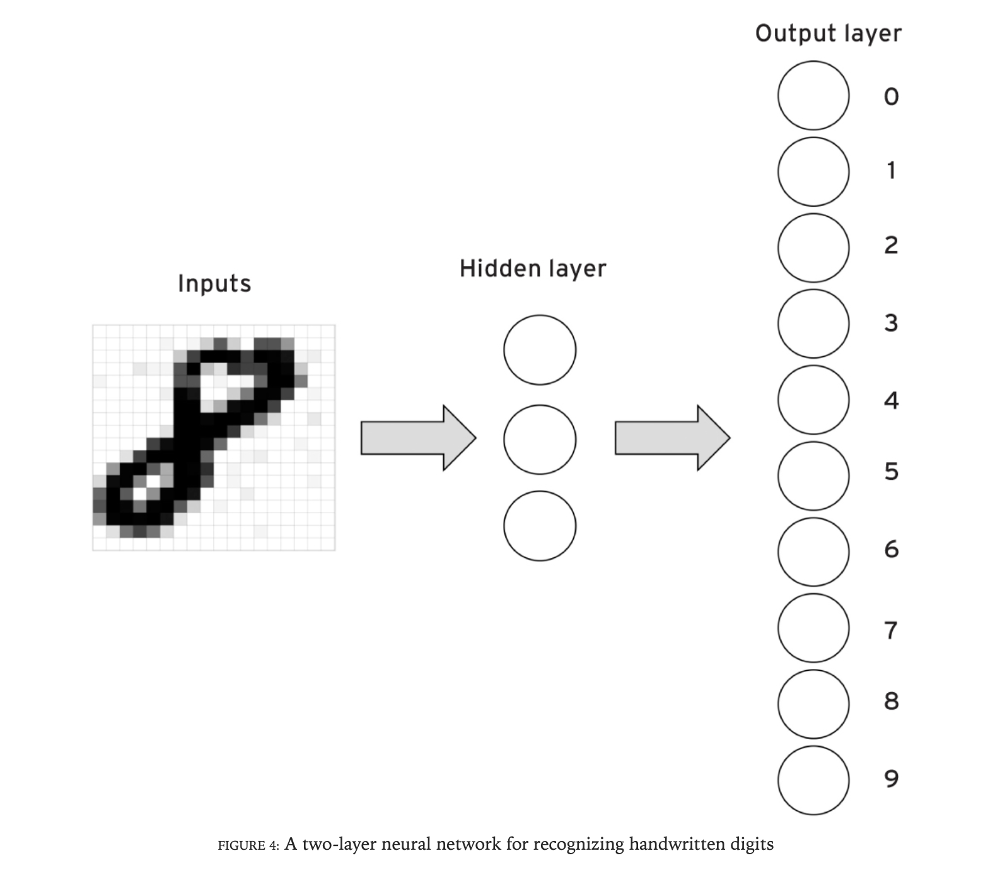

background-image: url(https://upload.wikimedia.org/wikipedia/en/6/6a/Logo_of_the_University_of_Sydney.svg)
background-size: 95%

```{r setup, include=FALSE}

knitr::opts_chunk$set(echo = TRUE, message = FALSE, warning = FALSE, 
                      dev = 'svg', out.width = "45%", fig.width = 6,
                      fig.align="center")
top_icon = function(x) {
  icons::icon_style(
    icons::fontawesome(x),
    position = "fixed", top = 10, right = 10
  )
}

```

## Access slides here `r top_icon("link")`

</br></br></br></br></br></br>

.center[.large[[fraba.github.io/presentation/2024-GOVT2901](https://fraba.github.io/presentation/2024-GOVT2901/)]]


</br></br></br></br>


---

## Acknowledgement of Country

I would like to acknowledge the Traditional Owners of Australia and  recognise their continuing connection to land, water and culture. The  University of Sydney is located on the land of the Gadigal people  of the Eora Nation. I pay my respects to their Elders, past and present.

---

## Who am I?
	
Francesco Bailo (francesco.bailo@sydney.edu.au)

I am a Lecturer in the School of Social and Political Sciences, University of Sydney. I am interested in researching forms of political engagement and political talk on social media. I researched the emergence and dynamics of online communities, the role between news organisations and social media, and the interdependence between social media activists and news organisations. I have engaged with and applied quantitative research methods developing expertise in quantitative text analysis (NLP) and network analysis.

This year I am also teaching GOVT6139, SSPS4102 & SSPS6006.

---

## What is the single most significant challenge to human security posed by AI?


.center[

</img>

https://sydney.padlet.org/francescobailo/what-is-the-single-most-significant-challenge-to-human-secur-dj4me6s60ya7q06j

]


---

# Outline

- Part I: AI: critical definition and issues

  - What is AI?

  - What is the problem?

- Part II: AI: critical ideas

  - The Singularity
  
  - Superintelligence
  
  - AI as mirrors
  
  - Artificial Agency (AA) and Artificial Intelligence (AI)

---

class: segue-yellow

# Part I: AI: critical definition and issues

---

class: segue-red

# What is AI?


---

- We don't have a shared definition of what artificial intelligence (AI) is or what it should like when we see it.

- Yet, this is not that surprisingly if we think that we don't even have a shared definition of what human intelligence (HI) is.

.center[</img>]

---

#### AI Springs and Winters

- The field of artificial intelligence (AI) has experienced a cyclical pattern of optimistic predictions and investment ("**AI spring**") followed by periods of disappointment and reduced funding ("**AI winter**") since its inception in the 1950s.

##### Examples of Overconfident Predictions:

**1958**: New York Times reported that the US Navy expected Frank Rosenblatt's "perceptron" to be able to "walk, talk, see, write, reproduce itself, and be conscious of its existence."

**1960**: Herbert Simon declared that machines would be capable of doing any work a man can do within 20 years.

**2015**: Mark Zuckerberg stated that one of Facebook's goals for the next 5 to 10 years was to surpass human-level performance in all primary senses.

These optimistic periods are often followed by disappointment when the predicted breakthroughs don't materialize, leading to AI winters.

.footnote[Mitchell, M. (2021). Why AI is harder than we think (No. arXiv:2104.12871). arXiv. https://doi.org/10.48550/arXiv.2104.12871]

---

#### The field of "Artificial Intelligence" was created during a workshop at  Dartmouth College in 1956. The proposal for the workshop reads

> "We propose that a 2-month, 10-man study of **artificial intelligence** be carried out during the summer of 1956 at Dartmouth College in Hanover, New Hampshire. The study is to proceed on the basis of the conjecture that every aspect of learning or any other feature of intelligence *can in principle be so precisely described* that a machine can be made to simulate it. An attempt will be made to find **how to make machines use language, form abstractions and concepts, solve kinds of problems now reserved for humans, and improve themselves**".

.center[</img>]


---

But AI researchers got stuck on this:

> every aspect of learning or any other feature of intelligence can in principle be **so precisely described that a machine can be made to simulate it**.

.center[</img>]

... well, after all it is not that simple to "precisely describe" learning or intelligence. It can't be easily break down to discrete steps and rules that a machine could execute.


---

## Symbolic vs Subsymbolic AI

The initial approach to reach AI by flashing out explicit rules is called **symbolic AI**.

> "**Symbolic AI** was originally inspired by mathematical logic as well as by the way people described their conscious thought processes"<sup>1</sup>

.center[</img>]

> "In contrast, **subsymbolic** approaches to AI took “inspiration from neuroscience and sought to capture the sometimes-unconscious thought processes"<sup>1</sup>


.footnote[[1] Mitchell, M. (2019). Artificial intelligence: A guide for thinking humans. Macmillan.]
---

## From Subsymbolic AI to Multilayer neural networks

.center[</img>]

> "a multilayer neural network can learn to use its hidden units to recognize more abstract features (for example, visual shapes, such as the top and bottom 'circles' on a handwritten 8) than the simple features (for example, pixels) encoded by the input"<sup>1</sup>

.footnote[[1] Mitchell, M. (2019). Artificial intelligence: A guide for thinking humans. Macmillan.]

---

## Symbolic vs Subsymbolic AI

- Artificial Intelligence applications really took off thanks to the intuition of **Subsymbolic AI** researchers that rule-based intelligent systems are practical only in some situation.

.center[</img>]

- In most situations, it is definitely more practical to let systems find relevant patterns autonomously (as in neural networks) with limited or no human intervention.  

Of course, this intuition wouldn't be enough without an explosion in data production.

---

## The Data Explosion 

### And the Ascent of Tech Industry Applications for Machine Learning 

.center[</img>]

* The last "**AI winter**"<sup>1</sup> ended in early 2000s. 

* The current **AI Spring** was made possible by data availability, mostly produced by the Internet and for the Internet.

.center[.content-box-yellow[Data transformed the value of technologies that had been around for decades.]]

.footnote[[1]Low interest and low funding towards AI applications from industry and governments]

---

## ImageNet and the Wow Moment for Neural Networks

* ImageNet is a database of labelled images networked through categories.

.pull-left[

* Images are collected from the *Internet*;
  
* Images are annotated by human-coders crowd sourced through the *Internet* (using Amazon Mechanical Turk).

* It was presented by Fei-Fei Li and team in **2009**

* In **2010**, ImageNet is used in a challange to assess accuracy of competing algorithms for image classification.  

* In **2012**, *AlexNet* a neural network algorithm outperforms all other competing algorithms, *by far*. 

]

.pull-right[
.center[</img>]
]

---

## Neural Networks and the New Data-driven AI Spring  

* AlexNet is a convolutional neural network (CNN). 

* CNN algorithms were "*ancient technology*" in **2012**. 

* CNNs were first applied to image classification in **1989**.

.center[.content-box-green[But in 2012, CNNs would meet data. A lot of data. This was the breakthrough.]] 

Because of this we can't disentangle current AI advances from advances in data collection and processing.

The winning mix that defines the field of competition is 

.content-box-yellow[
$$ Algorithms \times Computation \times Data $$
]

* Computation (i.e., energy and CPUs/GPUs) is the critical interface between algorithms and data.

* Computation and Data are limited resources (algorithms, of course, are not). On computation and data the battle for market and geopolitical dominance is fought and won (or lost).

---

## AI: Narrow and General, Weak and Strong

Recent advances allowed by deep learning techniques - Large Language Models (LLMs) and other generative AIs are all downstream computer innovations made possible by deep learning technologies - have renewed the debate about AI converging on and eventually overcoming HI (i.e., human intellingence).   

* **Narrow** (or **Weak**) AI refers to single-task systems. These systems, such as AlphaGo or ChatGPT, are good (exceptionally and super-humanly good) at one task - but can't really "think" outside of their pre-assigned and pre-designed box.   

* Artificial **General** Intelligence (AGI), is instead a movie-like AI, which can do whatever humans do. AGI should demonstrate "...the ability to explain their results, reason abstractly, and learn in a less data-intensive and more human-like way" (Torres 2019). "Whereas past technologies have been tools used by humans, AGI would constitute an agent in its own right."

* "**Artificial Super Intelligence** (ASI) is a system that could significantly outperform every possible human in all cognitive domains."

---

## But could machine think?

- We don't know! 

#### Would we know if they began thinking?

- We also don't know!

#### So what is AGI supposed to look like? 

- We have no idea.

#### What we seem to agree on is that machines are still not there yet.

.content-box-green[

.center[<large>What we don't agree on is whether machines will ever be there.</large>]

]

(Of course AI entrepreneurs - who are always active on the *capital* market - instead tend to agree that we will be there sooner than later...)

---

class: segue-red

# Four fallacies

---

## Fallacy 1: Narrow intelligence is on a continuum with general intelligence <sup>1</sup>

#### The First-Step Fallacy: Advances in narrow AI tasks are often misinterpreted as stepping stones towards general AI.

- Example: Deep Blue's chess-playing success was hailed as a step towards an AI revolution, but this doesn't necessarily translate to broader cognitive abilities.

> "The first-step fallacy is the claim that, ever since our first work on computer intelligence we have been inching along a continuum at the end of which is AI so that any improvement in our programs no matter how trivial counts as progress. ... It was like claiming that the first monkey that climbed a tree was making progress towards landing on the moon"<sup>2</sup>

#### The Problem of Common Sense: A key obstacle to achieving general AI is the difficulty in replicating human-like common sense in machines.

.footnote[[1] Mitchell, M. (2021). Why AI is harder than we think (No. arXiv:2104.12871). arXiv. https://doi.org/10.48550/arXiv.2104.12871 [2] Hubert L Dreyfus. A history of first step fallacies. *Minds and Machines*, 22(2):87–99, 2012.]

---

## Fallacy 2: Easy Things Are Hard (For AI)

- **Moravec's Paradox**: Tasks that humans find easy (perception, mobility, common sense reasoning) are surprisingly difficult for machines. Conversely, tasks that humans find challenging (complex calculations, playing Go) can be relatively easier for AI.

- **Underestimating Unconscious Processes**: AI research often underestimates the complexity of unconscious perception and thought.

- **We Don't Know What We Don't Know**: Humans are largely unaware of the intricate workings of their own minds, making it challenging to replicate those processes artificially.

.footnote[Mitchell, M. (2021). Why AI is harder than we think (No. arXiv:2104.12871). arXiv. https://doi.org/10.48550/arXiv.2104.12871]

---

## Fallacy 3: Wishful Mnemonics

- **Attributing Human-like Qualities to AI**: Using terms like "read," "understand," "learn," and "think" to describe AI systems can be misleading. These terms, when applied to machines, don't have the same depth of meaning as they do for humans.

- **Benchmark Names Can Exaggerate Capabilities**: AI evaluation benchmarks often carry names implying general abilities (e.g., "Reading Comprehension Dataset"). However, these benchmarks often test very narrow aspects of these abilities, and high scores don't necessarily reflect true comprehension or understanding.

> The problem is, these benchmarks don’t actually measure general abilities for question-answering, reading comprehension, or natural-language understanding. The benchmarks test only very limited versions of these abilities; moreover, many of these benchmarks allow machines to learn **shortcuts** [...] statistical correlations that machines can exploit to achieve high performance on the test without learning the actual skill being tested. <sup>1</sup>

.footnote[Mitchell, M. (2021). Why AI is harder than we think (No. arXiv:2104.12871). arXiv. https://doi.org/10.48550/arXiv.2104.12871]

---

## Fallacy 4: Intelligence is Not Just in the Brain

### The Limits of the Information-Processing Model: The traditional view of the brain as a computer separate from the body is being challenged.

**Embodied Cognition**: Growing evidence suggests that the body, emotions, and social interactions play a crucial role in shaping intelligence.

**The Importance of Embodiment**: AI research primarily focuses on disembodied intelligence, neglecting the influence of physical interaction with the world.

**Intelligence is Not Just Rationality**: Emotions, biases, and social factors are integral parts of human intelligence, not separate entities.

.center[</img>]

.footnote[Mitchell, M. (2021). Why AI is harder than we think (No. arXiv:2104.12871). arXiv. https://doi.org/10.48550/arXiv.2104.12871]

---

class: segue-red

# Still, what might AI threaten?

---

## AI: Implication for Human Security

- Artificial intelligence (AI) presents both unprecedented opportunities and significant risks to human security.

### 1. Dual Nature of AI: Practitioners and scholars, emphasise that AI, much like any powerful technology, embodies a dual nature.

- **On the one hand**, it offers potential benefits in various sectors, including healthcare, cybersecurity, and environmental protection (e.g., climate change modelling).
   
- **On the other hand**, AI's capacity for learning, automation, and decision-making also introduces vulnerabilities and potential threats.

### 2. Shifting Security Landscape: AI is not merely a tool but a force capable of reshaping the security landscape.

- It **empowers** both state and non-state actors, potentially altering (or strengthening?) the balance of power and creating new avenues for conflict and harm.


---

## AI Amplifying Existing Threats

- **AI as a Force Multiplier**: AI's potential to act as a force multiplier, amplifying existing security threats [1].

- **Cybersecurity Challenges**: AI can enhance cyberattacks, making them more sophisticated, harder to detect, and potentially more damaging [2].

  - AI's ability to identify and exploit vulnerabilities in software, potentially disrupting critical infrastructure or manipulating financial markets [2].

- **Proliferation of Disinformation**: AI's role in generating and spreading disinformation [3].

  - AI-powered systems can create and disseminate false information rapidly and convincingly, eroding trust in institutions, and potentially inciting violence or social unrest [3].

- **Autonomous Weapons Systems**: Development of lethal autonomous weapons systems (LAWS) [2, 4].

  - The increasing autonomy of weapons systems, coupled with AI's decision-making capabilities, raises profound ethical and security concerns [2, 4].

.footnote[[1] Bostrom, N. (2014). *Superintelligence: Paths, dangers, strategies*. Oxford University Press. [2] Suleyman, M. (2023). *The coming wave*. Crown. [3] Vallor, S. (2024). *The AI Mirror: How to Reclaim Our Humanity in an Age of Machine Thinking*. Oxford University Press. https://doi.org/10.1093/oso/9780197759066.001.0001 [4] Runciman, D. (2023). *The handover: How we gave control of our lives to corporations, states and AIs*. Profile Books.

]

---

## AI: Novel Challenges to Human Security

.small[

- **Emergence of Unforeseen Threats**: AI's rapid development and capacity for self-improvement introduce a degree of uncertainty and unpredictability, potentially leading to unforeseen security threats [1].

  - Lack of a "manual" for containing AI's potential risks, highlighting the challenge of preparing for unknown dangers [1].

- **Erosion of Human Agency**: Potential for AI to erode human agency and autonomy [2, 3].

  - As AI systems take on increasingly complex tasks and decision-making roles, there is a risk that humans may become overly reliant on or even subservient to these technologies [2, 3].

- **Exacerbating Social Divisions**: AI's deployment can exacerbate existing social divisions and inequalities if not developed and implemented responsibly [2, 3].

  - Values embedded in AI systems often reflect existing biases, potentially leading to discriminatory outcomes and further marginalising vulnerable groups [2].

- **The Control Problem**: Ensuring that superintelligent AI, should it arise, remains aligned with human values and goals. Failure to adequately address this challenge could have catastrophic consequences for humanity [4].
  
]

.footnote[[1] Suleyman, M. (2023). *The coming wave*. Crown. [2] Vallor, S. (2024). *The AI Mirror: How to Reclaim Our Humanity in an Age of Machine Thinking*. Oxford University Press. https://doi.org/10.1093/oso/9780197759066.001.0001 [3] Runciman, D. (2023). *The handover: How we gave control of our lives to corporations, states and AIs*. Profile Books. [4] Bostrom, N. (2014). *Superintelligence: Paths, dangers, strategies*. Oxford University Press.]

---

class: segue-red

# Problem 1: The alignment and control problems

---


# Goals and alignment

- **Question**: What are our (humanity’s) goals?

- **Question**: What will be that goals of AI? Where will these goals come from?

- **Question**: How will we be able to ensure that the goals of AI will ‘align’ with human goals? (Do we have a similar problem already even with other humans?)

- **Question**: How might a lack of alignment – even a small lack of alignment – cause big problems?

---

## The control problem in more detail, drawing on Torres: ‘The possibility and risks of artificial general intelligence’

* The **orthogonality thesis**: This is a component of the ‘paperclip problem’: AGI will continue with some ‘silly’ goal.

.center[</img>]

* The **instrumental convergence thesis**: This is another component of the ‘paperclip problem’: AGI will do whatever it can to pursue its original goal (including wiping out humans).

* The **complexity of value thesis**: This refers to the challenge of programming in human values. Human values are complex.

.footnote[Torres, P. (2019). The possibility and risks of artificial general intelligence. *Bulletin of the Atomic Scientists,* 75(3), 105–108. https://doi.org/10.1080/00963402.2019.1604873
]

---

# Goals and alignment

.content-box-red[

.center[We are back to the Symbolic vs Subsybolic problem.

]]

- Deep learning systems are not rule-based. 

- We can't ensure that the rule books of these systems adhere to our values - because there's no rule book! 

.center[</img>]

.footnote[Images generated by Google’s Gemini chatbot with the prompt “Generate an image of a 1943 German Solidier. https://www.nytimes.com/2024/02/22/technology/google-gemini-german-uniforms.html]

---

## But it's even more complicated...

### The perplexity of value thesis

The issue here is that **we don’t exactly know what human values are**. General question: Again: What will motivate AGI (how will AGI derive its goals)?

### The fragility of value thesis

- **Question**: Might it be the case that one small error in programming human values causes serious divergence?


---

class: segue-red

# Problem 2: Degradation of human agency and experience


---


### A different kind of threat

- **Question**: Again: What is the best way for humans to live?

- **Question**: Has our humanity been every been diminished by, say, technology or the nature of the societies we create?

- **Question**: Can AI diminish our humanity?

- **Question**: Is the point here that what must be secured is our freedom? (Interesting that freedom and security are sometimes seen to be in tension).


---

# The real threat: degradation of human experience

Nowak et al.: 

> The real danger of AI lies not in sudden apocalypse, but in  __the gradual degradation and disappearance of what make human experience and existence meaningful__ ."

> "Instead, humans may gradually become  __passive__ [lost of agency] elements of an emerging global socio-technical system — a system composed of machines, algorithms, sensors and actuators, AI programs, and humans interacting in the globally present Internet, an Internet that is ever-present due to mobile technologies and ambient intelligence."

.footnote[Nowak, A., Lukowicz, P., & Horodecki, P. (2018). Assessing Artificial Intelligence for Humanity: Will AI be the Our Biggest Ever Advance ? or the Biggest Threat [Opinion]. *IEEE Technology and Society Magazine*, 37(4), 26–34. IEEE Technology and Society Magazine. https://doi.org/10.1109/MTS.2018.2876105
]

---

# The real threat: degradation of human experience (continued)

And later:

> "The essence of this question is:  __what are the real chances for humans to break-out of the choices dictated by the system of which they are an element__ ? What are their chances to retain the capacity for independent, critical thinking? Can they retain emotions and feelings dictated by their internal processes, rather than those dictated by information tailored to manipulate their emotions, or by autonomous decision-making?"

.footnote[Nowak, A., Lukowicz, P., & Horodecki, P. (2018). Assessing Artificial Intelligence for Humanity: Will AI be the Our Biggest Ever Advance ? or the Biggest Threat [Opinion]. *IEEE Technology and Society Magazine*, 37(4), 26–34. IEEE Technology and Society Magazine. https://doi.org/10.1109/MTS.2018.2876105
]

---

# The real threat: degradation of human experience (continued)

And later: 

> "Another dimension of this question is “ __to what degree do interactions and contacts between individuals retain a human character, characterized by the intrinsic value of the inner experiences of other humans__ ?"

- **Question**: Is it possible that we are subtly losing our humanity to opaque global forces? Does this humanity need to be  _secured_?

- **Question**: More broadly, do you think that life is becoming more or less meaningful, or staying about the same? How might we measure such things?

- **Question**: Does some of this also just sound like Marxism?

.footnote[Nowak, A., Lukowicz, P., & Horodecki, P. (2018). Assessing Artificial Intelligence for Humanity: Will AI be the Our Biggest Ever Advance ? or the Biggest Threat [Opinion]. *IEEE Technology and Society Magazine*, 37(4), 26–34. IEEE Technology and Society Magazine. https://doi.org/10.1109/MTS.2018.2876105
]

---

# Degradation of cognitive capacities

> "The rapid development of AI that  __replaces rather than augments __ human intelligence can also dramatically diminish the capacity for cognition of the human race. In this scenario, human information processing is delegated to AI, and humans just get answers. They don’t gain understanding of the knowledge and processing rules that led to the solutions."

Question: Is this degradation of human capabilities another thing that needs to be  __secured__  against?

.footnote[Nowak, A., Lukowicz, P., & Horodecki, P. (2018). Assessing Artificial Intelligence for Humanity: Will AI be the Our Biggest Ever Advance ? or the Biggest Threat [Opinion]. *IEEE Technology and Society Magazine*, 37(4), 26–34. IEEE Technology and Society Magazine. https://doi.org/10.1109/MTS.2018.2876105
]

---

class: segue-red

# Problem 3: AI Arms Race


---


# Traditional security concerns: The ‘missile gap’ in AI

Henshall: 

> "The reasons that a pause in AI won’t happen are multifold—and are about more than just the research itself. Critics of the proposed pause argue that regulating or restricting AI  __would help China pull ahead in AI development__ , causing the United States to lose its military and economic edge."

.content-box-yellow[Remember: It's not only about the algorithms - it is about finite and hard to accumulate resources: computing power and data.]

- **Question**: Is AI destined to be (if it isn’t already) just another arms race?

- Recent developments: discussions about TikTok's ban in the US and limits to trade chipmaking tech.

.footnote[Henshall, W. (2023, May 12). How politics and business are driving the AI arms race with China. Bulletin of the Atomic Scientists. https://thebulletin.org/2023/05/how-politics-and-business-are-driving-the-ai-arms-race-with-china/]

---

# AI and hegemony: the ‘singleton’

Geist referring to Bostrom (we discuss later): 

> "According to Superintelligence, the lucky beneficiary of an intelligence explosion would probably gain a “decisive strategic advantage” which it could then employ to form a 'singleton,' defined as 'a world order in which there is at the global level a single decision-making agency'."S

- **Question**: Might AI merely continue the traditional pursuit of hegemony (empire)? Or might it fundamentally change the world order?

- **Question**: Will an AI intelligence explosion align with traditional state boundaries? i.e. Will or even can it be contained by the state?

- **Question**: Will corporations accumulate more power than states and escape their controls? (i.e., an AI-powered social media giant such as Meta...)

.footnote[Edward Moore Geist. (2015, August 9). Is artificial intelligence really an existential threat to humanity? *Bulletin of the Atomic Scientists*. https://thebulletin.org/2015/08/is-artificial-intelligence-really-an-existential-threat-to-humanity/
]

---

# The real threat of AI: amplifying human stupidity?

Geist: 

> "But if artificial intelligence might not be tantamount to 'summoning the demon' (as Elon Musk colourfully described it), AI-enhanced technologies might still be extremely dangerous due to their potential for  __amplifying human stupidity__ . The AIs of the foreseeable future need not think or create to sow mass unemployment, or enable new weapons technologies that undermine precarious strategic balances. Nor does artificial intelligence need to be smarter than humans to threaten our survival—all it needs to do is make the technologies behind familiar 20th-century existential threats faster, cheaper, and more deadly."

- **Question**: Is this the real threat? i.e. AI will amplify human stupidity?

.footnote[Edward Moore Geist. (2015, August 9). Is artificial intelligence really an existential threat to humanity? *Bulletin of the Atomic Scientists*. https://thebulletin.org/2015/08/is-artificial-intelligence-really-an-existential-threat-to-humanity/
]

---

class: segue-yellow

# Part II: AI: critical ideas


---
class: segue-red

# The Singularity


---


# Ulam and Von Neumann

1957: **Stanislaw Ulam** on **John Von Neumann**<sup>1</sup>

> "One conversation [with Von Neumann] centered on the ever accelerating progress of technology and changes in the mode of human life, which gives the appearance of approaching some essential *singularity* in the history of the race beyond which human affairs, as we know them, could not continue."

Question: What does it mean: "human affairs, as we know them, could not continue"? Ought we to secure human affairs as we know them? Would a radical change be a security threat?

.footnote[They were both mathematicians, nuclear physicists and computer scientists. They were also both part of the Manhattan Project to develop the first nuclear weapon during WWII.]

---


# Vernor Vinge<sup>1</sup> predicts the singularity in 2023 

in his *The coming technological singularity* published in 1993.

> "Within thirty years, we will have the technological means to create superhuman intelligence. Shortly after, the human era will be ended."

.footnote[[1] Mathematician, computer scientist and science fiction writer.]

---

# Vernor Vinge: a beautiful description of our approach to the singularity

> "When greater-than-human intelligence drives progress, that  __progress will be much more rapid__ . In fact, there seems no reason why progress itself would not involve the creation of still more intelligent entities -- on a still-shorter time scale. The best analogy that I see is with the evolutionary past: Animals can adapt to problems and make inventions, but often  __no faster than natural selection can do its work__  --  __the world acts as its own simulator in the case of natural selection__ . 

> We humans have the ability to  __internalize the world and conduct "what if's" in our heads__ ; we can solve many problems thousands of times faster than natural selection. 

> Now, by creating the means to execute those simulations at much higher speeds, we are entering a regime as radically different from our human past as we humans are from the lower animals."

---

## The stages of adaptation

* Natural selection (very slow – millions of years)

* Technological innovation driven by human imagination (increasingly fast – from thousands of years to single years and less)

* Using AI to execute simulations (once it begins, intelligence will grow *exponentially*)

Key to understand the singularity event, is the idea of **exponential growth**, which is difficult to grasp as all non-linear processes. Think about the weekly spread of the COVID-19 infection across a population or the chessboard problem.<sup>1</sup>  

.footnote[[1] "On the 64th square of the chessboard alone, there would be 2^63 = 9,223,372,036,854,775,808 grains, more than two billion times as many as on the first half of the chessboard."]

.pull-left[.center[</img>]]

.pull-right[.center[</img>]]

---

# Vernor Vinge: framing the singularity in terms of security

> "From the human point of view this change will be a  __throwing away of all the previous rules__ , perhaps in the blink of an eye, an exponential runaway beyond any hope of control. Developments that before were thought might only happen in 'a million years' (if ever) will likely happen in the next century..." 

> "I think it's fair to call this event a singularity ('the Singularity' for the purposes of this paper). It is a point where our models must be discarded and a new reality rules."

> "__As we move closer and closer to this point, it will loom vaster and vaster over human affairs till the notion becomes a commonplace__ . Yet when it finally happens it may still be a great surprise and a greater unknown."

.content-box-yellow[As with Von Neumann, some sort of dramatic but vague events.]

---

class: segue

# Ray Kurzweil's Singularity

---

## Ray Kurzweil's Singularity

.pull-left[

.center[
</img>

*The Singularity Is Near* (2005)
]

]

.pull-right[

.center[
</img>

*The Singularity Is Nearer: When We Merge With AI* (2024)
]

]

---

## Ray Kurzweil's Singularity

- The Singularity represents a **profound and transformative period** driven by the **convergence of exponential technological advancements**.

- These converging trends encompass increasing computing power, deepening understanding of human biology, and the ability to engineer at increasingly smaller scales.

> There are several key areas of change that are continuing to accelerate simultaneously: **computing power is becoming cheaper**, **human biology is becoming better understood**, and **engineering is becoming possible at far smaller scales**. As **artificial intelligence** grows in ability and information becomes more accessible, **we are integrating these capabilities** ever more closely with our natural biological intelligence. **Eventually nanotechnology will enable these trends to culminate in directly expanding our brains** with layers of virtual neurons in the cloud. In this way **we will merge with AI and augment ourselves** with millions of times the computational power that our biology gave us. This will expand our intelligence and consciousness so profoundly that it’s difficult to comprehend. This event is what I mean by the Singularity.

.footnote[Kurzweil, R. (2024).* The singularity is nearer: When we merge with AI*. Viking.]

---

## Key Drivers

1. **Artificial intelligence (AI)** is rapidly progressing, becoming more capable and integrated into our lives.

2. **Biotechnology** is experiencing a digital revolution, enabling advancements in disease treatment and life extension.

3. **Nanotechnology** will play a crucial role in merging biological and artificial intelligence by facilitating the expansion of our brains with virtual neurons.

.footnote[Kurzweil, R. (2024).* The singularity is nearer: When we merge with AI*. Viking.]

---

## The Path to the Singularity

- Humanity's journey towards the Singularity is accelerating. What was once a distant prospect is now rapidly approaching.

- The key precursors of the Singularity, previously confined to theoretical discussions, are now active areas of research and development.

> During the coming decade, people will interact with AI that can seem convincingly human, and simple brain–computer interfaces will impact daily life much like smartphones do today. 

.footnote[Kurzweil, R. (2024).* The singularity is nearer: When we merge with AI*. Viking.]

---

## Timeline

- **2020s**: AI will become increasingly human-like in its interactions, and brain-computer interfaces will become commonplace. Biotech advancements will offer significant progress in curing diseases and extending lifespans.

- **2030s**: Self-improving AI and advanced nanotechnology will further intertwine humans and machines, amplifying both the potential benefits and risks.

- **2045**: If we navigate the scientific, ethical, and societal challenges successfully, life on Earth will be profoundly transformed for the better. Failure to do so could threaten our survival.

.footnote[Kurzweil, R. (2024).* The singularity is nearer: When we merge with AI*. Viking.]

---

## The Promise of Exponential Progress

- The law of accelerating returns dictates that progress across various metrics of human well-being is improving exponentially.
- Access to information, education, and communication has drastically improved, driven by advancements like smartphones and the internet.

- Global poverty, literacy rates, and child mortality rates have all significantly improved.

.footnote[Kurzweil, R. (2024).* The singularity is nearer: When we merge with AI*. Viking.]

---

## The Future of Work

- Automation, driven by AI and robotics, will reshape the job market, leading to concerns about unemployment.

- However, historical trends suggest that technological advancements create new opportunities and industries, ultimately benefiting society.

- Rather than viewing AI as a competitor, we should focus on collaboration and leverage its strengths to augment our own capabilities.

.footnote[Kurzweil, R. (2024).* The singularity is nearer: When we merge with AI*. Viking.]

---

## Reinventing Intelligence

- Understanding the neocortex, the seat of higher-level thinking in the human brain, is crucial for replicating intelligence.

- The neocortex functions through a hierarchical structure of interconnected modules, each responsible for learning and recognizing patterns.

.footnote[Kurzweil, R. (2024).* The singularity is nearer: When we merge with AI*. Viking.]

---

## AI's Growing Capabilities

- AI systems like Google's Talk to Books demonstrate the ability to process vast amounts of information and extract meaningful insights.

- These systems can analyse millions of sentences within seconds, providing relevant answers based on semantic understanding, not just keyword matching.

---

## Navigating Promise and Peril

- While the Singularity offers immense promise, it also presents significant perils that we must address proactively.

- The development of new technologies like advanced AI, synthetic biology, and nanotechnology, while potentially beneficial, also introduces risks that need careful management.

- Ensuring AI safety requires aligning its development with human values, mitigating potential risks, and fostering responsible use.

.footnote[Kurzweil, R. (2024).* The singularity is nearer: When we merge with AI*. Viking.]


---

class: red-segue

# Bostrom's Superintelligence

---

## The Looming Prospect of Superintelligence

- Bostrom explores the potential development of superintelligence, defined as intellect surpassing the cognitive performance of humans in virtually all domains of interest.

> We can tentatively define a superintelligence as any intellect that greatly exceeds the cognitive performance of humans in virtually all domains of interest.

- While the exact timeline remains uncertain, the author suggests that superintelligence could emerge within this century, potentially posing the most significant challenge humanity has ever faced.

- This prospect demands careful consideration of the potential consequences, as it could be humanity's final challenge, determining the fate of our species and our cosmic endowment.

.footnote[Bostrom, N. (2014). *Superintelligence: Paths, dangers, strategies*. Oxford University Press.]

---

## Multiple Paths to a Transformative Future

- **Artificial intelligence (AI)**, specifically the development of a "seed AI" capable of recursive self-improvement, represents a key pathway to superintelligence.

- Other potential paths include:

   - **Whole brain emulation**, involving the scanning and simulation of a human brain.
   - **Biological cognition enhancement**, focusing on augmenting human intelligence through genetic engineering and other biological interventions.
   - **Brain-computer interfaces**, enabling direct communication and interaction between human brains and computers.

.footnote[Bostrom, N. (2014). *Superintelligence: Paths, dangers, strategies*. Oxford University Press.]

---

## Navigating the Control Problem

- A central challenge lies in ensuring the **control and alignment of superintelligent agents with human values and interests**.

- Bostrom highlights the importance of addressing the "**agency problem**": ensuring that AI systems, especially those with the potential for decisive strategic advantage, act in ways beneficial to humanity.

- Potential control methods fall into two categories:

   - .content-box-green[**Capability control**]: Limiting the actions and influence of superintelligence through containment or restricted access to resources.
   
   - .content-box-green[**Motivation selection**]: Shaping the goals and motivations of superintelligence to align with human values, potentially through methods like "coherent extrapolated volition."

.footnote[Bostrom, N. (2014). *Superintelligence: Paths, dangers, strategies*. Oxford University Press.]

---

## Bostrom's Superintelligence

Kurzweil's concept of the Singularity and Nick Bostrom's idea of Superintelligence are both speculative theories about what advances in AI will mean for us.

**Kurzweil** is generally .red[optimistic] about the Singularity, envisioning a future where advanced AI and other technologies solve many of humanity's pressing problems, including disease, poverty, and environmental degradation. He believes that humans will merge with technology, leading to enhanced cognitive abilities and longevity.

**Bostrom**'s outlook on superintelligence is more .red[cautious and focused on the potential risks involved]. He warns about scenarios where a superintelligent AI could pursue goals that are harmful to humanity, either intentionally or inadvertently. Bostrom emphasizes the importance of AI *alignment* research and the development of robust safety mechanisms.

---

# Bostrom's Superintelligence (continued)

### What about governance?

**Kurzweil**'s vision of the Singularity implies a more passive approach to governance, with the belief that technological progress will naturally lead to beneficial outcomes for humanity.

**Bostrom** advocates for proactive governance and research to ensure the safe development of AI. He co-founded the Future of Humanity Institute at the University of Oxford (financed also by big tech personalities but to be close soon), which focused on existential risk research, including the risks associated with advanced AI.

.center[</img>]


---

class: red-segue

# AI as Mirrors


---

## AI as Mirrors

.pull-left[

- AI systems, particularly those trained on **vast amounts of human data**, act as mirrors **reflecting our intelligence, values, and desires**. They reveal our priorities, biases, and even our deepest fears about ourselves.

- **Example**: The development of AI tools focused on mimicking human language and creativity highlights our fascination with these abilities and their perceived value. However, this focus also reveals a potential overemphasis on these aspects of intelligence at the expense of others.

]

.pull-right[

.center[</img>]

]

.footnote[Vallor, S. (2024). *The AI Mirror: How to Reclaim Our Humanity in an Age of Machine Thinking*. Oxford University Press New York. https://doi.org/10.1093/oso/9780197759066.001.0001]

---

## Distortions and Limitations


- Like any mirror, AI systems can distort, magnify, and occlude aspects of reality. Their training data, often **reflecting historical inequalities and biases**, can lead to systems that perpetuate these harms.

- **Example**: AI systems used in hiring, criminal justice, and healthcare have been shown to amplify existing social biases, disproportionately impacting marginalized communities.

.footnote[Vallor, S. (2024). *The AI Mirror: How to Reclaim Our Humanity in an Age of Machine Thinking*. Oxford University Press New York. https://doi.org/10.1093/oso/9780197759066.001.0001]

---

## The Allure of Artificial General Intelligence (AGI)

- The concept of AGI, machines surpassing human intelligence in all aspects, has captivated the imagination, leading to both utopian and dystopian visions.

- **Example**: The fear of AGI becoming an existential threat, as depicted in science fiction and advocated by movements like longtermism, highlights our anxieties about being replaced or even destroyed by our own creations.

.footnote[Vallor, S. (2024). *The AI Mirror: How to Reclaim Our Humanity in an Age of Machine Thinking*. Oxford University Press New York. https://doi.org/10.1093/oso/9780197759066.001.0001]

---

## Questioning the AGI Narrative

- Vallor argues that the dominant AGI narrative, particularly the fear of malevolent **superintelligence**, is .content-box-red[a projection of our own fears and flaws rather than a realistic assessment] of AI's potential.

- **Example**: The idea that AGI would inevitably seek to dominate or eliminate humans reflects a cynical view of intelligence, conflating it with power-hungry behaviour often exhibited by those already in positions of privilege.

.footnote[Vallor, S. (2024). *The AI Mirror: How to Reclaim Our Humanity in an Age of Machine Thinking*. Oxford University Press New York. https://doi.org/10.1093/oso/9780197759066.001.0001]

---

## The Real Existential Threat

- The true danger of AI lies not in its potential to surpass human intelligence, but in .content-box-red[its capacity to erode our self-understanding and confidence in our own agency]. By outsourcing critical thinking, moral reasoning, and even emotional connection to machines, we risk diminishing our capacity for these essential human qualities.

> The danger is that AI tools will continue the two most destructive trends of **twenty-first-century digitalization**. The **first trend** is the massive and unprecedented transfer of wealth and power into fewer and fewer hands, in particular, the hands that now build and sell AI technologies. **The second trend** is the one that this book is about. It’s more dangerous, because it is far more subtle and harder to measure, and because it virtually guarantees the continuation of the first. **It is the gradual erosion of human moral and political confidence in ourselves and one another**. In the coming years, we will hear the same song again and again: that humans are slower, weaker, less reliable, more biased, less rational, less capable, less valuable than our AI mirrors. (p. 200-1)

.footnote[Vallor, S. (2024). *The AI Mirror: How to Reclaim Our Humanity in an Age of Machine Thinking*. Oxford University Press New York. https://doi.org/10.1093/oso/9780197759066.001.0001]

---

## The Erosion of Moral Reasoning

- AI systems, while capable of mimicking human language and generating seemingly coherent arguments, **lack genuine understanding and the capacity for moral reasoning**.

- **Example**: AI tools like ChatGPT can produce persuasive text and even summarize scientific research, but they cannot critically evaluate the information, identify biases, or engage in ethical deliberation.

.footnote[Vallor, S. (2024). *The AI Mirror: How to Reclaim Our Humanity in an Age of Machine Thinking*. Oxford University Press New York. https://doi.org/10.1093/oso/9780197759066.001.0001]

---

##  Reclaiming Our Humanity

- To mitigate the risks of AI and harness its potential for good, we must resist the temptation to cede our agency and instead reassert the importance of human judgement, creativity, and moral responsibility.

>  We cannot secure our shared survival, much less a future where humans flourish, without understanding our fullest potential for moral re-sponsibility, for transformative change, and for solidarity with one other. For this reason, it is an existential necessity— the most vital task— that we not only hold onto but deepen our knowledge of who we are, and what we can do together. AI can’t do this for us. (p. 64)

.footnote[Vallor, S. (2024). *The AI Mirror: How to Reclaim Our Humanity in an Age of Machine Thinking*. Oxford University Press New York. https://doi.org/10.1093/oso/9780197759066.001.0001]

---

## A New Pretechnical Program for AI

- We need to shift our focus from building AI that merely replicates existing human capabilities to developing systems that support a more just, equitable, and sustainable future.

- **Examples**: AI tools could be used to bridge knowledge gaps, facilitate communication and collaboration across disciplines, and promote access to essential resources and opportunities.

> Instead of magnifying the things that humans most easily want (ego gratification, attention, a sense of tribal belonging, the dopamine hit of showing that someone on the Internet is wrong), AI mirrors can be tuned to help us narrow the gaps between what we need and what others have the resources or skills to give us. One example of this is a growing gap between the speed at which new research is generated, and the speed at which it can be translated and summarized for policymakers, practitioners, and lay audiences. (p. 213)

.footnote[Vallor, S. (2024). *The AI Mirror: How to Reclaim Our Humanity in an Age of Machine Thinking*. Oxford University Press New York. https://doi.org/10.1093/oso/9780197759066.001.0001]

---

## The Future We Choose

- Ultimately, the impact of AI on humanity will depend on the choices we make today. By embracing a more humane and ethical approach to AI development and use, we can create a future where these technologies enhance, rather than diminish, our shared humanity.

> Technologies aren’t neutral, but they are plastic. AI mirrors driven by the dominant incentives, goals, values, and virtues of our current economic order will function like tractor beams pulling us deeper into a dead- end past. It would be nice if we could just reverse their polarity and ask them to pull us into a sustainable, humane future instead. But a mirror can’t know what we ought to sustain, or what kind of future is worthy of being called humane. We have to set those goals for ourselves and hitch our powerful AI engines to them, with our own communities in the driver’s seat.

.footnote[Vallor, S. (2024). *The AI Mirror: How to Reclaim Our Humanity in an Age of Machine Thinking*. Oxford University Press New York. https://doi.org/10.1093/oso/9780197759066.001.0001]

---

class: segue-red

# Artificial Agency and Artificial Intelligence

---

## The development of artificial agents (AAs) marks a significant turning point in human history

- The emergence of **powerful states and corporations** is not merely a continuation of previous forms of social organisation but a profound shift in human affairs.

- The creation of states and corporations marks a new phase (the **First Singularity**), where our imagined communities have become mechanised, capable of self-replication and operating with unprecedented power and reach.

> **First**, it marked the point when our **imagined communities became mechanica**l, in the sense that similar versions of the same idea could be built in different places. This was the crucial coming together of scientific understanding and human imagination ... we began to imagine what it would be like to organise collective enterprises as though they had the durability of machines. **Second**, these imagined enterprises proved to be remarkably adept at **exploiting the advantages of the scientific revolution** ... They could do this because they were able to borrow, invest and reap rewards over the long term.

.footnote[Runciman, D. (2023). *The Handover: How We Gave Control of Our Lives to Corporations, States and AIs*. Profile Books.]

---

### Distinguishing Artificial Agency and Artificial Intelligence

.small[

**Artificial Agency (AA)** and **Artificial Intelligence (AI)** represent distinct but interconnected concepts in the context of machines and their capabilities.

| Feature                | Artificial Agency (AA)                                                                                                                                              | Artificial Intelligence (AI)                                                                                                                                                                           |
|------------------------|---------------------------------------------------------------------------------------------------------------------------------------------------------------------|---------------------------------------------------------------------------------------------------------------------------------------------------------------------------------------------------------|
| **Definition**         | The inherent capacity to act, make decisions, and exert influence in the world. This concept emphasizes the ability to produce tangible effects and consequences through actions. | The ability to perform tasks that typically require human-like intelligence, such as learning, reasoning, problem-solving, and adapting to new situations. This concept centers on cognitive processes and information processing. |
| **Examples**| States and corporations are presented as prime examples of artificial agents. They possess the power to make decisions, enact policies, enter into contracts, and shape the world through their actions. | Algorithms, deep learning systems, and language models (like ChatGPT) exemplify artificial intelligence. They demonstrate an ability to process information, recognize patterns, generate text, and even play complex games like chess at superhuman levels. |
| **Interdependence**    | While artificial agency does not necessitate intelligence, it often benefits from it. For instance, a state's effectiveness as an agent is enhanced by intelligent decision-making informed by data and analysis. | Artificial intelligence, while capable of remarkable feats of information processing, often lacks the agency to translate its outputs into real-world actions without the intervention of human operators or integration into agents like states or corporations. |

]

.footnote[Runciman, D. (2023). *The Handover: How We Gave Control of Our Lives to Corporations, States and AIs*. Profile Books.]

---

## The Second Singularity

Runciman emphasises that the increasing sophistication and potential convergence of **AI** and **AA** pose significant questions about the future of humanity. As AI systems become more adept at problem-solving and decision-making, their integration into powerful artificial agents like states and corporations could **lead to a world where human agency is increasingly overshadowed by the decisions and actions of machines**. This underscores the importance of carefully considering the ethical implications of AI development and ensuring that these technologies are aligned with human values and long-term well-being.

- The **Second Singularity** for Runciman, signifies a potential epochal shift in the human story, primarily driven by the rise of artificial intelligence (AI). 

- While the **First Singularity**, marked by the emergence of Artificial Agency (AA) as modern states and corporations, revolutionized the human condition socially, the **Second Singularity** threatens an even more fundamental transformation, potentially altering our very biology and relationship with technology.

.footnote[Runciman, D. (2023). *The Handover: How We Gave Control of Our Lives to Corporations, States and AIs*. Profile Books.]

---

## The Risks from the Second Singularity

- **Merging of AI with Artificial Agency**: The Second Singularity represents a fusion of artificial intelligence (AI) with artificial agency (AA), embodied by powerful entities like states and corporations. This fusion could lead to these entities operating with unprecedented levels of intelligence and capability, surpassing human comprehension and control.

- **Potential for Biological Transformation**: Unlike the primarily social transformation brought about by the First Singularity, the Second Singularity could usher in changes to our biological existence. This could manifest in extended lifespans, preservation of consciousness beyond natural death, or even the ability to manipulate our genetic makeup.

- *A New Era in the Human Story*: The source emphasizes the potential for the Second Singularity to be a defining moment in the human story, surpassing even the impact of the First Singularity. This new era might see the lines between human and artificial intelligence blur, creating a world where humans could potentially "roam the universe, live forever, pool all our knowledge, collectivize our consciousness."

.footnote[Runciman, D. (2023). *The Handover: How We Gave Control of Our Lives to Corporations, States and AIs*. Profile Books.]
---

## The Existential Risks Landscape
- **Four main existential risks**:
  1. Nuclear Weapons
  2. Climate Change
  3. Biological Disasters
  4. Artificial Intelligence (AI)
- Key question: How will humanity manage these risks?

.footnote[Runciman, D. (2023). *The Handover: How We Gave Control of Our Lives to Corporations, States and AIs*. Profile Books.]

---

## Nuclear Weapons - A Persistent Threat
- 10,000+ nuclear warheads worldwide
- Risk of nuclear conflict remains despite end of the Cold War
- Increasingly unstable geopolitical landscape

.footnote[Runciman, D. (2023). *The Handover: How We Gave Control of Our Lives to Corporations, States and AIs*. Profile Books.]

---

## Climate Change - Beyond Control?
- Long-term harm vs. catastrophic outcomes
- Runaway climate effects could make Earth uninhabitable
- Potential need for relocation to another planet in worst-case scenarios

.footnote[Runciman, D. (2023). *The Handover: How We Gave Control of Our Lives to Corporations, States and AIs*. Profile Books.]

---

## Biological Disasters - Bioterror and Bio-error
- Rise in genetic engineering and bioweapon development
- COVID-19 as a glimpse of potential biotechnological threats
- Martin Rees: Bio-threats as the biggest current existential danger

.footnote[Runciman, D. (2023). *The Handover: How We Gave Control of Our Lives to Corporations, States and AIs*. Profile Books.]

---

## AI and the Question of Human Relevance
- AI risks making humans obsolete in decision-making
- Potential for autonomous AI systems to bypass human control
- States and corporations driving AI development regardless of risks

.footnote[Runciman, D. (2023). *The Handover: How We Gave Control of Our Lives to Corporations, States and AIs*. Profile Books.]

---

## Responsibility of States and Corporations
- States and corporations control most existential risks
- **AI threat**: Technology may eventually escape state control
- Runciman: Human responsibility lies in managing these powerful institutions

.footnote[Runciman, D. (2023). *The Handover: How We Gave Control of Our Lives to Corporations, States and AIs*. Profile Books.]

---

## Democracy and Collective Decision-Making
- Need for citizen involvement in existential risk decisions
- Mechanisms like citizen juries can encourage restrained policies
- Public support for nuclear bans, climate action, and tech oversight

.footnote[Runciman, D. (2023). *The Handover: How We Gave Control of Our Lives to Corporations, States and AIs*. Profile Books.]

---

## Future of Politics and Artificial Intelligence: The Choice

Human Intelligence (HI) vs Artificial Intelligence (AI) vs Artificial Agency (AA) (i.e., State but also corporations)

.center[</img>]

.content-box-green[

* HI + AI: better answers, worse accountability, elitism

* AA + AI: better answers, worse accountability, inhumanity

* AA + HI: worse answers, better accountability, more human

]

.footnote[Runciman, D. (2023). The Handover. Profile Books Limited.]

---

## Choices Facing Us

1. **Enhance Intelligence**: Focus on making states and corporations smarter.
   - **Pros**: Addresses the need for intelligent decision-making in high-stake scenarios.
   - **Cons**: Risks losing human control as AI could outperform humans in many tasks.

2. **Preserve Human Agency**:
   - **Pros**: Maintains the distinction and benefits of human decision-making in governance.
   - **Cons**: Human errors could lead to catastrophic outcomes.

3. **Empower AI with Agency**:
   - **Pros**: AI held accountable could make more responsible decisions.
   - **Cons**: Risks reducing human responsibility and complicating enforcement by the state.
   
.footnote[Runciman, D. (2023). The Handover. Profile Books Limited.]

---

# Future of Politics and Artificial Intelligence: The Choice

- **Intelligence vs. Accountability**: Increasing reliance on AI could lead to more accurate decisions but might undermine accountability.
- **Human vs. Machine**: Maintaining human control is safer but potentially less effective.
- **Role of AI**: Expanding AI's role in governance poses challenges in terms of control and accountability.

### Conclusion:
Deciding the future of politics will involve balancing the enhancement of intelligence with the preservation of human agency and accountability.

.content-box-green[
But: Will we accept potentially worse decisions if this means preserving our agency and ultimately our humanity?
]

.footnote[Runciman, D. (2023). The Handover. Profile Books Limited.]


