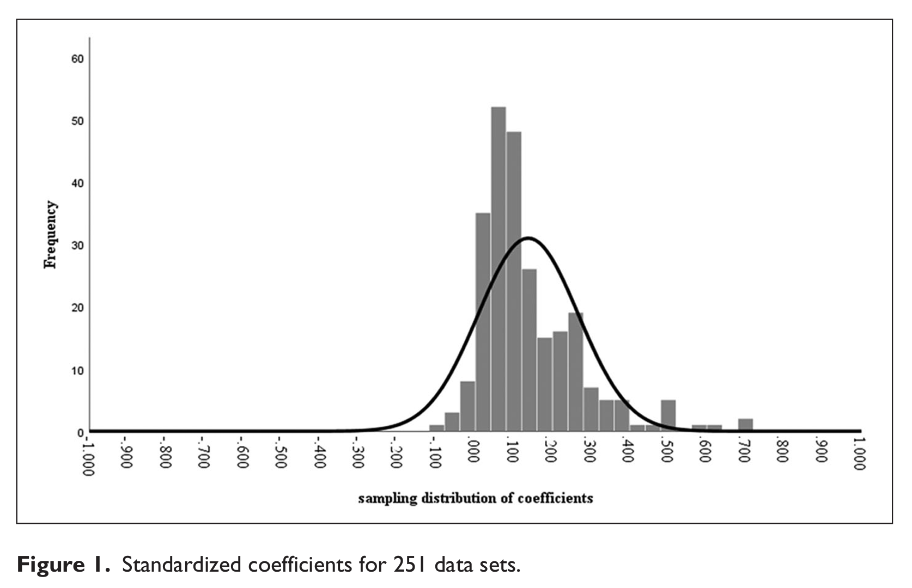
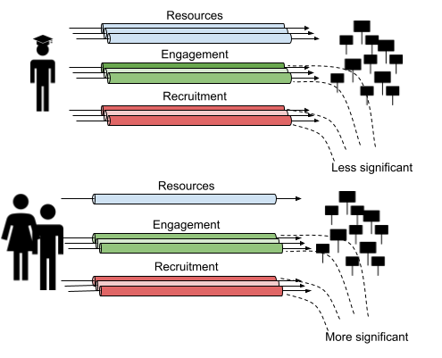

layout: true
<div style="position: absolute;left:60px;bottom:11px;color:gray;"><small><small><small><a href = 'https://fraba.github.io/presentation/2024-GOVT6156/'>fraba.github.io/presentation/2024-GOVT6156 `r icons::fontawesome("link", style = "solid")`</a></small></small></small></div>


```{r setup, include=FALSE, cache=FALSE, message=FALSE}

knitr::opts_chunk$set(echo = TRUE, message = FALSE, warning = FALSE, 
                      dev = 'svg', out.width = "45%", fig.width = 6,
                      fig.align="center")


library(RefManageR)
BibOptions(check.entries = FALSE, 
           bib.style = "authoryear", 
           cite.style = 'authoryear', 
           style = "markdown",
           hyperlink = FALSE, 
           dashed = FALSE,
           no.print.fields = c("urldate","isbn","issn"))
myBib <- ReadBib("assets/biblatex.bib", check = FALSE)
top_icon = function(x) {
  icons::icon_style(
    icons::fontawesome(x),
    position = "fixed", top = 10, right = 10
  )
}

```

---

## Access slides here `r top_icon("link")`

</br></br></br></br></br></br>

.center[.large[[fraba.github.io/presentation/2024-GOVT6156](https://fraba.github.io/presentation/2024-GOVT6156/)]]


</br></br></br></br>

<p style = "font-size: 80px">&nbsp;&nbsp;&nbsp;&nbsp;&nbsp;&nbsp;&nbsp;&nbsp;&nbsp;&nbsp;&nbsp;&nbsp;&nbsp;&swarr;</p>

---

class: segue-red

# Twenty Years of Digital Media Effects on Civic and Political Participation `r Cite(myBib,c("boulianne_Twenty_2020"))`

---

## Digital Media's Impact on Civic and Political Participation 

### Overall Trend
- The relationship between digital media use and offline participation has strengthened over the past 20 years.
- Early studies showed small, positive effects, but more recent research shows substantial positive impacts due to the rise of social networking sites (SNS).

### Data Overview  
- Meta-analysis includes **300+ studies** conducted over a **20-year period**.
- Covers data from **50 countries**, with over **300,000 respondents** across surveys.

---

### Key Findings 
- SNS have played a major role in increasing political participation, particularly through tools like online petitions and grassroots activism.
- The average coefficient for the relationship between digital media use and participation is now around **0.137** (on a scale from -1 to +1).

### Cross-National Comparisons
- The effects of digital media are similar across democratic and non-democratic systems.
- No significant differences in digital media’s impact between countries like the United States and others globally.

---

.center[]

Source: `r Citet(myBib,c("boulianne_Twenty_2020"))` 

---

class: segue-red

# Everyday Making through Facebook Engagement: Young Citizens' Political Interactions in Australia, the United Kingdom and the United States `r Cite(myBib,c("vromenEverydayMakingFacebook2016"))`

---

## Everyday Making and Political Engagement through Social Media

### Changing Nature of Youth Engagement
- Young people's engagement with politics has been evolving towards more personalised, local, and action-oriented forms of civic engagement.
- Move away from conventional politics (voting, party membership) to more digital and everyday practices.
  
---

### Facebook as a Platform
- Facebook serves as a key platform for sharing political information, expressing political views, and mobilising others.
- Use of Facebook for political engagement reflects new norms of engaged citizenship, such as project-based or cause-specific identities `r Cite(myBib,c("bangEverydayMakersExpert2005"))`: 

   - Participation is ad hoc, part-time, and project-specific, not tied to organizational membership.
   - Everyday makers avoid state-sponsored participation and focus on local, lived experiences.
   - They engage in immediate, non-abstract causes without ideological narratives.
   - Participation is driven by personal expression and creativity, often for fun.

---

### Key Findings from the Comparative Study

- **Data**: Survey of young people (aged 16–29) from Australia, UK, and USA (over 1,200 respondents per country).
  - **High Usage**: Over 90% of respondents used Facebook regularly, with many engaging in politics-related activities.
  
- **Forms of Engagement**  
  - Common activities: 'Liking' posts about political issues, sharing political content, and commenting on social or political events.
  - Less frequent activities: Actively encouraging others to vote or take political action.

- **Challenges**  
  Many young people are ambivalent about using Facebook for politics due to fear of conflict, privacy concerns, and the perception that Facebook is primarily for social, not political, interactions.

---

class: segue-red

# Outside the Bubble: Social Media and Political Participation in Western Democracies `r Cite(myBib,c("vaccariOutsideBubbleSocial2021"))`

---

## Social Media and Informal Political Interactions 

### Nonpolitical Spaces and Interactions  
- Most relationships and interactions on social media are nonpolitical, aligning with general disengagement from politics among citizens  `r Cite(myBib,c("dalton_Parties_2002","hibbingStealthDemocracyAmericans2002"))`.  
- Political talk happens informally and often accidentally due to the lack of rigid distinctions between political and nonpolitical spaces `r Cite(myBib,c("wojcieszakOnlineGroupsPolitical2009"))`.

---

### Third Spaces for Everyday Political Talk 
- Scott `r Cite(myBib,c("wrightThirdPlaceThird2012"))` describes social media as "third spaces," where political talk occurs informally and continuously.  
- These spaces expose citizens to political content they may not have otherwise encountered, which can enhance political participation `r Cite(myBib,c("vaccariOutsideBubbleSocial2021"))`.

---

### Accidental Political Exposure and Participation on Social Media

- **Accidental Exposure to Political Content**  
  Social media combines high selectivity with the potential for accidental exposure to political content, which can positively impact political participation `r Cite(myBib,c("vaccariOutsideBubbleSocial2021"))`.  
  - Engaging with like-minded viewpoints, encountering political news, and receiving mobilization messages are experiences that can encourage participation.

- **Mobilization and Participation**  
  Mobilization efforts, whether from political actors or citizens, help integrate users into networks of political action.  
  - This can have long-term effects on users' ability to participate politically, potentially narrowing participation gaps between more and less involved citizens `r Cite(myBib,c("vaccariOutsideBubbleSocial2021"))`.

---

class: segue-red

# Levelling at the Margin: Personal Networks, Social Capital and the Internet in the Mobilisation of the Five Star Movement `r Cite(myBib,c("bailo_Levelling_2023"))`


---

## Internet Affordances and Political Participation: A Case Study of the Five Star Movement  

- *Based on the "Internet-as-equaliser" hypothesis*:

  - Does the Internet reduces the participatory gap? And **how**?

---

## Background: Political Participation and Inequality 

- **Political Equality vs. Participation Gaps**  
  Democratic systems grant equal rights, but participation is unequal.
  
- Why?  
  
- **Civic Voluntarism Model `r Cite(myBib,c("verbaVoiceEqualityCivic1995"))`** .
  Factors influencing participation:  
  - Resources: Time, money, civic skills  
  - Engagement: Political interest, efficacy  
  - Recruitment: Social capital networks

---

## Internet as an Equaliser Hypothesis

- **Key Idea**: Internet affordances help close participatory gaps caused by socioeconomic disparities.

- **Case Study**: The Five Star Movement (M5S) in Italy, using digital technologies for political mobilisation.

---

## Theoretical Framework

- **Civic Voluntarism Model (CVM)**  
  Three dimensions affecting political participation:  
  - Resources  
  - Engagement  
  - Recruitment

  
---

## Participation Bandwidth Model

- **Key Idea**: Internet affordances expand participation bandwidth.  
  - H1: Low-education individuals and women have fewer participatory resources.
  - H2: Internet affordances increase demographic diversity in political movements.
  - H3-H5: The internet and news compensate for limited resources and social capital.

---

.center[]

---

## Case Study: The Five Star Movement (M5S)

- **Founded**: 2009 by Beppe Grillo and Gianroberto Casaleggio.
- **Key Features**:  
  - Digital platforms like Meetup and "Rousseau" used for organising.
  - Strong focus on digital participation and mobilisation.

---

## Methodology

- **Data Sources**:  
  - General population surveys (2005, 2013, 2020).
  - M5S-specific surveys (2013, 2020).
- **Key Variables**:  
  - Demographics: Education, gender, social capital.
  - Internet Affordances: Importance of online interactions, content.
  - Civic Associations: Ties to political and non-political groups.

---

## Findings on selected hypothesis: Demographic Diversification 

| **Hypothesis** | **Result** | **Description** |
|----------------|------------|-----------------|
| **H1**: Women and low-education individuals have access to fewer resources for political participation. | Supported | Education and gender are significant predictors of access to participation resources (money, civic skills, time). Women and low-education individuals report fewer resources across multiple dimensions. |

---

| **Hypothesis** | **Result** | **Description** |
|----------------|------------|-----------------|
| **H3**: Participants with fewer resources rely more on the Internet for engagement and recruitment. | Supported | The Internet plays a more important role in recruitment and engagement for women and low-education participants. This effect is more pronounced locally for low-education individuals. |
| **H4**: Lack of ties to civic associations amplifies the role of the Internet for recruitment. | Supported | Participants with no ties to civic associations rely more on Internet-mediated recruitment, especially for women and low-education individuals. Local online interactions are particularly significant. |


---

## Conclusion: Impact of Digital Affordances

- **Final Thoughts**:  
  The internet helped diversify political participation, particularly for those with fewer social resources.
- **Limitations**:  
  The M5S is a unique case due to its strong digital focus and charismatic leadership.

---

class: segue-red

# Bibliography

---

.small[

```{r, results = "asis", echo=FALSE}
PrintBibliography(myBib, end = 5)
```

]

---

.small[

```{r, results = "asis", echo=FALSE}
PrintBibliography(myBib, start = 6)
```

]

