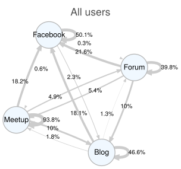
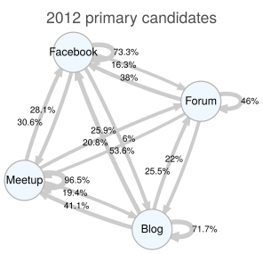
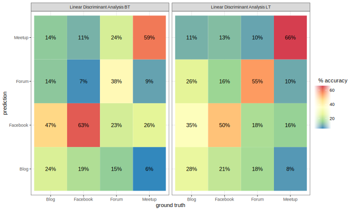
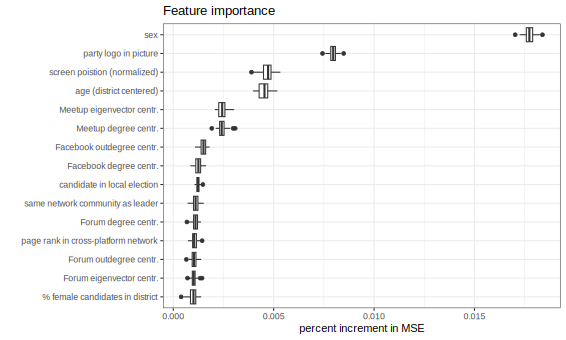

layout: true
<div style="position: absolute;left:60px;bottom:11px;color:gray;"><small><small><small><a href = 'https://fraba.github.io/presentation/2024-ICA/'>fraba.github.io/presentation/2024-ICA `r icons::fontawesome("link", style = "solid")`</a></small></small></small></div>


```{r setup, include=FALSE, cache=FALSE, message=FALSE}

knitr::opts_chunk$set(echo = TRUE, message = FALSE, warning = FALSE, 
                      dev = 'svg', out.width = "45%", fig.width = 6,
                      fig.align="center")


library(RefManageR)
BibOptions(check.entries = FALSE, 
           bib.style = "authoryear", 
           cite.style = 'authoryear', 
           style = "markdown",
           hyperlink = FALSE, 
           dashed = FALSE,
           no.print.fields = c("urldate","isbn","issn"))
myBib <- ReadBib("assets/biblatex.bib", check = FALSE)
top_icon = function(x) {
  icons::icon_style(
    icons::fontawesome(x),
    position = "fixed", top = 10, right = 10
  )
}

```

---

## Access slides here `r top_icon("link")`

</br></br></br></br></br></br>

.center[.large[[fraba.github.io/presentation/2024-ICA](https://fraba.github.io/presentation/2024-LUISS/)]]


</br></br></br></br>

<p style = "font-size: 80px">&nbsp;&nbsp;&nbsp;&nbsp;&nbsp;&nbsp;&nbsp;&nbsp;&nbsp;&nbsp;&nbsp;&nbsp;&nbsp;&swarr;</p>

---

## Acknowledgement of Country

I would like to acknowledge the Traditional Owners of Australia and  recognise their continuing connection to land, water and culture. This venue is located on the land of the Yugambeh people. I pay my respects to their Elders, past and present.

---

class: segue-red

# Case

---

# The M5S and the Internet

- The M5S, established in 2009, has significantly disrupted Italian politics by blending techno-utopian and populist ideologies to advocate for **direct democracy via online participation**, challenging traditional representative systems. 

- It promoted the use of technology to empower ordinary citizens, emphasizing the Internet's role in **decentralizing authority**<sup>1</sup> and believes in the **expertise of common citizens**, showcased through its innovative online-only primary elections in December 2012. 


.small[.small[[1] Note that the decentralizing rethoric was about both external and internal (to the party) democracy.]]


---

### Five Platforms for Different Party Functions

1. Beppe Grillo's personal **blog** served as both the voice of the party's central strategy and his personal commentary, **establishing the party's goals**.

2. **Meetup.com** was crucial for mobilizing local grassroots groups and organizing events on national and local issues, acting as the **hub for territorial engagement and mobilization**. 

3. The M5S **Forum** provided a space for members to **engage in deliberations** and propose ideas, fostering a community of online discussion. 

4. **Facebook** extended the reach of the party's messages and blog content to a broader audience, **enhancing communication channels**. 

5. The **e-voting platform** for the 2012 primaries was instrumental in the elite selection process within the M5S, **showing the party's innovative approach** to member participation and candidate selection.

---
class: segue-red

# The paper


---

- This paper is co-authored with **Francesco Marolla** (Università degli Studi di Milano), **Marilù Miotto** (Erasmus University Rotterdam) and **Giovanni Cassani** (Tilburg University) and is based on our research published in:

  - Bailo, F. (2020). *Online Communities and Crowds in the Rise of the Five Star Movement*. Cham: Palgrave Macmillan. DOI: [10.1007/978-3-030-45508-8](http://link.springer.com/10.1007/978-3-030-45508-8).
  
  - Marolla, F., A. Maineri, J. Tagliabue and G. Cassani (2023). "Voting, Fast and Slow: Ballot Order and Likeability Effects in the Five-Star Movement's 2012 Online Primary Election". In: *Contemporary Italian Politics* 0.0, pp. 1-18. DOI: [10.1080/23248823.2023.2175124](https://doi.org/10.1080/23248823.2023.2175124).

.content-box-purple[

For a copy of the paper: francesco.bailo@sydney.edu.au

]

---

class: segue-red

# Data

---

## Data

- **Social Media Data**. Data was gathered by scraping the Blog and Forum, and through public APIs for Meetup.com and Facebook, focusing on M5S-related Meetup groups, Beppe Grillo's page, the Five Star Movement's page, and pages of 944 M5S leaders identified via snowball sampling.

- **E-voting Data**. The dataset, scraped from the e-voting platform used for the 2012 online primaries of the M5S, includes each candidate's personal and electoral details, combined with their historical electoral performance at various administrative levels in Italy from 2007 to 2012.

---
class: segue-red

# Approach

---

### Theory of Affordances and Network Analysis 

- Using an affordance approach, different platforms are theorized to offer varying degrees of **visibility** and **associability**, which in turn influence different organizational outcomes. 

- Utilizing **network analysis** of users' interactions across postings and replies and **topic modelling** to map the the content of their discussions

- To **measure** the implications of platform-specific affordances on organizational outcomes.

.center[]


---
class: segue-red

# Social Media Affordances: Visibility and Associability

---

### Social Media Affordances

Drawing from `r Citet(myBib,c("treem_Social_2013"))` and `r Citet(myBib,c("kim_Observation_2022"))`, we focus on and operationalize the measurement of two social media affordances:


.content-box-yellow[

**Visibility** is the property that allows users and their content **to see and be seen** within a social media platform.

]

.content-box-green[

**Associability** is the property allowing users **to associate themselves** within a social media platform with other users and with content (e.g. news, stories, photos)

]


---

### Platforms can Afford Visibility and Associability, locally and globally


.pull-left[

.content-box-purple[

**Local** visibility and associability, allowing communication among a relatively **small but dense** network of users.

]

```{r echo = F, out.width='70%'}
require(igraph)

g <- 
  igraph::sample_gnp(15, 5/20, directed=TRUE) %du% 
  igraph::sample_gnp(15, 5/20, directed=TRUE) %du% 
  igraph::sample_gnp(15, 5/20, directed=TRUE)

g <- add_edges(g, c(1,11, 2,12, 6,25, 21, 32, 35, 8))

par(mar=c(0,0,0,0))
plot(g,
     vertex.size=5, 
     vertex.label=NA,
     edge.width=1,                                
     edge.arrow.size=.4,                      
     edge.arrow.width=.9)

```

]

.pull-right[

.content-box-red[

**Global** visibility and associability, allowing a user to communicate with a relatively **large but sparse** network of users.

]

```{r echo = F, dev = 'svg', out.width='70%'}
require(igraph)

g <- 
  sample_pa(85, power=1.5, m=2)

par(mar=c(0,0,0,0))
plot(g,
     vertex.size=5, 
     vertex.label=NA,
     edge.width=1,                                
     edge.arrow.size=.3,                      
     edge.arrow.width=.6)

```

]

---
class: segue-red

# Hypotheses

---

- The varied functionalities of the M5S's digital platforms have significantly influenced the movement's internal dynamics.

.content-box-yellow[

We characterize the differences in terms of overall **communication orientation**, **affordances** and **outcomes** among the platforms under study. 

]


- We expect two communication orientations: 

  1. The **top-down** orientation of the Blog and Facebook.com is characterized by **limited or absent bottom-up communication** feedback and will result in a **centripetal tendency** with attention highly concentrated on the leadership. 
  
  2. The **horizontal** orientation of the Forum and Meetup.com will result in **centrifugal tendencies** with relatively **low attention diffused across small communities** of users.

---

### Expected Orientations, Affordances and Outcomes Across M5S Digital Platforms

```{r, echo=FALSE, results='asis'}
xfun::file_string('affordances-outcomes-table.html')
```


---

### Hypotheses

.content-box-yellow[

1. **Platform difference hypothesis**: Using key properties of the network of users interacting within each platform, we measure the platform affordances listed in the previous table to substantiate our **hypothesis of significant cross-platform differences**.

2. **Platform fragmentation hypothesis**: We investigate the degree of cross-platform integration under the assumption that **platform boundaries limit cross-platform communication**.

3. **Platform centrality hypothesis**: Using user metrics from different networks, we investigate whether the primary candidates' position and behavior within the four platforms can **predict primary results** under the hypothesis that platform centralities and proximity to the leadership might have helped candidates to obtain more preferences.

]

---

class: segue-red

# Methods

Topic Modelling

Platform Networks (user-to-user, topic-to-topic, topic-to-user)

Measuring Affordances Using Network Analysis

Modelling Primary Results


---

class: segue-yellow

# Measuring Affordances Using Network Analysis


---


### Measuring Affordances Using Network Analysis

We propose to use *four network metrics* to measure  

* **Visibility**, and

* **Associability**


on two scales:

* on a **local scale**, and

* on a **global scale**

|            | **Visibility**                   | **Associability**       |
|------------|----------------------------------|-------------------------|
| **Local**  | Link reciprocity ratio           | Link transitivity ratio |
| **Global** | SD of the in-degree distribution | Mean node distance      |


---


class: segue-yellow

# Modeling Primary Results

---

### Modeling Primary Results


- To **model the ranking of candidates** in the 2012 online primaries (we didn't have access direct vote counts), we utilized data from 

  - the e-voting and 
  
  - social media platforms, 
  
      - including network centrality, 
    
      - network closeness to Beppe Grillo, 
    
      - topic heterogeneity, and the 
    
      - similarity between each candidate's and Grillo's topic distributions. 

- Due to the high collinearity among predictors, random forests (RFs) were chosen for their ability to handle non-linear relationships and collinear variables by **randomly selecting a subset of predictors** for each decision tree. 

---
class: segue-red

# Results

Cross-Platform Affordances

Cross-Platform Integration

What Predicts Ranking in the M5S 2012 Online Primary Elections?


---

class: segue-yellow

# Cross-Platform Affordances

---

### Affordances measurement based on the networks of users within each platform

```{r, echo=FALSE, results='asis'}
xfun::file_string('affordances-measurements-table.html')
```

.small[.small[[1] Meetup visibility measures are unavailable as we collected no visibility proxy metric. [2] Facebook affordance measurements are limited by the lack of likes to comments.]]

---

## Cross-platform affordances


- We find **two distinct classes of platforms**:

    - Meetup.com and the Forum facilitate local and horizontal communication, while 
    - the Blog and Facebook.com enable global, top-down communication. 

- The Forum and Meetup.com are noted for their **strong local visibility and associability**, with the Forum having a notable rate of reciprocated ties and closed triplets, and Meetup.com showing high local associability with a significant percentage of closed triplets but limited global reach. 

- Conversely, Facebook.com and the Blog, despite their different functionalities, both foster **global visibility and associability with minimal local interaction**, positioning them as centralizing forces within the movement, directing attention towards leadership.


---

class: segue-yellow

# Cross-Platform Integration

---

### For the platform of users' first activity, the proportion users active at least a second time

.pull-left[
.center[]
]

.pull-right[
.center[]
]

---

### Cross-platform integration

- Although cross-platform activity exists, we note **significant barriers to crossing platform boundaries**: 

    - The proportion of users active a second time on a different platform is always a fraction of those active again on the same platform. 
    
- We also note that the two centrifugal platforms, the Forum and Meetup.com tend to see a higher proportion of their users moving to the other platforms while the Blog and especially Facebook.com, significantly less so. Likely, this is because of differences in terms of audiences.

---

### Classification of documents published in December 2012 into a platform based on topic weights 

.center[]


---

## Cross-platform integration

- Based on the classifiers' confusion matrix presented before, we infer **some degree of fragmentation** in the discussion. 

- We can then conclude that **cross-platform participation and discussions are limited** even if not absent.


---

class: segue-yellow

# What predicts ranking in the M5S 2012 Online Primary elections?

---

### Percent increment in Mean Squared Error when removing each variable

.center[]

<small><small>Larger values indicate the model gets worse when a variable is removed, and thus that the variable is more important for accurate predictions.</small></small>

---

### What predicts ranking in the M5S 2012 Online Primary elections?

- Variables available to the voters through the interface of
the voting platform (e.g. screen position, gender) are consistently more important.

- Candidates with higher eigenvector centrality on Meetup.com compared to other competitors in the district tend to rank better. 

- Candidates not in the leader's community appear to receive a moderate boost and rank better.

- Degree centrality on the Forum shows a penalty for candidates who were not on the Forum, with little variation relating to activity. 

- Page rank of a user in the cross-platform network shows a benefit for more active candidates.

---
class: segue-red

# Conclusions

---

### Findings

- M5S' **horizontal platforms** (Meetup.com and Forum) afford greater local visibility and associability, aligning with our expectations about their fostering of grassroots initiatives and networking. 

- In contrast, **top-down platforms** (Blog and Facebook.com) reported a greater potential in connecting users to the broader M5S network.

- Prioritizing presence and **engagement on horizontal platforms** (especially Meetup.com) could have been the **optimal strategy for candidates** aiming to rise within the M5S ranks and not engagement on top-down platforms.


- And yet the strategic utility of platforms for M5S candidates could vary with the evolution of the Movement trajectory within the Italian political landscape: **Top-down platforms' global affordances could become crucial** for MPs to consolidate their power positions in the later stages of the M5S, where a party in public office (Mair and Katz, 2002) established. 

---

### Findings 

1. Contrary to previous research on digital parties, including the M5S, **we find no confirmation of centripetal tendencies in candidates' selection**. 

  - Active engagement in platforms closer to the grassroots yielded higher electoral rewards ...
  
  - But not closeness to the leadership.

2. And yet, **variables measuring candidates' platform engagement** contributed to a **relatively small portion of the explained variance** compared to the information about candidates presented to voters through the interface of the voting platform, such as gender, age, and on-screen position.

  - This suggests that even in the presence of centrifugal tendencies, top-down hierarchical control can be exercised through apparently small design choices.


---

class: segue-red

# Bibliography

---

.small[

```{r, results = "asis", echo=FALSE}
PrintBibliography(myBib)
```

]


