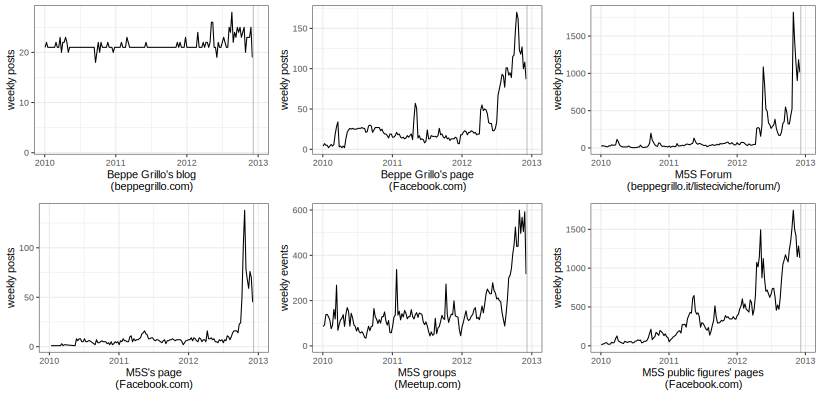
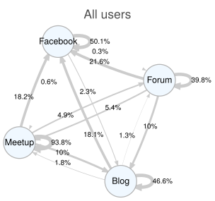
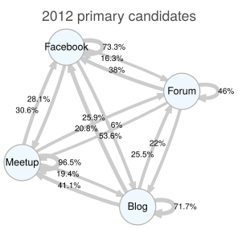
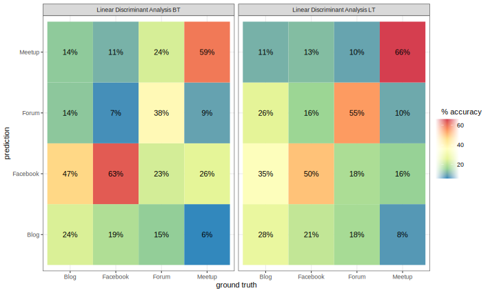
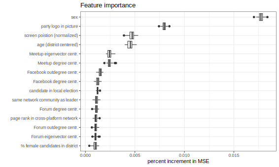

```{r setup, include=FALSE}

knitr::opts_chunk$set(echo = TRUE, message = FALSE, warning = FALSE, 
                      dev = 'svg', out.width = "45%", fig.width = 6,
                      fig.align="center")

require(fontawesome)

```


---


- This paper is co-authored with **Francesco Marolla** (Università degli Studi di Milano), **Marilù Miotto** (Erasmus University Rotterdam) and **Giovanni Cassani** (Tilburg University). 

- The paper is currently under peer-review. 

- It was accepted for presentation at 2024 Annual Conference of the **International Communication Association** (*Political Communication* division). 

---

## Introduction

- Leveraging **digital platforms for internal organization and campaigning**, the Italian Five Star Movement (M5S) exemplifies the transformative power of digitalization in politics.

- This digital strategy shaped the M5S **internal dynamics** and established the M5S as a leading example of an Internet-centered political mobilization and party.

- Yet, we know little about what adopting **multiple Internet platforms** by the same political organization means for its **community's cohesion** and **intra-party dynamics**.

.center[]


---

## Online Ecosystems of Political Movements: A Multi-Platform Perspective

- Political movements do not confine their online presence to a single platform: they span across multiple platforms, each selected for its **unique user affordances** and the distinct **organizational outcomes** they facilitate.

- Employing data from four social media platforms (Beppe Grillo’s Blog, Meetup.com, the members’ Forum, and Facebook.com), we examine **structural variances** within the M5S multi-platform online ecosystem and how these differences correlate with **voting behaviors** in the online  primaries of 2012.


.center[]

---

## Theory of affordances and network analysis 

- Using an affordance approach, different platforms are theorized to offer varying degrees of **visibility** and **associability**, which in turn influence different organizational outcomes. 

- Utilizing **network analysis** of users’ interactions across postings and replies and **topic modelling** to map the the content of their discussions, the study measures the implications of platform-specific affordances on the organization and dynamics of political movements, offering new insights into digital political engagement.

.center[]

---

## Findings

- **Structural Differences**: Identified within the multi-platform ecosystem of M5S.

- **Visibility and Associability**: Different platforms offer varying degrees of these affordances, affecting organizational outcomes.
  - Meetup.com and the Forum: Higher *local* visibility and associability.
  - The Blog and Facebook.com: Higher *global* visibility and associability.
  
- **Influence on Voting**: Platforms' boundaries influence cross-platform activity and intra-platform communication.
  - Network centrality within Meetup.com had a stronger predictive power for the 2012 online primaries results.

---

## Centrifugal vs. Centripetal Theories in Digital Politics

- Different theories contend that digital technologies may either decentralize (**centrifugal**) or centralize (**centripetal**) political party operations.

.pull-left[]

.pull-right[]


---

###  Centrifugal Theories

Digital technologies strengthen democracy by reducing barriers to participation and need for strong organizational capabilities. They also,

1. **Enhance democracy and political action** (Farrell, 2012) by 

  - increasing electoral competition, 
  - providing new opportunities for mobilization (Norris, 2001), and 
  - reducing communication and participation costs (Deseriis, 2021).
  
2. **Improve participation within political parties** by 

  - creating transparent, participatory, and non-hierarchical processes, 
  - empowering party members and undermine leadership, 
  - enabling connective action (Bennett & Segerberg, 2012), which is based on horizontal structures for political engagement, 
  - facilitating recruitment and publicity in organized networks while fostering inclusivity and community-building in hybrid networks (Caraway, 2016).

---

### Centripetal Theories

Skeptical on whether incorporating digital technologies in politics leads to decentralization. 

1. Between the late 2000s and early 2010s, parties leveraged digital technologies for cost-effective campaigning and administrative services rather than for flattening their hierarchies (Gibson & Ward, 2009). 

2. Digital technologies do not necessarily encourage internal participation (Gibson & Ward, 2009). 

3. The democratizing potential of digital tools can be undermined by attempts of party elites to control decision-making, paving the way for forms of 'reactive democracy' where members merely ratify top-down decisions (Deseriis, 2021; Gerbaudo, 2019).

.center[]

---

## Social Media Affordances

> **Social media affordances** are defined as perceived actual or imagined properties of social media, emerging through the relation of technological, social and contextual that enables and constrains specific uses of the platforms. .right[-- <cite>Ronzhyn et al., 2022, p. 14</cite>] 


.center[]

---

## Social Media Affordances

.center[]

.content-box-yellow[
- We argue that in the context of collective action and political organization, the predominance of centrifugal or centripetal tendencies is determined by the **platform’s specific affordances**. 

- We also argue that centrifugal and centripetal tendencies can **coexist** within a multi-platform ecosystem.
] 

---

## Social Media Affordances


.pull-left[

.center[
## Visibility 
]]

.pull-left[

.center[
## Associability
]]

---

## Visibility 

.content-box-yellow[
Visibility is the property that allows users and their content to see and be seen within a social media platform.
]

.center[]

---

## Associability 

.content-box-yellow[
Associability is the property allowing users to associate themself within a social media platform with other users and with content (e.g. news, stories, photos)]

.center[]

---

```{r}
require(igraph)
g <- make_full_graph(10, directed = T) %du% 
  make_full_graph(10, directed = T) %du% 
  make_full_graph(10, directed = T)
g <- add_edges(g, c(1,6, 2,7, 1,11, 6, 11)*2)
```


---

### Comparison of Affordances and Outcomes Across M5S Digital Platforms

```{r, echo=FALSE, results='asis'}
xfun::file_string('affordances-outcomes-table.html')
```


---

### Activity frequency between 2010-2012 on the four target social media platforms



---

### Affordances measurement based on the networks of users within each platform

```{r, echo=FALSE, results='asis'}
xfun::file_string('affordances-measurements-table.html')
```

.footnote[[1] Meetup visibility measures are unavailable as we collected no visibility proxy metric. [2] Facebook affordance measurements are limited by the lack of likes to comments.]

---

### Activity frequency between 2010-2012 on the four target social media platforms

.pull-left[
.center[]
]

.pull-right[
.center[]
]

---

### Classification of documents published in December 2012 into a platform based on topic weights 

.center[]

---

### Variance explained and 𝚫 with respect to immediately simpler models 

```{r, echo=FALSE, results='asis'}
xfun::file_string('variance-explained-table.html')
```

<small>Sets of predictors capturing conceptually related aspects were entered together and kept when the variance explained improved (positive 𝚫s). Each RF model was run 100 times to derive robust estimates.</small>

.footnote[[1] We report results for the network measures extracted from the giant component of the cross-platform user network. Measures extracted from the user-location, user-organization, and user-person networks did not afford better predictions when combined with network measures extracted from the cross-platform user network.]

---

### Percent increment in Mean Squared Error when removing each variable

.center[]

<small><small>Larger values indicate the model gets worse when a variable is removed, and thus that the variable is more important for accurate predictions.</small></small>
