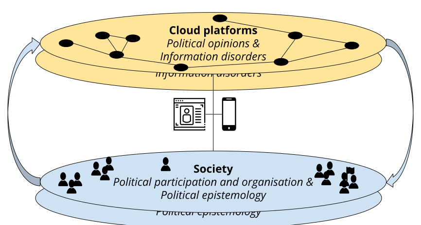
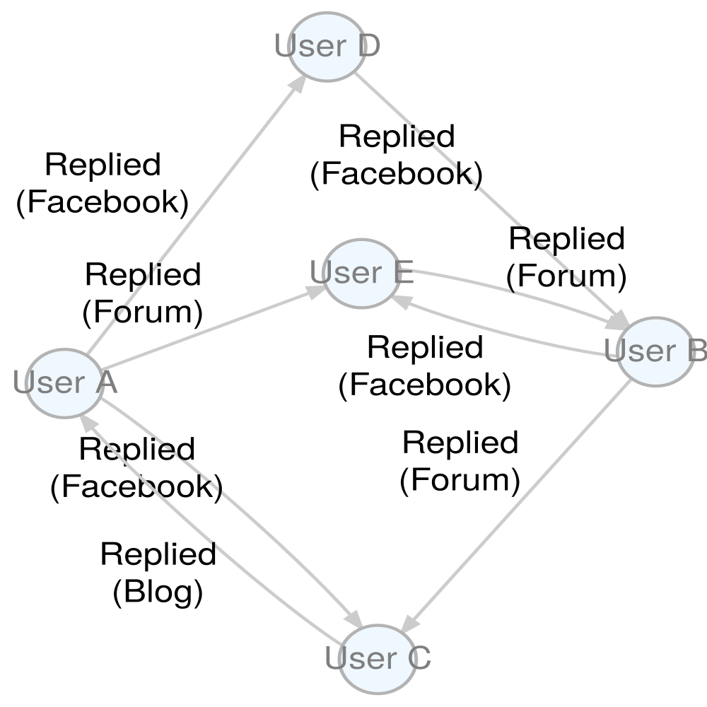
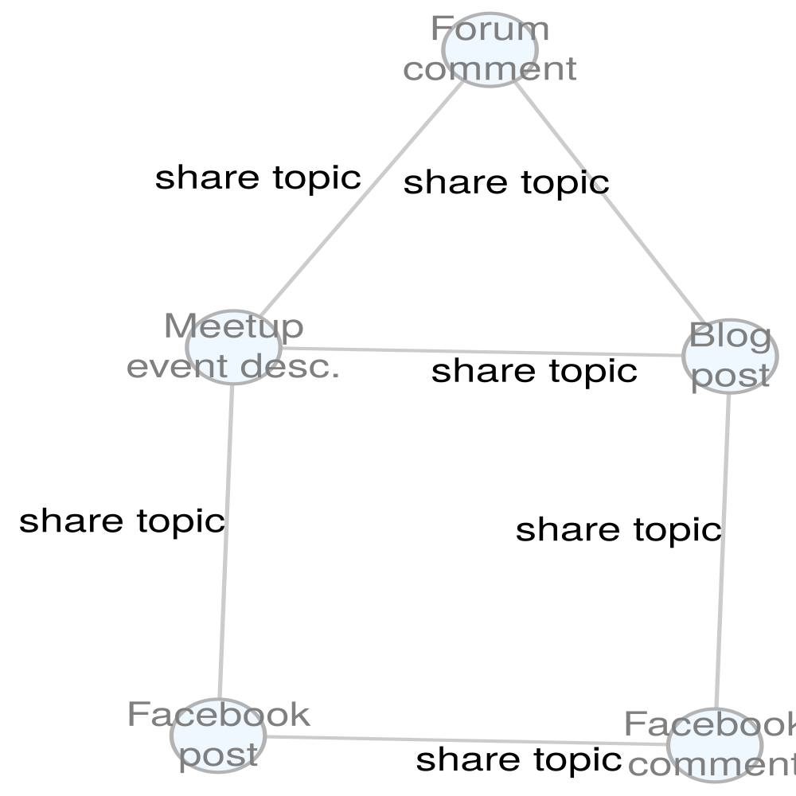
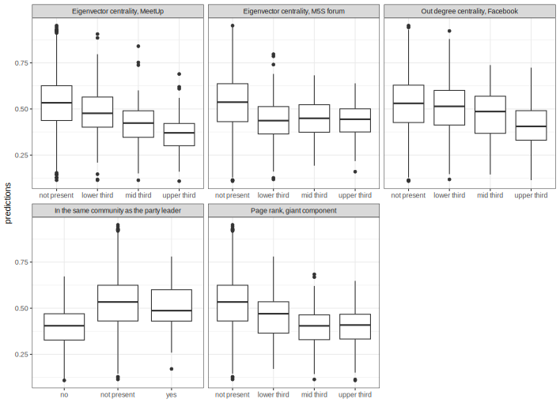

layout: true
<div style="position: absolute;left:60px;bottom:11px;color:gray;"><small><small><small><a href = 'https://fraba.github.io/presentation/2024-LUISS/'>fraba.github.io/presentation/2024-LUISS `r icons::fontawesome("link", style = "solid")`</a></small></small></small></div>


```{r setup, include=FALSE, cache=FALSE, message=FALSE}

knitr::opts_chunk$set(echo = TRUE, message = FALSE, warning = FALSE, 
                      dev = 'svg', out.width = "45%", fig.width = 6,
                      fig.align="center")


library(RefManageR)
BibOptions(check.entries = FALSE, 
           bib.style = "authoryear", 
           cite.style = 'authoryear', 
           style = "markdown",
           hyperlink = FALSE, 
           dashed = FALSE,
           no.print.fields = c("urldate","isbn","issn"))
myBib <- ReadBib("assets/biblatex.bib", check = FALSE)
top_icon = function(x) {
  icons::icon_style(
    icons::fontawesome(x),
    position = "fixed", top = 10, right = 10
  )
}

```

---

## Access slides here `r top_icon("link")`

</br></br></br></br></br></br>

.center[.large[[fraba.github.io/presentation/2024-LUISS](https://fraba.github.io/presentation/2024-LUISS/)]]


---

### How does this paper fit in my research agenda


My current and future research is grounded in two lines of research:

.content-box-yellow[

1\. **Emergence, interaction, and diffusion of political opinions online**;

]

.center[]

.content-box-blue[

2\. **Impacts of social media technologies and services on political participation and organisation**.

]

---

### Lines of research

<small>

.content-box-yellow[

#### 1. Emergence, interaction, and diffusion of **political opinions** online
* Cross-disciplinary research: Digital ethnography, Computer science and Political science. 
* Loops involving Qualitative, Quantitative & Computational methods.
* **Key concepts**: Cloud platforms, Information disorder. 
  
]

.content-box-blue[  
  
#### 2. Impact of social media technologies and services on **political participation and organisation**
* Political science research: Parties, Movements, Campaigns and Elections.
* Qualitative, Quantitative & Computational methods.
* **Key concepts**: Discontent, Turbulence, Centralization/Decentralization 

]

</small>

---

```{r echo=F}
RefManageR::NoCite(myBib, 
                   c("bailoInstitutionalImpactsAlgorithmic2021",
                     "kongSlippingExtremeMixed2022",
                     "bailo_Riding_2024",
                     "johns_Labelling_2024",
                     "bailoOnlineCommunitiesCrowds2020",
                     "tronconi_Other_2024",
                     "bailo_Levelling_2024",
                     "bailo_Breaking_2004"
                     ))

```


### Publications

.content-box-yellow[

#### 1. Emergence, interaction, and diffusion of **political opinions** online

<small>
```{r, results = "asis", echo=FALSE}
PrintBibliography(myBib[title = "institutional"])
```

```{r, results = "asis", echo=FALSE}
PrintBibliography(myBib[title = "extreme"])
```

```{r, results = "asis", echo=FALSE}
PrintBibliography(myBib[title = "riding"])
```

```{r, results = "asis", echo=FALSE}
PrintBibliography(myBib[title = "labelling"])
```

</small>

]

---

### Publications

.content-box-blue[

#### 2. Impact of social media technologies and services on **political participation and organisation**

<small>

```{r, results = "asis", echo=FALSE}
PrintBibliography(myBib[title = "communities"])
```

*Currently under review or in progress*

```{r, results = "asis", echo=FALSE}
PrintBibliography(myBib[title = "other side"])
```

```{r, results = "asis", echo=FALSE}
PrintBibliography(myBib[title = "breaking"])
```

```{r, results = "asis", echo=FALSE}
PrintBibliography(myBib[title = "levelling"])
```

</small>

And the paper I am about to present today...

]
---

```{r echo = F}

RefManageR::NoCite(myBib, c("marollaVotingFastSlow2023","bailoOnlineCommunitiesCrowds2020"))

```

## Affording Fragmented Audiences: Multi-Platform Deliberation Within the Five Star Movement

<small>

- This paper is co-authored with **Francesco Marolla** (Università degli Studi di Milano), **Marilù Miotto** (Erasmus University Rotterdam) and **Giovanni Cassani** (Tilburg University) and is based on our research published in:

  - Bailo, F. (2020). *Online Communities and Crowds in the Rise of the Five Star Movement*. Cham: Palgrave Macmillan. DOI: [10.1007/978-3-030-45508-8](http://link.springer.com/10.1007/978-3-030-45508-8).
  - Marolla, F., A. Maineri, J. Tagliabue and G. Cassani (2023). "Voting, Fast and Slow: Ballot Order and Likeability Effects in the Five-Star Movement's 2012 Online Primary Election". In: *Contemporary Italian Politics* 0.0, pp. 1-18. DOI: [10.1080/23248823.2023.2175124](https://doi.org/10.1080/23248823.2023.2175124).


- The paper is currently under peer-review. 

- It was accepted for presentation at 2024 Annual Conference of the **International Communication Association** (*Political Communication* division). 

</small>

---

### Introduction

- Leveraging **digital platforms for internal organization and campaigning**, the Italian Five Star Movement (M5S) exemplifies the transformative power of digitalization in politics.

- This digital strategy shaped the M5S **internal dynamics** and established the M5S as a leading example of an Internet-centered political mobilization and party.

- Yet, we know little about what adopting **multiple Internet platforms** by the same political organization means for its **community's cohesion** and **intra-party dynamics**.

.center[]

---

### Online Ecosystems of Political Movements: A Multi-Platform Perspective

- Political movements do not confine their online presence to a single platform: they span across multiple platforms, each selected for its **unique user affordances** and the distinct **organizational outcomes** they facilitate.

- Employing data from four social media platforms (Beppe Grillo’s Blog, Meetup.com, the members’ Forum, and Facebook.com), we examine **structural variances** within the M5S multi-platform online ecosystem and how these differences correlate with **voting behaviors** in the online  primaries of 2012.


.center[]

---

### Theory of Affordances and Network Analysis 

- Using an affordance approach, different platforms are theorized to offer varying degrees of **visibility** and **associability**, which in turn influence different organizational outcomes. 

- Utilizing **network analysis** of users’ interactions across postings and replies and **topic modelling** to map the the content of their discussions, the study measures the implications of platform-specific affordances on the organization and dynamics of political movements, offering new insights into digital political engagement.

.center[]

---

### Main Findings

- **Structural Differences**: Identified within the multi-platform ecosystem of M5S.

- **Visibility and Associability**: Different platforms offer varying degrees of these affordances, affecting organizational outcomes.
  - Meetup.com and the Forum: Higher *local* visibility and associability.
  - The Blog and Facebook.com: Higher *global* visibility and associability.
  
- **Influence on Voting**: Platforms' boundaries influence cross-platform activity and intra-platform communication.
  - Network centrality within Meetup.com had a stronger predictive power for the 2012 online primaries results.

---
class: segue-red

# Theoretical Approach

Centrifugal vs. Centripetal Theories in Digital Politics

Social Media Affordances: Visibility and Associability

Social Media Outcomes

---
class: segue-yellow

# Centrifugal vs. Centripetal Theories in Digital Politics

---

### Centrifugal vs. Centripetal Theories in Digital Politics

.content-box-red[

Different theories contend that *digital technologies* may either **decentralize** or **centralize** political party operations.

]


.pull-left[.center[**Centrifugal theories** ]]

.pull-right[.center[**Centripetal theories** ]]


---

.content-box-yellow[

###  Centrifugal Theories

Digital technologies strengthen democracy by reducing barriers to participation and need for strong organizational capabilities. They also,

<small>

1. **Enhance democracy and political action** `r Citep(myBib,"farrellConsequencesInternetPolitics2012")` by 

  - increasing electoral competition, 
  - providing new opportunities for mobilization `r Citep(myBib,"norrisDigitalDivideCivic2001a")`, and 
  - reducing communication and participation costs `r Citep(myBib,"deseriisRethinkingDigitalDemocratic2021")`.
  
2. **Improve participation within political parties** by 

  - creating transparent, participatory, and non-hierarchical processes, 
  - empowering party members and undermine leadership, 
  - enabling connective action `r Citep(myBib,"bennettLogicConnectiveAction2012")`, which is based on horizontal structures for political engagement, 
  - facilitating recruitment and publicity in organized networks while fostering inclusivity and community-building in hybrid networks `r Citep(myBib,"carawayOURWalmartCase2016")`.

</small>

]
---

.content-box-blue[

### Centripetal Theories

Skeptical on whether incorporating digital technologies in politics leads to decentralization. 

1. Between the late 2000s and early 2010s, parties leveraged digital technologies for **cost-effective campaigning** and **administrative services** rather than for flattening their hierarchies `r Citep(myBib,"gibson_Parties_2009")`. 

2. Digital technologies **do not necessarily encourage internal participation** `r Citep(myBib,"gibson_Parties_2009")`. 

3. The democratizing potential of digital tools can be undermined by attempts of **party elites to control decision-making**, paving the way for forms of 'reactive democracy' where members merely ratify top-down decisions `r Citep(myBib,c("deseriisRethinkingDigitalDemocratic2021","gerbaudoDigitalPartyPolitical2019"))`.

]

---
class: segue-yellow

# Social Media Affordances: Visibility and Associability

---

### Social Media Affordances

> Social media affordances are defined as **perceived actual or imagined properties of social media**, emerging through the **relation of technological, social and contextual** that **enables and constrains** specific uses of the platforms. .right[-- <cite>`r Citet(myBib,c("ronzhyn_Defining_2022"))`</cite>] 


.center[]

---

### Social Media Affordances

.center[]

.content-box-yellow[
- We argue that in the context of collective action and political organization, the predominance of centrifugal or centripetal tendencies is determined by the **platform’s specific affordances**. 

- We also argue that centrifugal and centripetal tendencies can **coexist** within a multi-platform ecosystem.
] 

---

### Social Media Affordances


Drawing from `r Citet(myBib,c("treem_Social_2013"))` and `r Citet(myBib,c("kim_Observation_2022"))`, we focus on and operationalize the measurement of two social media affordances:


.pull-left[

.content-box-yellow[

.center[
.red[.large[Visibility]]
]]

]

.pull-left[

.content-box-blue[

.center[
.red[.large[Associability]]
]]

]

---

.content-box-yellow[

### Visibility 


Visibility is the property that allows users and their content **to see and be seen** within a social media platform.

.center[]

]

---

.content-box-blue[

### Associability 


Associability is the property allowing users **to associate themselves** within a social media platform with other users and with content (e.g. news, stories, photos)

.center[]

]

---

### Platforms can Afford Local/Global Visibility and Associability


.pull-left[

.content-box-purple[

**Local visibility and associability**, allowing communication among a relatively **small but dense** network of users, as well as 

]

```{r echo = F, out.width='70%'}
require(igraph)

g <- 
  igraph::sample_gnp(15, 5/20, directed=TRUE) %du% 
  igraph::sample_gnp(15, 5/20, directed=TRUE) %du% 
  igraph::sample_gnp(15, 5/20, directed=TRUE)

g <- add_edges(g, c(1,11, 2,12, 6,25, 21, 32, 35, 8))

par(mar=c(0,0,0,0))
plot(g,
     vertex.size=5, 
     vertex.label=NA,
     edge.width=1,                                
     edge.arrow.size=.4,                      
     edge.arrow.width=.9)

```

]

.pull-right[

.content-box-red[

**Global visibility and associability**, allowing a user to communicate with a relatively **large but sparse** network of users.

]

```{r echo = F, dev = 'svg', out.width='70%'}
require(igraph)

g <- 
  sample_pa(85, power=1.5, m=2)

par(mar=c(0,0,0,0))
plot(g,
     vertex.size=5, 
     vertex.label=NA,
     edge.width=1,                                
     edge.arrow.size=.3,                      
     edge.arrow.width=.6)

```

]

---
class: segue-yellow

# Social Media Outcomes

---

### Social Media Outcomes

#### What different outcomes can social media platforms produce for political organisations?

We focus on four critical outcomes:<sup>1</sup>

<small>

1. **Mobilization**: Platforms can help coordinate the mobilization of the base

2. **Deliberation**: Platforms can support decision-making processes (weak deliberation such as online discussions but also strong deliberation such as voting)

3. **Amplification**: Platforms allow to use the network of users to amplify the message of the organisation.

4. **Validation**: Platform can expose individuals to content that confirms beliefs, attitudes, or perceptions that are in line with the politics of the organisation and validates the political relevance of the organisation. 

</small>

.small[.small[[1] Note the critical difference between *affordances* as capabilities and *outcomes* as realizations.]]

---

class: segue-red

# The M5S Digital Ecosystem

---

### The M5S and the Internet

- The M5S, established in 2009, has significantly disrupted Italian politics by blending techno-utopian and populist ideologies to advocate for **direct democracy via online participation**, challenging traditional representative systems. 

- It promoted the use of technology to empower ordinary citizens, emphasizing the Internet's role in **decentralizing authority**<sup>1</sup> and believes in the **expertise of common citizens**, showcased through its innovative online-only primary elections in December 2012. 

- The M5S pioneered the use of digital platforms for political activities, using Internet platforms to spread counter-narratives and foster participatory communication practices, aiming to **decentralize political power** and **bridge resource disparities**.

.small[.small[[1] Note that the decentralizing rethoric was about both external and internal (to the party) democracy.]]

---

### Different Platforms for Different Party Functions

- Beppe Grillo's personal **blog** served as both the voice of the party's central strategy and his personal commentary, **establishing the party’s goals**.
- **Meetup.com** was crucial for mobilizing local grassroots groups and organizing events on national and local issues, acting as the **hub for territorial engagement and mobilization**. 
- The M5S **Forum** provided a space for members to **engage in deliberations** and propose ideas, fostering a community of online discussion. 
- **Facebook** extended the reach of the party's messages and blog content to a broader audience, **enhancing communication channels**. 
- The **e-voting platform** for the 2012 primaries was instrumental in the elite selection process within the M5S, **showing the party's innovative approach** to member participation and candidate selection.

---

- The varied functionalities of the M5S's digital platforms have significantly influenced the movement's internal dynamics.

.content-box-yellow[

We characterize the differences in terms of overall **communication orientation**, **affordances** and **outcomes** among the platforms under study. 

]


- We expect two communication orientations: 

  1. The **top-down** orientation of the Blog and Facebook.com is characterized by **limited or absent bottom-up communication** feedback and will result in a **centripetal tendency** with attention highly concentrated on the leadership. 
  
  2. The **horizontal** orientation of the Forum and Meetup.com will result in **centrifugal tendencies** with relatively **low attention diffused across small communities** of users.

---

### Expected Orientations, Affordances and Outcomes Across M5S Digital Platforms

```{r, echo=FALSE, results='asis'}
xfun::file_string('affordances-outcomes-table.html')
```

---
class: segue-red

# Research design

---

### Hypotheses and research goals

.content-box-yellow[

1. **Platform difference hypothesis**: Using key properties of the network of users interacting within each platform, we measure the platform affordances listed in the previous table to substantiate our *hypothesis of significant cross-platform differences*.


2. **Platform fragmentation hypothesis**: We investigate the degree of cross-platform integration under the assumption that *platform boundaries limit cross-platform communication*.

3. **Platform centrality hypothesis**: Using user metrics from different networks, we investigate whether the primary candidates' position and behavior within the four platforms can predict primary results under the hypothesis that platform centralities and proximity to the leadership might have helped candidates to obtain more preferences.

]

---
class: segue-red

# Data


---

## Data

- **E-voting Data**. The dataset, scraped from the e-voting platform used for the 2012 online primaries of the M5S, includes each candidate's personal and electoral details, combined with their historical electoral performance at various administrative levels in Italy from 2007 to 2012.

- **Social Media Data**. Data was gathered by scraping the Blog and Forum, and through public APIs for Meetup.com and Facebook, focusing on M5S-related Meetup groups, Beppe Grillo's page, the Five Star Movement's page, and pages of 944 M5S leaders identified via snowball sampling.

---

### Activity frequency between 2010-2012 on the four target social media platforms

.center[]

---

class: segue-red

# Methods

Platform Networks

Measuring Affordances Using Network Analysis

Topic Modelling

Modelling Primary Results

---

class: segue-yellow


# Platform Networks

---

### Platform Networks

From the social media data, two network types were created: 

.content-box-yellow[

.pull-left[
<small>
1\. a **user network**, based on replies among users for the Blog, Facebook, and the Forum, and an undirected network on Meetup.com for users attending the same event; and 
</small>

]

.pull-right[

.center[]

]

]

.content-box-blue[

.pull-left[
<small>

2\. a **content-based network**, utilizing topic modeling and entity recognition. 
These networks were analyzed globally and individually, with communities identified through algorithms, and user mapping across platforms done through username matching.

</small>

]

.pull-right[

.center[]

]

]

---

class: segue-yellow

# Measuring Affordances Using Network Analysis

---

### Measuring Affordances Using Network Analysis

We propose to use *four network metrics*

.content-box-yellow[

1\. **Local visibility**: Link recirpocity ratio, or the proportion of mutual connections in a directed network

]

.pull-left[


```{r echo = FALSE, fig.height=2, out.width="100%"}
require(DiagrammeR)
require(DiagrammeRsvg)
create_graph() %>%
  add_node(label = "Alice") %>%
  add_node(label = "Bob") %>%
  add_edge(from = 1, to = 2, edge_data = list(label = "replies to")) %>%
  add_edge(from = 2, to = 1, edge_data = list(label = "replies to")) %>%
  render_graph(as_svg = TRUE, title = "reciprocity = 1")
```
]

.pull-right[

```{r echo = FALSE, fig.height=3, out.width="100%"}
require(DiagrammeR)
require(DiagrammeRsvg)
create_graph() %>%
  add_node(label = "Alice") %>%
  add_node(label = "Bob") %>%
  add_node(label = "Cat") %>%
  add_edge(from = 1, to = 2, edge_data = list(label = "replies to")) %>%
  add_edge(from = 2, to = 1, edge_data = list(label = "replies to")) %>%
  add_edge(from = 1, to = 3, edge_data = list(label = "replies to")) %>%
  add_edge(from = 3, to = 2, edge_data = list(label = "replies to")) %>%
  render_graph(as_svg = TRUE, title = "reciprocity = 0.3")
```

]

.content-box-blue[

2\. **Global visibility**: Standard deviation of the in-degree distribution

It tells how much a single user can have incoming links well above the average for that network. It captures the capacity (for some but not for all) to be seen by a large portion of the network. 

]


---

### Measuring Affordances Using Network Analysis

We propose to use *four network metrics*

.content-box-yellow[

3\. **Local associability**: Link transitivity ratio, it quantifies how many of the potential triangles in a network are actual triangles.

]

.pull-left[

```{r echo = F, out.width = "70%"}
require(igraph)

# Create an undirected graph
g <- 
  graph.formula(Alice-Bob, Bob-Cat, Cat-Dave, Dave-Alice, Bob-Dave)

# Plot the graph
par(mar=c(0,0,2.5,0))
plot(g,
     edge.width = 5,
     vertex.size=50,
     vertex.label.cex = 3)
title(sprintf("Transitivity: %s", transitivity(g, type="global")),
      cex.main=3.5)

```

]

.pull-right[

```{r echo = F, out.width = "70%"}
g2 <- graph.formula(A-B, A-C, A-D, B-C, C-D, D-E, E-F, F-G, G-H, H-I, I-J, J-G)

# Plot the graph
par(mar=c(0,0,2.5,0))
plot(g2,
     edge.width = 5,
     vertex.size=20,
     vertex.label.cex = 2.5)
title(sprintf("Transitivity: %s", round(transitivity(g2, type="global"),2)),
      cex.main=3.5)
```


]

---

### Measuring Affordances Using Network Analysis

We propose to use *four network metrics*

.content-box-blue[

4\. **Global associability**: Mean node distance, or the average number of steps to traverse the network. 

]

.pull-left[

```{r echo = F, out.width = "70%"}
g1 <- 
  graph.formula(Alice-Bob, Bob-Cat, Cat-Dave, Dave-Alice, Bob-Dave)

# Plot the graph
par(mar=c(0,0,2.5,0))
plot(g1,
     edge.width = 5,
     vertex.size=50,
     vertex.label.cex = 3)
title(sprintf("Mean distance: %s", round(mean_distance(g1, directed=FALSE),2)),
      cex.main=3.5)
```

]

.pull-right[

```{r echo = F, out.width = "70%"}
g_large <-
  igraph::sample_pa(85, power=.5, m=8)

par(mar=c(0,0,2.5,0))
plot(g_large,
     vertex.size=5, 
     vertex.label=NA,
     edge.width=1,                                
     edge.arrow.size=.3,                      
     edge.arrow.width=.6)
title(sprintf("Mean distance: %s", round(mean_distance(g_large, directed=FALSE),2)),
      cex.main=3.5)
```

]


---

### How We Measure Visibility on Social Media Networks

.pull-left[

**Local**: Link *reciprocity* ratio

.content-box-yellow[

```{r echo = F}
set.seed(28100)
g <- 
  igraph::sample_gnp(10, 14/20, directed=TRUE)

par(mar=c(0,0,0,0))
plot(g,
     vertex.size=15, 
     vertex.label=NA,
     edge.width=1,                                
     edge.arrow.size=1.3,                      
     edge.arrow.width=1.3)
```

<small><small>**High** local visibility: `r round(reciprocity(g), 4)`</small></small>

]

.content-box-blue[

```{r echo = F}
set.seed(28200)
g <- 
  igraph::sample_gnp(10, 4/20, directed=TRUE)

par(mar=c(0,0,0,0))
plot(g,
     vertex.size=15, 
     vertex.label=NA,
     edge.width=1,                                
     edge.arrow.size=1.3,                      
     edge.arrow.width=1.3)
```

<small><small>**Low** local visibility: `r round(reciprocity(g), 4)`</small></small>

]

]

.pull-right[

**Global**: SD of *in-degree distribution*

.content-box-yellow[

```{r echo = F}
set.seed(28100)
g <- 
  igraph::sample_pa(85, power=2, m=2)

par(mar=c(0,0,0,0))
plot(g,
     vertex.size=5, 
     vertex.label=NA,
     edge.width=1,                                
     edge.arrow.size=.3,                      
     edge.arrow.width=.6)
```

<small><small>**High** global visibility: `r round(sd(igraph::degree(g, mode = 'in')), 4)`</small></small>

]

.content-box-blue[

```{r echo = F}
set.seed(28100)
g <- 
  igraph::sample_pa(85, power=.1, m=2)

par(mar=c(0,0,0,0))
plot(g,
     vertex.size=5, 
     vertex.label=NA,
     edge.width=1,                                
     edge.arrow.size=.3,                      
     edge.arrow.width=.6)
```

<small><small>**Low** global visibility: `r round(sd(igraph::degree(g, mode = 'in')), 4)`</small></small>

]

]

---


### How We Measure Associability on Social Media Networks

.pull-left[

**Local**: Link *transitivity* ratio

.content-box-yellow[

```{r echo = F}
set.seed(28100)
g <- 
  igraph::sample_gnp(10, 14/20, directed=TRUE)

par(mar=c(0,0,0,0))
plot(g,
     vertex.size=15, 
     vertex.label=NA,
     edge.width=1,                                
     edge.arrow.size=1.3,                      
     edge.arrow.width=1.3)
```

<small><small>**High** local associability: `r round(transitivity(g), 4)`</small></small>

]

.content-box-blue[

```{r echo = F}
set.seed(28200)
g <- 
  igraph::sample_gnp(10, 4/20, directed=TRUE)

par(mar=c(0,0,0,0))
plot(g,
     vertex.size=15, 
     vertex.label=NA,
     edge.width=1,                                
     edge.arrow.size=1.3,                      
     edge.arrow.width=1.3)
```

<small><small>**Low** local associability: `r round(transitivity(g), 4)`</small></small>

]

]

.pull-right[

**Global**: Mean *node distance*

.content-box-yellow[

```{r echo = F}
set.seed(28100)
g <- 
  igraph::sample_gnp(85, 3/20, directed=TRUE)

par(mar=c(0,0,0,0))
plot(g,
     vertex.size=5, 
     vertex.label=NA,
     edge.width=1,                                
     edge.arrow.size=.3,                      
     edge.arrow.width=.6)
```

<small><small>**High** global associability: `r round(igraph::mean_distance(g), 4)`</small></small>

]

.content-box-blue[

```{r echo = F}
set.seed(28100)
g <- 
  igraph::sample_gnp(85, 1/40, directed=TRUE)

par(mar=c(0,0,0,0))
plot(g,
     vertex.size=5, 
     vertex.label=NA,
     edge.width=1,                                
     edge.arrow.size=.3,                      
     edge.arrow.width=.6)
```

<small><small>**Low** global associability: `r round(igraph::mean_distance(g), 4)`</small></small>

]

]


---

class: segue-yellow

# Topic Modelling

---

### Topic Modelling


- Two Contextualized Topic Models (CTM) were developed using an Italian sentence transformers model to analyze the posts on Beppe Grillo's blog and a sample of comments on those posts, aiming to differentiate between the language used by the leadership and the blog's audience. 

- Each CTM generated 26 topics, which were then labeled by two independent coders based on the topics' 25 most representative words. Only topics with similar labels from both coders were considered for further analysis to ensure consistency and relevance.

---

class: segue-yellow

# Modeling Primary Results

---

### Modeling Primary Results


- To **model the ranking of candidates** in the 2012 online primaries (we didn't have access direct vote counts), we utilized data from the e-voting and social media platforms, including network centrality, network closeness to Beppe Grillo, topic heterogeneity, and the similarity between each candidate's and Grillo's topic distributions. 

- Due to the high collinearity among predictors, random forests (RFs) were chosen for their ability to handle non-linear relationships and collinear variables by **randomly selecting a subset of predictors** for each decision tree. 

- This approach allowed for the examination of **how different predictor sets impact** the model's ability to explain variance in candidates' normalized rankings across districts, with models iteratively refined by evaluating the contribution of new predictor sets.

---
class: segue-red

# Results

Cross-Platform Affordances

Cross-Platform Integration

What Predicts Ranking in the M5S 2012 Online Primary Elections?


---

class: segue-yellow

# Cross-Platform Affordances

---

### Affordances measurement based on the networks of users within each platform

```{r, echo=FALSE, results='asis'}
xfun::file_string('affordances-measurements-table.html')
```

.small[.small[[1] Meetup visibility measures are unavailable as we collected no visibility proxy metric. [2] Facebook affordance measurements are limited by the lack of likes to comments.]]

---

## Cross-platform affordances


- We find **two distinct classes of platforms**:

    - Meetup.com and the Forum facilitate local and horizontal communication, while 
    - the Blog and Facebook.com enable global, top-down communication. 

- The Forum and Meetup.com are noted for their **strong local visibility and associability**, with the Forum having a notable rate of reciprocated ties and closed triplets, and Meetup.com showing high local associability with a significant percentage of closed triplets but limited global reach. 

- Conversely, Facebook.com and the Blog, despite their different functionalities, both foster **global visibility and associability with minimal local interaction**, positioning them as centralizing forces within the movement, directing attention towards leadership.


---

class: segue-yellow

# Cross-Platform Integration

---

### For the platform of users’ first activity, the proportion of users who were active
multiple times across each platform.

.pull-left[
.center[]
]

.pull-right[
.center[]
]

---

## Cross-platform integration

- Although cross-platform activity exists, we note **significant barriers to crossing platform boundaries**: 

    - The proportion of users active a second time on a different platform is always a fraction of those active again on the same platform. 
    
- We also note that the two centrifugal platforms, the Forum and Meetup.com tend to see a higher proportion of their users moving to the other platforms while the Blog and especially Facebook.com, significantly less so. Likely, this is because of differences in terms of audiences.

---

### Classification of documents published in December 2012 into a platform based on topic weights 

.center[]


---

## Cross-platform integration

- Based on the classifiers’ confusion matrix presented in the confusion matrix, we infer **some degree of fragmentation** in the discussion. 

- We can then conclude that **cross-platform participation and discussions are limited** even if not absent.


---

class: segue-yellow

# What predicts ranking in the M5S 2012 Online Primary elections?


---

### Variance explained and 𝚫 with respect to immediately simpler models 

```{r, echo=FALSE, results='asis'}
xfun::file_string('variance-explained-table.html')
```

<small>Sets of predictors capturing conceptually related aspects were entered together and kept when the variance explained improved (positive 𝚫s). Each RF model was run 100 times to derive robust estimates.</small>

.small[.small[[1] We report results for the network measures extracted from the giant component of the cross-platform user network. Measures extracted from the user-location, user-organization, and user-person networks did not afford better predictions when combined with network measures extracted from the cross-platform user network.]]

---

### Percent increment in Mean Squared Error when removing each variable

.center[]

<small><small>Larger values indicate the model gets worse when a variable is removed, and thus that the variable is more important for accurate predictions.</small></small>

---

### What predicts ranking in the M5S 2012 Online Primary elections?

- Variables available to the voters through the interface of
the voting platform (e.g. screen position, gender) are consistently more important, followed by different platform-specific measures of centrality, with Meetup.com and Facebook.com appearing as more central.

---

### Relationship between predicted rank in the 2012 primaries and five predictors in best RF model

.center[]

---

### What predicts ranking in the M5S 2012 Online Primary elections?


- Candidates with higher eigenvector centrality on Meetup.com compared to other competitors in the district tend to rank better. 

- A similar, albeit weaker pattern, appears considering out degree centrality on Facebook.com. 

- Candidates not in the leader’s community appear to receive a moderate boost and rank better.

- Degree centrality on the Forum shows a penalty for candidates who were not on the Forum, with little variation relating to activity. 

- Page rank of a user in the cross-platform network shows a benefit for more active candidates.

---

### What predicts ranking in the M5S 2012 Online Primary elections?

- As a block, associations between candidates and topics did not improve
predictions.

- Yet, some topics did show moderate importance, especially topics concerning the
internal life of the movement: candidates who posted more about these topics ranked better in the primary. 

- But, given the wealth of variables to consider and the difficulty in formulating precise hypotheses on which topics would be more prominent, we leave a more focused analysis of what candidates communicated about and its relation with political outcomes in the party to future research.

---
class: segue-red

# Conclusions


---

### Contribution

1. By measuring visibility and associability affordances of the M5S digital ecosystem, monitoring its cross-platform activity, and investigating the concrete impact that it had on candidate selection, we contribute to crossplatform research by providing a first systematic study of **how a fragmented digital media landscape impacts intra-party politics**. 

2. We contribute to the debate on intra-party digitalization by providing evidence of **decentralization dynamics** in a political organization heavily dependent on digital platforms, **supporting centrifugal theories**.

---

### Findings

- M5S’ **horizontal platforms** (Meetup.com and Forum) afford greater local visibility and associability, aligning with our expectations about their fostering of grassroots initiatives and networking. 

- In contrast, **top-down platforms** (Blog and Facebook.com) reported a greater potential in connecting users to the broader M5S network.

- Prioritizing presence and engagement on horizontal platforms (especially Meetup.com) could have been the optimal strategy for candidates aiming to rise within the M5S ranks and not engagement on top-down platforms.

---

### Findings

- And yet the strategic utility of platforms for M5S candidates could vary with the evolution of the Movement trajectory within the Italian political landscape. 

- Top-down platforms’ global affordances could become crucial for MPs to consolidate their power positions in the later stages of the M5S, where a party in public office (Mair and Katz, 2002) established. 

- (Future studies may investigate the implications of online activity in the later stages of the M5S, especially considering the growing trajectory that Facebook.com experienced where many MPs would build large personal audiences).

---

### Findings 

1. Contrary to previous research on digital parties, including the M5S, we find no confirmation of centripetal tendencies in candidates' selection. Active engagement in platforms closer to the grassroots yielded higher electoral rewards than in those closer to the (hyper)leader Beppe Grillo (Gerbaudo, 2019).

2. And yet, variables measuring candidates' platform engagement (albeit being more than 100) contributed to a relatively small portion of the explained variance compared to the information about candidates presented to voters through the interface of the voting platform, such as gender, age, and on-screen position.

  - This suggests that even in the presence of centrifugal tendencies, top-down hierarchical control can be exercised through apparently small design choices.


---

class: segue-red

# Bibliography

---

.small[

```{r, results = "asis", echo=FALSE}
PrintBibliography(myBib, start = 1, end = 6)
```

]

---

.small[

```{r, results = "asis", echo=FALSE}
PrintBibliography(myBib, start = 7, end = 12)
```

]

---

.small[

```{r, results = "asis", echo=FALSE}
PrintBibliography(myBib, start = 13)
```

]


---

class: segue

# Teaching experience

---

### Teaching experience

I have been teaching at the undergraduate and postgraduate levels since 2014; since 2018, my responsibilities have included 

- **curriculum design**, 
- **course development**,
- **coordination** and the 
- **supervision of multiple teaching teams**.


My teaching experience in **quantitative methods** includes **statistical and data analysis** (with R), **research methods**, **data visualisation** (with R and Tableau), and **coding** (with R and Python) delivered to diverse audiences, including 

<small>

- undergraduate, postgraduate and research **students** (social sciences); 
- **academics**; and 
- **professionals**.

</small>

---

### Teaching approach

- Development of digital partnerships in learning and teaching, particularly for introducing **technology-enhanced pedagogy** and innovative digital tools. In the design of my curricula.

- Adoption of **Active Learning** principle so as to recurrently engage students with hands-on in-class activities to apply the information they just received.

---

### Teaching approach: Example

#### Using r/exams in the course of Data Analytics in the Social Sciences

To support the coupling of both statistical concepts and the R programming language in the learning experience, I designed a series of short, hands-on exercises with the R package *R/exams* to **practice statistical concepts applying them to real-world problems**.

In October 2023, I received the *Teaching Innovation Award* of the the Faculty of Arts and Social Sciences of the University of Sydney for "recognising and encouraging the creative and experimental ideas and practices that educators implement to meet current teaching and learning challenges".

- The course of Data Analytics in the Social Sciences of introduces undergraduates to **statistical concepts and R programming**, focusing on applying these in social sciences research.

- The unit challenges students by pushing them out of their comfort zones and **requiring simultaneous statistical and programming engagement**, addressed through continuous in-class assessments based on active learning principles.

---

#### Using r/exams in the course of Data Analytics in the Social Sciences

- A series of hands-on exercises allows students to self-assess and apply statistical concepts using R, featuring innovative aspects like the use of the open-source R package 'exams'.

- The 'exams' package facilitates the integration of exercises into the learning management system, enabling dynamic content generation and streamlined maintenance, thus enhancing learning and teaching efficiency.

-  The package enables a large number of practice exercises supporting continuous assessment and personalized feedback based on weekly learning outcomes.

- First implemented in 2023, the innovative approach received positive feedback, with high student engagement and appreciation for the challenge and support provided through the unit.

---

class: segue-red
