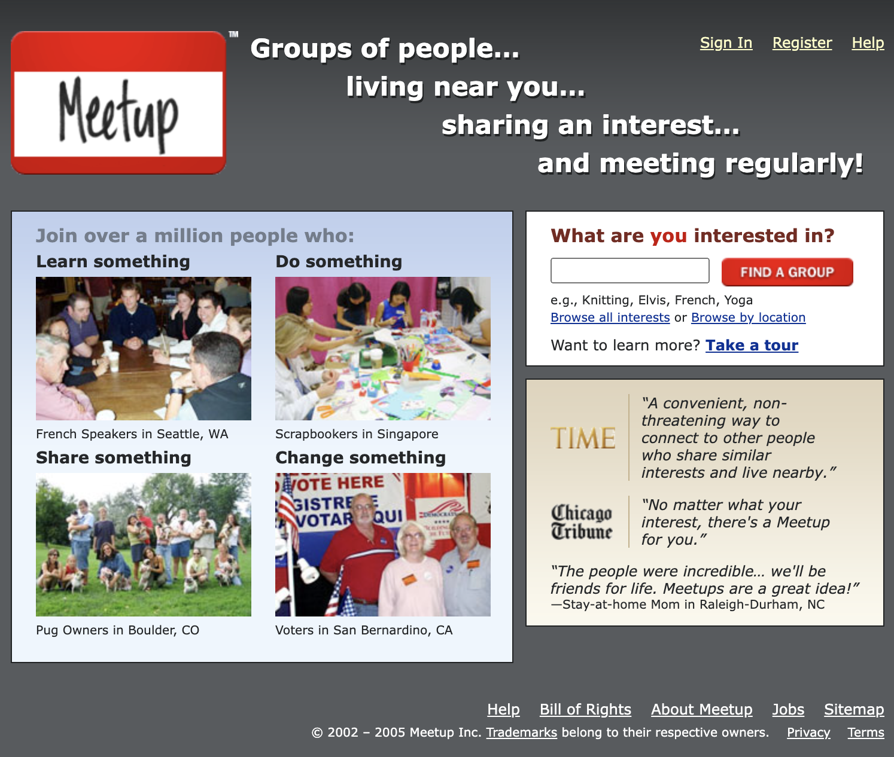
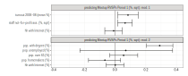
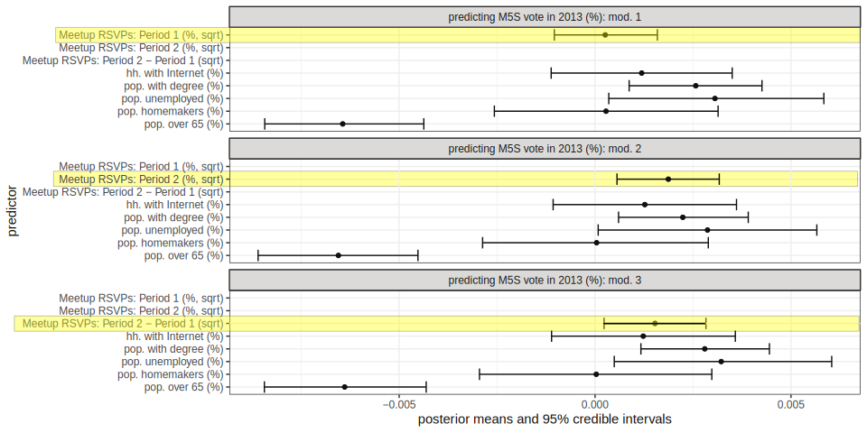
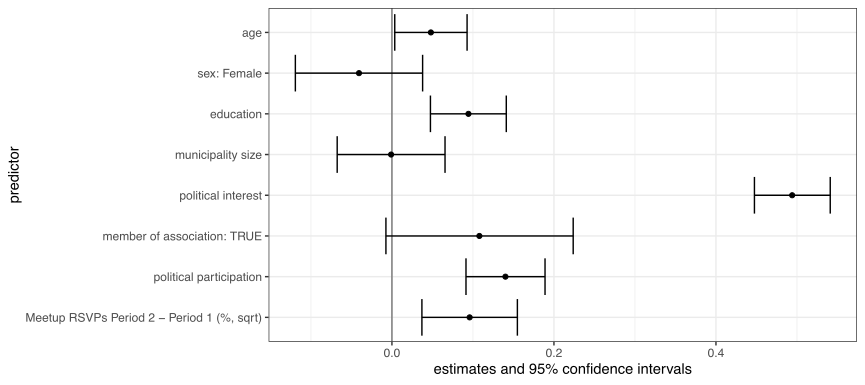
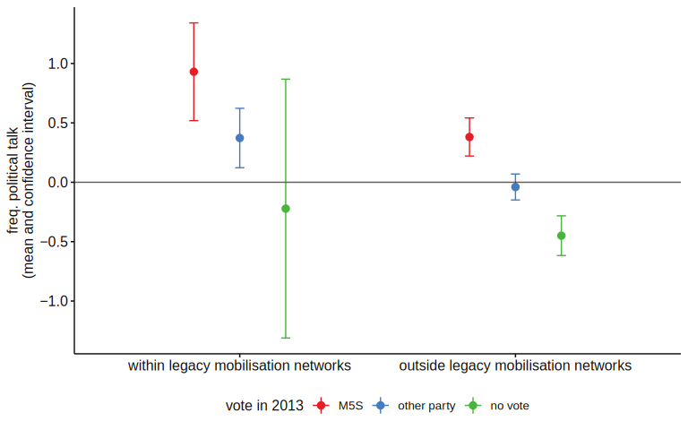

layout: true
<div style="position: absolute;left:60px;bottom:11px;color:gray;"><small><small><small><a href = 'https://fraba.github.io/presentation/2024-WSU/'>fraba.github.io/presentation/2024-WSU `r icons::fontawesome("link", style = "solid")`</a></small></small></small></div>


```{r setup, include=FALSE, cache=FALSE, message=FALSE}

knitr::opts_chunk$set(echo = FALSE, message = FALSE, warning = FALSE, 
                      cache = TRUE,
                      dev = 'svg', out.width = "45%", fig.width = 6,
                      fig.align="center")


library(RefManageR)
BibOptions(check.entries = FALSE,
           bib.style = "authoryear",
           cite.style = 'authoryear',
           style = "markdown",
           hyperlink = FALSE,
           dashed = FALSE,
           no.print.fields = c("urldate","isbn","issn"))
myBib <- ReadBib("assets/biblatex.bib", check = FALSE)
top_icon = function(x) {
  icons::icon_style(
    icons::fontawesome(x),
    position = "fixed", top = 10, right = 10
  )
}
```

---

## Access slides here `r top_icon("link")`

</br></br></br></br></br></br>

.center[.large[[fraba.github.io/presentation/2024-WSU](https://fraba.github.io/presentation/2024-WSU/)]]


</br></br></br></br>

<p style = "font-size: 80px">&nbsp;&nbsp;&nbsp;&nbsp;&nbsp;&nbsp;&nbsp;&nbsp;&nbsp;&nbsp;&nbsp;&nbsp;&nbsp;&swarr;</p>

---

## Introduction
### Research Problem
- Question: How does the Internet mobilise disengaged voters outside traditional political networks?
- Background: Decline of traditional party mobilisation and rise of anti-establishment parties
- Focus: Internet as a tool for organising outside traditional networks

---

## Traditional Mobilisation Networks
### The Role of Social Capital in Politics
- Voluntary associations provide civic skills and recruitment networks
- Mass parties used to mobilise in low social capital areas
- Decline of these networks after 1960s, with shrinking voter turnout
- Anti-party-system parties emerged but failed to build dense mobilisation networks

---

## Internet as a New Mobilisation Tool
### Internet Affordances for Political Action
- Facilitates the spread of information at scale
- Reduces coordination costs for collective action
- However, lacks dense, strong-tie networks found in social capital
- Online networks are more individualised and less reciprocal

---

## Hypotheses Overview
### Hypothesis 1: Internet vs. Social Capital Networks
- Internet-mediated coordination is more challenging in the absence of social capital
### Hypothesis 2: Media's Role in Mobilisation
- News media attention can temporarily boost Internet networks
### Hypothesis 3: Diffusion of Political Expertise
- Internet can mirror the role of legacy networks in mobilising voters
**Figure Placeholder:** [Diagram of hypotheses structure]

---

## Case Study - Italy's Five Star Movement (M5S)
### Overview of M5S

- Anti-establishment, populist, and Internet-centred political party
- Founded by Beppe Grillo in 2005 via his blog
- Intensive use of Meetup.com to organise events and grassroots support

---

## Timeline of M5S development, 2005–2018

.content-box-yellow[

- **2005**: Beppe Grillo launches "Friends of Beppe Grillo" meetups via his blog, encouraging local coordination through Meetup.com.

- **2007**: V-Day campaign collects 336,000 signatures for electoral reform, marking the movement’s first large-scale mobilisation.

- **2009**: The Five Star Movement (M5S) is officially launched.

- **2012**: M5S wins multiple mayoral elections in Northern Italy, including Parma, and gains national prominence.

- **2013**: M5S becomes Italy’s largest single party, winning 25.6% of the vote in the general election.

- **2014**: M5S secures 17 MEPs in the European Parliament elections.

- **2018**: M5S wins 32.7% of the vote in the general election, forming a coalition government with the League.

]

---

## Data and Methods
### Overview of Datasets
- Data Sources: Meetup.com API, Italian census, and electoral data
- Temporal Scope: Focus on the period from 2005 to 2018
- Analytical Approach: Spatial and temporal analysis of Internet-enabled grassroots organisations

---

## Research Questions
### Research Questions Guiding the Study
- **RQ1**: Does social capital predict where Meetups are organised?
- **RQ2**: How does media attention alter Meetup activity?
- **RQ3**: Does the spread of Meetups predict voting patterns?
- **RQ4**: Does the local presence of Meetups predict an average increase in the
frequency of political talks?
- **RQ5**: Among voters disconnected from social capital networks, do M5S voters
engage more frequently than non-M5S voters in political discussions?

---

## Social Capital vs Internet Capital

.pull-left[

.content-box-green[

### Social Capital
**Definition**: The networks of relationships, trust, and norms that facilitate collective action within a community.

**Characteristics**:
- Dense, reciprocal, and strong social ties (constrained by geography).
- Traditionally linked to voluntary associations, civic participation, and political engagement.
- Fosters political mobilisation through established, face-to-face networks.

]

]

.pull-right[

.content-box-purple[

### Internet Capital
**Definition**: The ability to mobilise and engage individuals through online platforms, *independently* from existing social networks.

**Characteristics**:
- Broad, weak-tie networks that connect geographically dispersed individuals.
- Lowers the barriers to political participation by reducing coordination costs.
- Facilitates rapid diffusion of information but lacks the depth of traditional social capital relationships.

]

]

---

## Meetup.com as example of Internet Capital

- Connecting independently from exiting social networks

.center[</img>]

*Meetup.com home page as of July 2005 (Source: The Internet Archive).*


---

## Hypothesis 1 - Social Capital Networks
### The Role of Social Capital in Early Mobilisation
- Social capital enhances connectedness and political competence
- Legacy networks historically provide the framework for political participation
- Initial M5S mobilisation concentrated in areas with high social capital

---

## Results - Meetup Activity (RQ1)

.center[</img>]


### Early Mobilisation Tied to Social Capital
- Geospatial analysis shows high correlation between social capital and Meetup activity from 2005–2012
- Social capital provided organisational strength in early years of M5S development


---

## Hypothesis 2 - Role of Media Attention
### Media's Influence on Expanding Mobilisation
- As media attention grew, M5S mobilisation spread beyond high social capital areas
- Media attention amplified visibility and political conversations
- Key period: 2012, M5S electoral success and spike in media attention

---

.center[</img>

*Timeseries of Meetup RSVPs, news media attention variables and posterior means for the staff of not-for-profit
association predicting RSVPs.*]


---

## Results - Media Impact (RQ2)
### Media and Meetup Diffusion Post-2012
- Meetup activity spread to regions with lower social capital after 2012
- Media attention reduced the reliance on existing social capital networks
- Indication of two distinct waves of mobilisation (pre- and post-2012)

---

.center[</img>

*Timeseries of Meetup RSVPs, news media attention variables and posterior means for the staff of not-for-profit
association predicting RSVPs.*]

---

## Hypothesis 3 - Diffusion of Political Expertise
### Internet's Role in Spreading Political Expertise
- Internet-enabled "islands of political expertise" emerged in areas outside of traditional social capital
- Disengaged voters became more politically engaged through Internet platforms

---

## Results - Voting Patterns (RQ3)
### Impact of Meetup Activity on M5S Voting
- Strong positive association between second-wave Meetup activity (post-2012) and M5S votes in 2013
- Areas with new Meetup activity saw higher voting percentages for M5S

---

.center[</img>

*Spatial areal unit modelling for M5S vote in 2013*]


---

## Political Discussion Increase (RQ4)
### Meetups and Increased Political Discussion
- Meetup activity correlated with an increase in political discussions among local voters
- Areas with more Meetups saw higher engagement in political conversations leading to the 2013 election

---

.center[</img>

*Coefficients and confidence intervals resulting from the regression model of survey responses (n=1382) predicting the frequency of political talks.* ]

---

## Voters Disconnected from Legacy Networks (RQ5)
### Meetup Mobilisation of Disengaged Voters
- Disengaged voters in areas with Meetup activity reported discussing politics more frequently
- Meetup platforms activated discussions in previously apathetic or politically disconnected regions

---

.center[</img>

*Frequency of political talk within and outside legacy mobilization networks among those expressing high political discontent (n=660).*]


---

## Social Capital vs. Internet Networks
### Conceptual Activation Model
- Traditional social capital networks foster tight-knit, high-influence ties
- Internet networks allow for broader, more distributed, but weaker ties

---

.center[</img>

*Theoretical activation model for local collective action*]


---

## Spatial and Temporal Diffusion of Meetups
### Evolution of Meetup Events Over Time
- First wave: Mobilisation driven by legacy networks
- Second wave: Mobilisation driven by Internet, independent of social capital

---

## Significance of Homemakers in Second Wave
### Socio-Demographic Shift in Mobilisation
- Post-2012, homemakers in economically weaker areas became key participants in Meetups
- Indicates a demographic shift from highly educated, high-capital areas to more diverse, disengaged regions

---

## Bayesian Spatial Modelling
### Analytical Methodology
- Bayesian spatial models used to estimate the impact of geographic diffusion of social capital and Meetup activity
- Captures neighbouring effects and residual spatial autocorrelation

---

## The Role of Media in Internet-Driven Movements
### Importance of Media Validation
- Media attention amplifies the reach of Internet-based movements
- Internet movements still rely on traditional media for legitimacy and widespread impact

---

## Key Findings
### Summary of Key Insights
- Internet-enabled networks can bypass traditional social capital constraints
- Media plays a critical role in sustaining Internet-driven mobilisation
- Diffusion of political expertise occurs even in disengaged, low-capital areas


---

## Theoretical Contributions
### Broader Implications of the Study
- Internet-enabled participation redefines political mobilisation patterns
- Opens participation to more diverse and disengaged demographics
- Suggests a new model for political unpredictability and turbulence in both democratic and non-democratic regimes

---

## Limitations of the Study
### Study Constraints and Considerations
- Ecological fallacy due to aggregation of spatial data
- Use of RSVP numbers as proxies for participation
- Lack of internal efficacy measures in survey data


---

## Future Research Directions
### Suggested Areas for Further Study
- Long-term political effects of Internet-based mobilisation
- Examining the role of other platforms (e.g., Facebook, Twitter) in political mobilisation
- Exploring the sustainability of Internet-enabled movements without media attention


---

## Final Remarks
### Contributions to Digital Mobilisation Studies
- This study demonstrates how Internet technologies can mobilise disengaged voters and extend political expertise beyond legacy networks
- Offers new insights into the relationship between Internet and media in fostering political action
