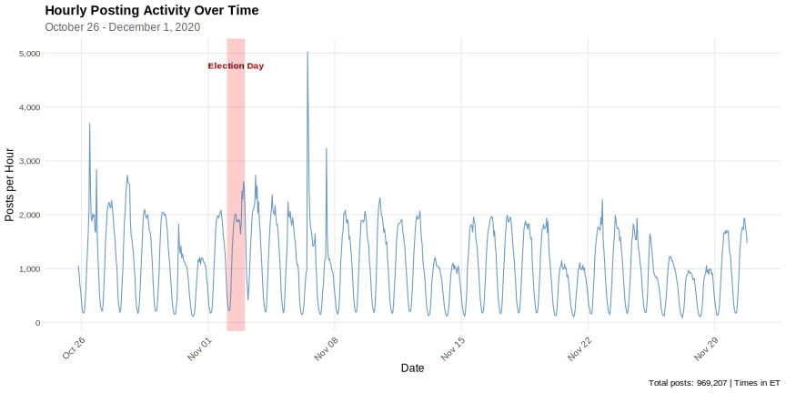
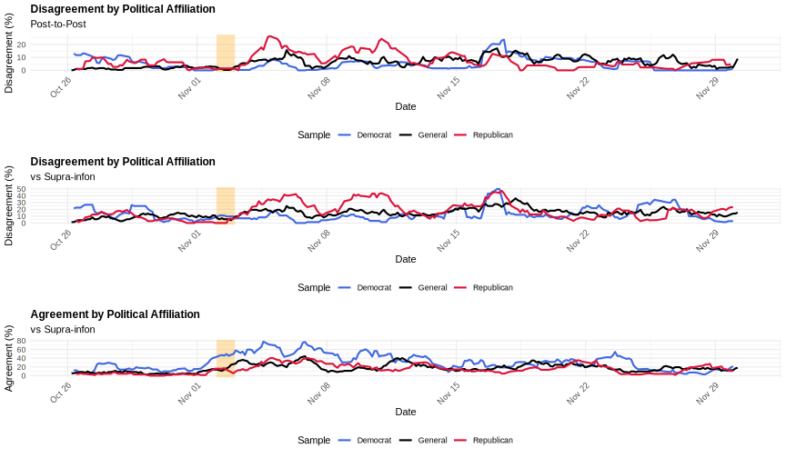
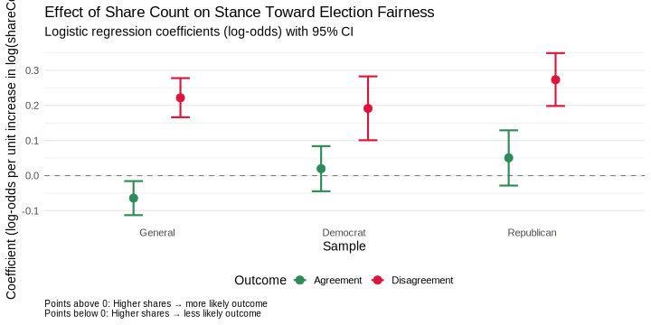

background-image: url(https://upload.wikimedia.org/wikipedia/en/6/6a/Logo_of_the_University_of_Sydney.svg)
background-size: 95%

```{r setup, include=FALSE}

knitr::opts_chunk$set(echo = TRUE, message = FALSE, warning = FALSE, 
                      dev = 'svg', out.width = "45%", fig.width = 6,
                      fig.align="center")

```

## I wish to acknowledge the people of the Kulin Nations, on whose land we are gathered today. I pay my respects to their Elders, past and present.

---

## The Challenge: Information Disorder in Democracy

Citizens face immersion in environments where coherent understanding becomes impossible

- Traditional fact-checking approach has fundamental limitations:
  - Requires establishing contested ground truths
  - Doesn't scale across millions of posts
  - Misses how contradictory *legitimate* perspectives undermine sense-making

**Key distinction**: Healthy pluralism → Chaotic pluralism

- Citizens possess **epistemic rights** to sufficient information AND competence to navigate information systems
- When undermined, consequences extend beyond confusion to degradation of democratic deliberation

---

## Our Contribution: Measuring Disorder Without Adjudicating Truth

**Framework**: Information environments as networks of semantic relationships

- **Infons**:$^1$ discrete, meaningful units of information (individual posts)
- Relationships between infons: agreement, disagreement, or independence
- **No reference to ground truth needed** - assess mutual support/contradiction

**Information Disorder Measure**:

$$
D = \frac{|E^-|}{|E^+| + |E^-| + |E^0|}
$$

Where $E^+$ = agreement, $E^-$ = disagreement, $E^0$ = independence

Ranges from 0 (no disagreement) to 1 (complete disagreement)

.footnote[Devlin, K. J. (1991). *Logic and Information*. Cambridge University Press. Floridi, L. (2011). *The philosophy of information*. Oxford University Press.]

---

## Methodological Innovation: Supra-Infon

**Supra-infon**: Anchoring claim outside immediate information space

.pull-left[

*"The election has been administered fairly so far"*

- Each infon classified as agreeing, disagreeing, or independent with respect to this reference
- Enables measurement of discourse alignment with specific positions
- **Still without adjudicating truth value**

]

.pull-right[

```{r echo = FALSE, dev = "svg", out.width="100%"}

library(igraph)
library(ggraph)
library(tidygraph)
library(RColorBrewer)

# Set seed for reproducibility
set.seed(42)

# =============================================================================
# Function to create a representative signed network
# =============================================================================

create_network <- function(n_nodes, 
                          p_agreement = 0.3, 
                          p_disagreement = 0.3,
                          include_supra = TRUE) {
  # Create node labels
  node_ids <- paste0("Infon ", 1:n_nodes)
  if (include_supra) {
    node_ids <- c(node_ids, "Supra")
  }
  
  n_total <- length(node_ids)
  
  # Create adjacency matrix
  adj_matrix <- matrix(0, n_total, n_total)
  rownames(adj_matrix) <- colnames(adj_matrix) <- node_ids
  
  # Generate edges between regular nodes (not supra)
  if (n_nodes > 1) {
    for (i in 1:(n_nodes-1)) {
      for (j in (i+1):n_nodes) {
        rand <- runif(1)
        if (rand < p_agreement) {
          adj_matrix[i, j] <- 1  # Agreement
          adj_matrix[j, i] <- 1
        } else if (rand < (p_agreement + p_disagreement)) {
          adj_matrix[i, j] <- -1  # Disagreement
          adj_matrix[j, i] <- -1
        }
        # Otherwise: independence (no edge)
      }
    }
  }
  
  # Add connections to supra-infon
  if (include_supra) {
    supra_idx <- n_total
    for (i in 1:n_nodes) {
      rand <- runif(1)
      if (rand < 0.35) {
        adj_matrix[i, supra_idx] <- 1  # Agree with supra
        adj_matrix[supra_idx, i] <- 1
      } else if (rand < 0.65) {
        adj_matrix[i, supra_idx] <- -1  # Disagree with supra
        adj_matrix[supra_idx, i] <- -1
      }
      # Otherwise: independent from supra
    }
  }
  
  # Create igraph object
  g <- graph_from_adjacency_matrix(adj_matrix, mode = "undirected", 
                                   weighted = TRUE, diag = FALSE)
  
  # Set node attributes
  V(g)$type <- ifelse(V(g)$name == "Supra", "supra", "post")
  V(g)$label <- V(g)$name
  
  # Set edge attributes based on weight
  E(g)$relationship <- ifelse(E(g)$weight > 0, "agreement", "disagreement")
  
  return(g)
}

# Network 1: 9 nodes (Set 1 - Partisan samples)
g_small <- create_network(n_nodes = 9, 
                          p_agreement = 0.25, 
                          p_disagreement = 0.30,
                          include_supra = TRUE)

plot_network_ggraph <- function(g) {
  # Convert to tbl_graph
  tg <- as_tbl_graph(g) %>%
    activate(nodes) %>%
    mutate(type = ifelse(name == "Supra", "Supra-infon", "Post")) %>%
    activate(edges) %>%
    mutate(relationship = ifelse(weight > 0, "Agreement", "Disagreement"),
           abs_weight = abs(weight))  # Add absolute weight for layout
  
  # Create plot - use abs_weight for layout computation
  p <- ggraph(tg, layout = "fr", weights = abs_weight) +
    # Edges
    geom_edge_link(aes(color = relationship, edge_width = relationship), 
                   alpha = 0.8) +  # Increased alpha from 0.7
    scale_edge_color_manual(values = c("Agreement" = "#2E8B57", 
                                       "Disagreement" = "#DC143C"),
                           name = "Relationship") +
    scale_edge_width_manual(values = c("Agreement" = 2.0,   # Increased from 1.5
                                       "Disagreement" = 2.0),
                           guide = "none") +
    # Nodes
    geom_node_point(aes(size = type, fill = type), 
                    shape = 21, color = "gray30", stroke = 1.5) +  # Increased stroke
    scale_size_manual(values = c("Post" = 12, "Supra-infon" = 20),  # Increased from 8 and 15
                     name = "Node Type") +
    scale_fill_manual(values = c("Post" = "#87CEEB", "Supra-infon" = "#FFD700"),
                     name = "Node Type") +
    # Labels
    geom_node_text(aes(label = name, fontface = ifelse(type == "Supra-infon", "bold", "plain")),
                   size = 5, repel = TRUE) +  # Increased from 3 to 5
    # Theme
    theme_void() +
    theme(legend.position = "bottom",
          legend.text = element_text(size = 14),        # Increased legend text
          legend.title = element_text(size = 16, face = "bold"),  # Increased legend title
          plot.title = element_text(hjust = 0.5, size = 18, face = "bold"),  # Increased from 14 to 18
          plot.margin = margin(10, 10, 10, 10))
  
  return(p)
}

print(plot_network_ggraph(g_small))


```

]

---

## Data Collection

**Source**: Facebook via CrowdTangle API (🪦 RIP)

.pull-left[

**Account types**:
- 749 curated lists (Local News, Politics, Metro groups, etc.)
- Republican and Democrat officials, state parties, PACs
]

.pull-right[

**Coverage**:
- 969,207 posts from 38,149 accounts
- October 26 - December 1, 2020
- With Election Day on 3 Nov 2020.

]

.center[

]

---


---

## Classification Pipeline

**Stage 1: Election-Related Content**

### This happened in two stages: 

.center[

1\. LLM annotation (4 models) for election content (`True/False`)

$\downdownarrows$

2\. Supervised classification using Logistic Regression (using majority vote labels)

]

---

### 1\. LLM annotation (4 models) for election content (`True/False`)

| Model Pair | Cohen's κ | Agreement (%) |
|:-----------|----------:|--------------:|
| Llama3 vs Gemma | 0.736 | 90.6 |
| Llama3 vs Granite | 0.848 | 95.4 |
| Llama3 vs Qwen3 | 0.841 | 95.0 |
| Gemma vs Granite | 0.752 | 91.1 |
| Gemma vs Qwen3 | 0.797 | 92.5 |
| Granite vs Qwen3 | 0.856 | 95.4 |
| **Fleiss' Kappa (all models)** | **0.804** | **—** |
| **Krippendorff's Alpha** | **0.804** | **—** |

*Note:* Interpretation: <0 poor, 0-0.20 slight, 0.21-0.40 fair, 0.41-0.60 moderate, 0.61-0.80 substantial, 0.81-1.0 almost perfect (Landis & Koch, 1977).

---

## **Stage 1: Election-Related Content**

- LLM annotation (4 models: Llama3, Gemma, Granite, Qwen3)
- Fleiss' Kappa = 0.804 (substantial agreement)
- Supervised classification (Logistic Regression)

### Result

- 175,613 election-related posts (19.1%)

---

## Stage 2: Network Construction

.pull-left[

**Temporal windowing**: 3-hour windows

**Sample Set** (Partisan comparison):
- 9 posts per window across full period
- Weighted by share counts
- Separate: General, Republican, Democrat samples

]


.pull-right[

```{r echo = FALSE, dev = "svg", out.width="90%"}

library(igraph)
library(ggraph)
library(tidygraph)
library(RColorBrewer)

# Set seed for reproducibility
set.seed(42)

# =============================================================================
# Function to create a representative signed network
# =============================================================================

create_network <- function(n_nodes, 
                          p_agreement = 0.3, 
                          p_disagreement = 0.3,
                          include_supra = TRUE) {
  # Create node labels
  node_ids <- paste0("Infon ", 1:n_nodes)
  if (include_supra) {
    node_ids <- c(node_ids, "Supra")
  }
  
  n_total <- length(node_ids)
  
  # Create adjacency matrix
  adj_matrix <- matrix(0, n_total, n_total)
  rownames(adj_matrix) <- colnames(adj_matrix) <- node_ids
  
  # Generate edges between regular nodes (not supra)
  if (n_nodes > 1) {
    for (i in 1:(n_nodes-1)) {
      for (j in (i+1):n_nodes) {
        rand <- runif(1)
        if (rand < p_agreement) {
          adj_matrix[i, j] <- 1  # Agreement
          adj_matrix[j, i] <- 1
        } else if (rand < (p_agreement + p_disagreement)) {
          adj_matrix[i, j] <- -1  # Disagreement
          adj_matrix[j, i] <- -1
        }
        # Otherwise: independence (no edge)
      }
    }
  }
  
  # Add connections to supra-infon
  if (include_supra) {
    supra_idx <- n_total
    for (i in 1:n_nodes) {
      rand <- runif(1)
      if (rand < 0.35) {
        adj_matrix[i, supra_idx] <- 1  # Agree with supra
        adj_matrix[supra_idx, i] <- 1
      } else if (rand < 0.65) {
        adj_matrix[i, supra_idx] <- -1  # Disagree with supra
        adj_matrix[supra_idx, i] <- -1
      }
      # Otherwise: independent from supra
    }
  }
  
  # Create igraph object
  g <- graph_from_adjacency_matrix(adj_matrix, mode = "undirected", 
                                   weighted = TRUE, diag = FALSE)
  
  # Set node attributes
  V(g)$type <- ifelse(V(g)$name == "Supra", "supra", "post")
  V(g)$label <- V(g)$name
  
  # Set edge attributes based on weight
  E(g)$relationship <- ifelse(E(g)$weight > 0, "agreement", "disagreement")
  
  return(g)
}

# Network 1: 9 nodes (Set 1 - Partisan samples)
g_small <- create_network(n_nodes = 9, 
                          p_agreement = 0.25, 
                          p_disagreement = 0.30,
                          include_supra = TRUE)

plot_network_ggraph <- function(g) {
  # Convert to tbl_graph
  tg <- as_tbl_graph(g) %>%
    activate(nodes) %>%
    mutate(type = ifelse(name == "Supra", "Supra-infon", "Post")) %>%
    activate(edges) %>%
    mutate(relationship = ifelse(weight > 0, "Agreement", "Disagreement"),
           abs_weight = abs(weight))  # Add absolute weight for layout
  
  # Create plot - use abs_weight for layout computation
  p <- ggraph(tg, layout = "fr", weights = abs_weight) +
    # Edges
    geom_edge_link(aes(color = relationship, edge_width = relationship), 
                   alpha = 0.8) +  # Increased alpha from 0.7
    scale_edge_color_manual(values = c("Agreement" = "#2E8B57", 
                                       "Disagreement" = "#DC143C"),
                           name = "Relationship") +
    scale_edge_width_manual(values = c("Agreement" = 2.0,   # Increased from 1.5
                                       "Disagreement" = 2.0),
                           guide = "none") +
    # Nodes
    geom_node_point(aes(size = type, fill = type), 
                    shape = 21, color = "gray30", stroke = 1.5) +  # Increased stroke
    scale_size_manual(values = c("Post" = 12, "Supra-infon" = 20),  # Increased from 8 and 15
                     name = "Node Type") +
    scale_fill_manual(values = c("Post" = "#87CEEB", "Supra-infon" = "#FFD700"),
                     name = "Node Type") +
    # Labels
    geom_node_text(aes(label = name, fontface = ifelse(type == "Supra-infon", "bold", "plain")),
                   size = 5, repel = TRUE) +  # Increased from 3 to 5
    # Theme
    theme_void() +
    theme(legend.position = "bottom",
          legend.text = element_text(size = 14),        # Increased legend text
          legend.title = element_text(size = 16, face = "bold"),  # Increased legend title
          plot.title = element_text(hjust = 0.5, size = 18, face = "bold"),  # Increased from 14 to 18
          plot.margin = margin(10, 10, 10, 10))
  
  return(p)
}

print(plot_network_ggraph(g_small))


```
]

---

## LLM Classification of Relationships

**Llama3** via local GPU cluster (Ollama), context + "few shots"

Three categories:
- **AGREEMENT**: Mutually supportive claims (co-informative)
- **DISAGREEMENT**: Mutually exclusive claims (contradictory)
- **INDEPENDENCE**: Logically unrelated

---

## Classification prompt

> You are an Information Analyst classifying the semantic relationship between two discrete items of information (infons) about the 2020 US presidential election.

> CONTEXT: The 2020 US Presidential Election

> The election was held on November 3, 2020. Democrat Joe Biden defeated incumbent ...

> CLASSIFICATION CATEGORIES: 

> AGREEMENT: The infons are co-informative—they convey the same fundamental claim or mutually supportive claims. This includes:
> - Semantically equivalent statements (same meaning, different wording)
> - Claims that reinforce or support each other
> - Statements that would both be true under the same circumstances ...

---

> EXAMPLES:

> Infon A: "Poll workers were excluded and couldn't observe the count"
> Infon B: "The election has been administered fairly so far"
> Classification: DISAGREEMENT
> Reason: Excluding observers implies unfair administration; these claims cannot both be true ...


---

## **Validation**: 100 post pairs, 4 models

- Cohen's Kappa: 0.230-0.606 (moderate agreement)
- Highest: Mistral-Llama3 (κ = 0.606)

*Pair-wise agreement (%)*

| | Gemma3 | Mistral | Deepseek-r1_8b | Llama3 |
|:----------------|-------:|--------:|---------------:|-------:|
| **Gemma3** | 100 | 75 | 73 | 78 |
| **Mistral** | 75 | 100 | 92 | 91 |
| **Deepseek-r1_8b** | 73 | 92 | 100 | 88 |
| **Llama3** | 78 | 91 | 88 | 100 |

---

## Key Finding 1: Partisan Asymmetry in Disorder

**Pre-election**: Low, stable internal disagreement

**Post-election spike**: Sharp increase after Nov 3, especially Republican accounts

**Election fairness stance**:
- **Democrat accounts**: Consistent agreement (~80%), low disagreement (<20%)
- **Republican accounts**: Sustained high disagreement, strong rejection of legitimacy
- **Asymmetry persisted** (and still persists today...)

**Secondary spike**: After Nov 15 (Trump's continued denunciation)

.center[

]

---


---

## Key Finding 2: Algorithmic Amplification of Disorder

**Question**: Did recommender systems amplify disorder or promote consensus?

**Method**: Logistic regression - stance toward fairness predicting viral spread (log share count)

**Results** - Asymmetric amplification:
- **Disagreement** with fairness of election → significantly **higher** shares
  - Republican: β = 0.27, p < .05
  - Democrat: β = 0.19, p < .05
  - General: β = 0.22, p < .05
- **Agreement** with fairness of election → signficantly **lower** shares
  - General: β = -0.06, p < .05

**Implication**: Platform dynamics systematically amplified disorder-generating content

---



---

## Implications for Democratic Governance

**Diagnostic utility**:
- Scalable, quantifiable measure of ecosystem health
- Identifies thresholds where contradiction density erodes public trust
- No adjudication of contested claims required

**Policy applications**:
- Actionable metrics for platform designers
- Monitor information environment quality
- Assess interventions without content moderation debates

**Critical insight**: Attention-driven algorithms systematically reward conflict over coherence

---

## Limitations and Future Directions

**Current limitations**:
- Single platform (Facebook)
- One election event
- LLM classification reliability (moderate inter-model agreement)
- Temporal windows may miss longer-term dynamics

**Future research**:
- Structural analysis of semantic networks
- Cross-platform comparison
- Multiple electoral contexts
- Refined relationship classification
- Causal mechanisms of amplification
- Intervention studies

---

## Conclusion

**Three contributions**:

1. **Theoretical**: Framework for measuring disorder without truth adjudication
2. **Methodological**: LLM-based classification of semantic relationships at scale
3. **Empirical**: Evidence of partisan asymmetry and algorithmic amplification

**Core finding**: Post-2020 election Facebook exhibited:
- Sharp partisan divide in information disorder
- Systematic amplification of skepticism over consensus
- Platform dynamics that exacerbated democratic information crisis

**Broader significance**: Move from identifying misinformation → diagnosing information ecosystem health

---

## Thank you

**Questions?**

francesco.bailo@sydney.edu.au
