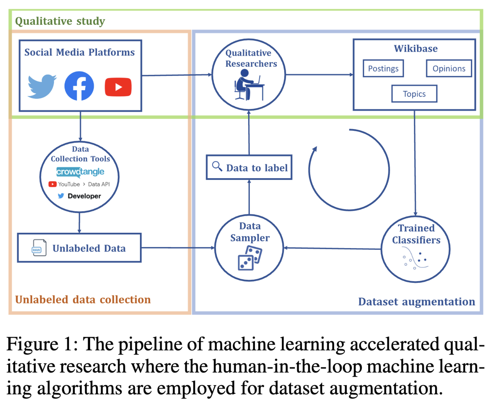

layout: true
<div style="position: absolute;left:60px;bottom:11px;color:gray;"><small><small><small><a href = 'https://fraba.github.io/presentation/2025-CS2ITALY/wikibase'>fraba.github.io/presentation/2025-CS2ITALY/wikibase `r icons::fontawesome("link", style = "solid")`</a></small></small></small></div>


```{r setup, include=FALSE, cache=FALSE, message=FALSE}

knitr::opts_chunk$set(echo = FALSE, message = FALSE, warning = FALSE, 
                      cache = TRUE,
                      dev = 'svg', out.width = "45%", fig.width = 6,
                      fig.align="center")


library(RefManageR)
BibOptions(check.entries = FALSE,
           bib.style = "authoryear",
           cite.style = 'authoryear',
           style = "markdown",
           hyperlink = FALSE,
           dashed = FALSE,
           no.print.fields = c("urldate","isbn","issn"))
myBib <- ReadBib("assets/biblatex.bib", check = FALSE)
top_icon = function(x) {
  icons::icon_style(
    icons::fontawesome(x),
    position = "fixed", top = 10, right = 10
  )
}
```

```{r}
library(ggplot2)
```


---

## Access slides here `r top_icon("link")`

</br></br></br></br></br></br>

.center[.large[[fraba.github.io/presentation/2025-CS2ITALY/wikibase](https://fraba.github.io/presentation/2025-CS2ITALY/wikibase)]]


</br></br></br></br>

<p style = "font-size: 80px">&nbsp;&nbsp;&nbsp;&nbsp;&nbsp;&nbsp;&nbsp;&nbsp;&nbsp;&nbsp;&nbsp;&nbsp;&nbsp;&swarr;</p>

---

# Introduction to Wikibase
## Collaborative Use of Wikibase for Interdisciplinary Research

- Wikibase is a *free* (as in 'free beer') knowledge graph software developed by the Wikimedia Foundation in 2012.
- Initially created to centralise and structure facts across Wikipedia.
- Powers **Wikidata**, integrating information into a graph database to improve consistency and machine readability.
- The book "**Collaborative Use of Wikibase for Interdisciplinary Mixed-Methods Research**" (also with Emily Booth, Marian-Andrei Rizoiu, Jennifer Williams, Amelia Johns, Julian Droogan, Frankie Yuan) will be published by Edward Elgar in 2025 (inshallah).

.content-box-yellow[

The book provides a practical guide for interdisciplinary research teams to leverage Wikibase as a collaborative tool for **managing**, **integrating**, and **analysing** complex, multimodal research data.

]

---

# Why Wikibase?
## Wikibase: From Wikipedia to Research Applications

.pull-left[

- Wikipedia relies on *Wikibase* to manage structured facts (e.g., ".content-box-red[Paris] .content-box-yellow[is the capital of] .content-box-red[France]").
- Addresses key issues:
  - Consistency across pages and languages.
  - Machine-friendly data for search engines and AI systems.

- Wikibase enables **knowledge hopping**, linking related concepts (e.g., "COVID-19 Pandemic → COVID-19 Misinformation → Conspiracy Theories").


]


.pull-right[

*Figure: Very High-Level Wikibase Data Model*

```{r out.width = "100%"}
# Load the DiagrammeR package
library(DiagrammeR)

# Create the diagram
grViz("
digraph {
  rankdir=LR;  // Set the direction of the graph to left-to-right
  node [shape=ellipse, style=filled, color=lightblue];

  // Define nodes
  A [label='Item A'];
  B [label='Item B'];
  Q [label='Qualifier'];

  // Define edges with properties
  A -> B [label='Property 1', fontsize=10, color=black];
  A -> Q [label='Property 2', fontsize=10, color=black];
}
")

```

]


---

## What the interface into a Wikibase item looks like ...

.center[]


---

# Key Wikibase Functionalities for Research Teams

.pull-left[

1. **Centralised Knowledge Repository**:
   - Stores, edits, and interrogates data in structured formats.
   - Supports collaboration via MediaWiki-based websites.

2. **Graph-Based Database**:
   - Establishes relationships between data objects.
   - Facilitates structured (complex) queries with SPARQL.

]

.pull-right[

3\. **Adaptability**:
   - Handles both qualitative and quantitative data.
   - Scalable for small and large projects.
   - Programming Interfaces to access, query and modifying the data (
   projects). 

.center[</img>]
]


---

# Applications in Mixed-Methods Research
## Why Researchers Need Wikibase

.pull-left[

- Faciliates emergence of complex data schema (a.k.a. **ontology**)
- Facilitates **qual-quant data integration** and interdisciplinary collaborations.
  - Convergent, explanatory, and exploratory sequential designs.
]

.pull-right[

##### A Workflow: Wikibase use in mixed-methods research

.center[]

<p style="font-size:0.4em">Kong, Q., Booth, E., Bailo, F., Johns, A., & Rizoiu, M.-A. (2022). Slipping to the extreme: A mixed method to explain how extreme opinions infiltrate online discussions. <i>Proceedings of the International AAAI Conference on Web and Social Media</i>, 16(1), 524–535. https://doi.org/10.1609/icwsm.v16i1.19312</p>

]

---

## Book's Table of Content

1. Introduction: The Case for Interdisciplinary Mixed-Methods Research  
2. What is Wikibase and Who Needs It  
3. How to Install and Maintain Wikibase  
4. Structuring and Linking Research Data  
5. Designing and Maintaining Project Ontologies with Wikibase  
6. Designing and Running Collaborative Research Projects with Wikibase  
7. Collecting, Mapping, and Modelling Social Media Data with Wikibase  
8. Glossary  


.content-box-yellow[
How to use Wikibase for mixed-methods research: an interdisciplinary and collaborative approach (expected in 2025)
]


---
