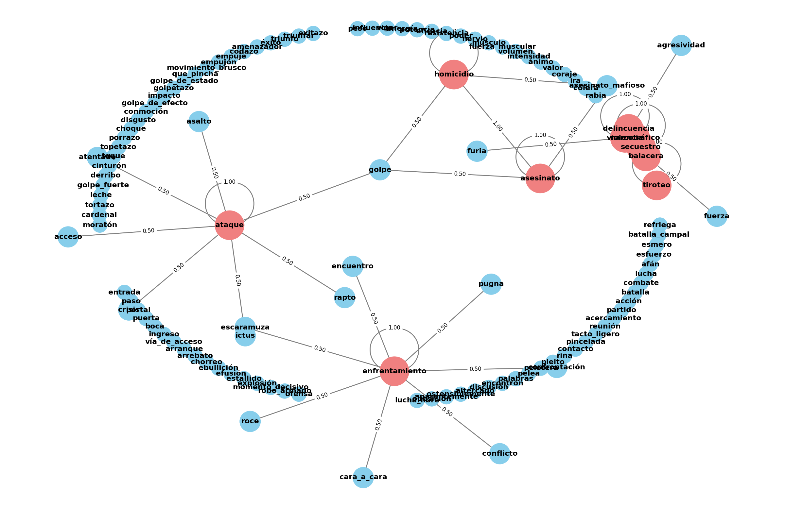

layout: true
<div style="position: absolute;left:60px;bottom:11px;color:gray;"><small><small><small><a href = 'https://fraba.github.io/presentation/2025-CS2ITALY/youtube'>fraba.github.io/presentation/2025-CS2ITALY/youtube `r icons::fontawesome("link", style = "solid")`</a></small></small></small></div>


```{r setup, include=FALSE, cache=FALSE, message=FALSE}

knitr::opts_chunk$set(echo = FALSE, message = FALSE, warning = FALSE, 
                      cache = TRUE,
                      dev = 'svg', out.width = "45%", fig.width = 6,
                      fig.align="center")


library(RefManageR)
BibOptions(check.entries = FALSE,
           bib.style = "authoryear",
           cite.style = 'authoryear',
           style = "markdown",
           hyperlink = FALSE,
           dashed = FALSE,
           no.print.fields = c("urldate","isbn","issn"))
myBib <- ReadBib("assets/biblatex.bib", check = FALSE)
top_icon = function(x) {
  icons::icon_style(
    icons::fontawesome(x),
    position = "fixed", top = 10, right = 10
  )
}
```

```{r}
library(ggplot2)
```


---

## Access slides here `r top_icon("link")`

</br></br></br></br></br></br>

.center[.large[[fraba.github.io/presentation/2025-CS2ITALY/youtube](https://fraba.github.io/presentation/2025-CS2ITALY/youtube)]]


</br></br></br></br>

<p style = "font-size: 80px">&nbsp;&nbsp;&nbsp;&nbsp;&nbsp;&nbsp;&nbsp;&nbsp;&nbsp;&nbsp;&nbsp;&nbsp;&nbsp;&swarr;</p>

---

class: segue-red

# Research goal and approach

---

## Research goal

.content-box-yellow[

### a. Developing a highly world-wide granular set of measures of perceived violence, with precise spatial and temporal resolution.

1. Measures will differentiate the **vector** of perceived violence and the **actors** involved

2. Measures will anchor the perceived violence to public **events**.

### b. Fine-tuning the measure against alternative measures to systematic biases of each approach


### c. Understand how to integrate alternative measures for improving real-time sensing and forecasting 

]

---

## Research approach

1. Set a population grid for the area of interest (i.e., country);

--

2. Set a population density threshold for areas to exclude from data collection because too scarcely populated;

--

3. Identifying YouTube videos 

  a. associated with each cell of the grid within the geographic area of interest using the YouTube API; and 
  
  b. published within the timeframe of interest.

--

4. Collect all comments posted to the YouTube videos identified in 3.

--

5. Retrieve information from the texts of the comments to estimate of perceived violence. `r emo::ji("construction")`

--

6. Aggregate this information to compute a set of measures. `r emo::ji("construction")`


---

class: segue-red

# YouTube: Data source justification

---

## Why using YouTube

.content-box-yellow[

### Data collection is practical

1. API queries for videos with a geographic parameter (`lon+lat` + `radius`) are available. 

2. A research program to increase API quotas is also available.

]

.content-box-purple[

### Data is useful

3. YouTube is one of the most diffuse **social media application**in the world. Users not only use it to watch videos, but of course they also use it to comment videos.

4. YouTube is probably the social media application with the **higher average penetration** in the world. This makes it an excellent data source for developing world-wide measures. 

]

---

class: segue-red

# Research Approach

---

## 1. Set a population grid for the area of interest (Mexico)

```{r}

library(sf)
library(lwgeom)
library(raster)

polygon_sf <- 
  read_sf("data/state-shape/mexican-states.shp")

polygon_sf <- 
  st_transform(polygon_sf, 4326)

```

```{r}
r <- 
  raster("data/pop-grid/mex_ppp_2020_1km_Aggregated.tif")
r <- 
  aggregate(r, fact = 10, fun = sum)
r_df <- 
  as.data.frame(rasterToPoints(r))
names(r_df) <- 
  c("x", "y", "value")
r_df <- 
  r_df %>% 
  dplyr::mutate(dplyr::across(c(x, y), round, digits = 4))
```


```{r}
r_df <- 
  r_df %>% 
  dplyr::mutate(include = value>100) 
```

```{r fig.width = 7.5, fig.height=4, out.width="90%"}
ggplot2::ggplot() +
  ggplot2::geom_tile(data = r_df, aes(x = x, y = y, fill = sqrt(value))) +
  ggplot2::geom_sf(data = polygon_sf, fill = NA) +
  ggplot2::scale_fill_distiller(palette ="Spectral") +
  ggplot2::coord_sf() +
  ggplot2::labs(title = sprintf("10 km population grid of Mexico\n(2020, n = %s)", 
                       format(nrow(r_df), 
                              big.mark = ",")), 
       x = NULL, y = NULL) +
  ggplot2::theme_minimal()
```

---

## 2. Set a population density threshold

```{r fig.width = 7.5, fig.height=4, out.width="90%"}

ggplot2::ggplot() +
  ggplot2::geom_tile(data = r_df, aes(x = x, y = y, fill = include)) +
  ggplot2::geom_sf(data = polygon_sf, fill = NA) +
  ggplot2::scale_fill_brewer(palette ="Set2") +
  ggplot2::coord_sf() +
  ggplot2::labs(title = sprintf("Grids with more than 100 inhabitants\n(n = %s)", 
                       format(sum(r_df$include),
                              big.mark = ",")), 
       fill = NULL, x = NULL, y = NULL) +
  ggplot2::theme_minimal()
```


---

## 3. Identifying YouTube videos 

  a. associated with each cell of the grid within the geographic area of interest using the YouTube API; and 
  
  b. published within the timeframe of interest.
  
  
```{r fig.width = 7.5, fig.height=4, out.width="80%"}

center_x <- -100.24292  # Example coordinates
center_y <- 23.18292
radius <- 7070  # Radius in meters (or the units of your raster's CRS)

# Create the circle as an sf object
center_point <- 
  st_sfc(st_point(c(center_x, center_y)), crs = 4326)
circle <- 
  st_buffer(center_point, dist = radius)

# Convert the circle to a data frame
circle_df <- 
  as.data.frame(st_as_sf(circle))

# Plot using ggplot2
ggplot() +
  geom_tile(data = r_df, aes(x = x, y = y, fill = value>100), colour = "black") +
  geom_sf(data = circle, colour = "red", fill = 'red', alpha = .5) +
  geom_sf(data = polygon_sf, fill = NA) +
  scale_fill_brewer(palette ="Set3") +
  coord_sf(xlim = c(-100.2923-(100.2923*.01), 
                    -100.1934+(100.2923*.01)), 
           ylim = c(23.13724-(23.13724*.03),
                    23.22858+(23.22858*.03))) +
  labs(title = "7.07 km radius of one YouTube query ", fill = "pop. > 100", x = NULL, y = NULL) +
  theme_minimal()
```


---

## 4. Collect all comments posted to the YouTube videos identified in 3.

.content-box-green[

### Three steps in terms of API calls

1. `https://www.googleapis.com/youtube/v3/search`
  * Video search results filtered by geographic coordinates, radius, and date (`location`, `locationRadius`, `publishedAfter`, and `publishedBefore` parameters).

2. `https://www.googleapis.com/youtube/v3/videos`
  * Relevant metadata about all videos returned from the video search.
  
3. `https://www.googleapis.com/youtube/v3/commentThreads`
  * Data and relevant metadata of the comments returned by the video search.
  
]

---

### Data collection for Mexico 2020-01-01 - 2024-06-18

- **Videos**: 1.2M

- **Video - geolocation** pairs: 3.4M

- **Comments**: 14.8M

- **Comments - geolocation** pairs: 41.9M

#### 2024 Mexican general election was held on 2 June 2024

.center[]

---

### Data for Mexico 2020-01-01 - 2024-06-18

#### Comments by day

```{r fig.width = 7.5, fig.height=2, out.width="90%"}
require(scales)
comments_by_date <- 
  readRDS("data/mx_all_comments_by_date.rds")
comments_by_date %>%
  dplyr::filter(date >= as.Date("2020-01-01")) %>%
  ggplot() +
  geom_col(aes(x = date, y = n)) +
  geom_vline(xintercept = as.Date("2024-06-02"), colour = "orange") +
  geom_vline(xintercept = as.Date("2024-06-18"), colour = "blue") +
  theme_bw() +
  scale_y_continuous(labels = comma)
```

```{r fig.width = 7.5, fig.height=2, out.width="90%"}

comments_by_date %>%
  dplyr::filter(date >= as.Date("2024-01-01")) %>%
  ggplot() +
  geom_col(aes(x = date, y = n)) +
  geom_vline(xintercept = as.Date("2024-06-02"), colour = "orange") +
  geom_vline(xintercept = as.Date("2024-06-18"), colour = "blue") +
  theme_bw() +
  annotate("text", x = as.Date("2024-08-01"), y = 30000, label = "Election: 2024-06-02", colour = "orange") +
  annotate("text", x = as.Date("2024-09-01"), y = 20000, label = "Last video parsed: 2024-06-18", colour = "blue") +
  scale_y_continuous(labels = comma)
  
```

---

### Data for Mexico 2020-01-01 - 2024-06-18

#### Comments by hour

```{r fig.width = 6, fig.height=4, out.width="60%"}
comments_by_hour <- 
  readRDS("data/comments_by_hour.rds")
ggplot(comments_by_hour) +
  geom_col(aes(x = hour, y = n)) +
  ggplot2::theme_bw() +
  scale_y_continuous(labels = comma)
```


---

### Data for Mexico 2020-01-01 - 2024-06-18

#### Comments by location

```{r fig.width = 7.5, fig.height=4, out.width="90%"}
comment_coords_sum <-
  readRDS("data/comment_202001_202406_coords_sum.rds")
ggplot2::ggplot() +
  ggplot2::geom_tile(data = comment_coords_sum, aes(x = longitude, y = latitude, fill = sqrt(n))) +
  ggplot2::geom_sf(data = polygon_sf, fill = NA) +
  ggplot2::scale_fill_distiller(palette ="Spectral") +
  ggplot2::coord_sf() +
  ggplot2::labs(title = "Geolocated comments 2020-24, n=14.8M", 
                x = NULL, y = NULL) +
  ggplot2::theme_minimal()
```

---

## 5. Retrieve information from the texts of the comments to estimate of perceived violence. `r emo::ji("construction")`

### Dictionary based approach

1. We started with a list of seed terms related to violence

2. Using Wordnet we expanded to include all words within 2 steps from the seed words.

3. We weight each word to reflect the distance from the seed words: 1 for the original seed words, 0.5 for words with distance = 1 to the seed words and 0.25 for words with distance = 2 from the seed words.

$$L = \{ (e_1, w_1), (e_2, w_2), \ldots, (e_n, w_n) \}$$
---

.center[</img>]

---

4\. We assign to each comment $i$ a score based on the presence of word :

$$\text{Comment Score} = \sum_{i=1}^{n} (c_i \cdot w_i)$$

- $c_i$ is the count of the $i$-th word in the document.
- $w_i$ is the weight associated with the $i$-th word in the list $L$.
- $n$ is the total number of words in the list $L$.

---

### Average score per day (7-day moving average)

```{r fig.width = 7.5, fig.height=4, out.width="90%"}

comments_score_by_date <- 
  readRDS("data/comments_score_by_date.rds")
comments_score_by_date %>%
  dplyr::filter(date >= as.Date("2020-01-01") &
                  date < as.Date("2024-06-10")) %>%
  ggplot() + 
  geom_line(aes(x = date, y = rollmean)) +
  theme_bw() +
  annotate("text", y = 0.09, x = as.Date("2021-01-01"), 
           label = "March 2020 massive protests against violence") +
  annotate("text", y = 0.07, x = as.Date("2022-06-01"),
           label = "January 2023 Sinaloa unrest following Ovidio Guzmán arrest")
  
```

---

### 6. Aggregate this information to compute measures. `r emo::ji("construction")`

1. We average comments for **commenter** and by day.

2. We jitter **commenters** within the geographic boundary of the cell associated to the commented video.

3. We use the inverse distance weighted (IDW) technique to map the entire grid (this can be done for grids of different granularity) 

---

#### Preliminary results

```{r fig.width = 7.5, fig.height=4, out.width="90%"}
lonlat_weight <- 
  readRDS("data/lonlat_weight.rds")
ggplot2::ggplot() +
  ggplot2::geom_tile(data = lonlat_weight, 
                     aes(x = longitude, y = latitude, 
                         fill = mean_value_cut)) +
  ggplot2::geom_sf(data = polygon_sf, fill = NA) +
  ggplot2::scale_fill_brewer(palette ="YlOrRd", direction = 1) +
  ggplot2::coord_sf() +
  ggplot2::labs(title = "Comment reference to violence 2020-24", 
                x = NULL, y = NULL) +
  ggplot2::theme_minimal() + labs(fill = "Mean score")
```


