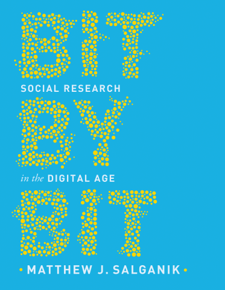
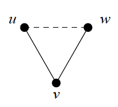
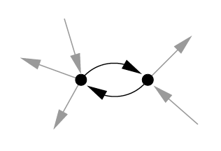
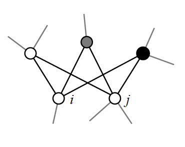
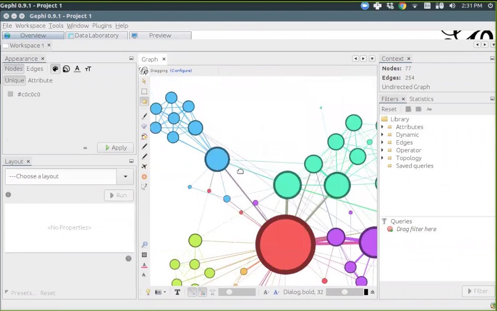
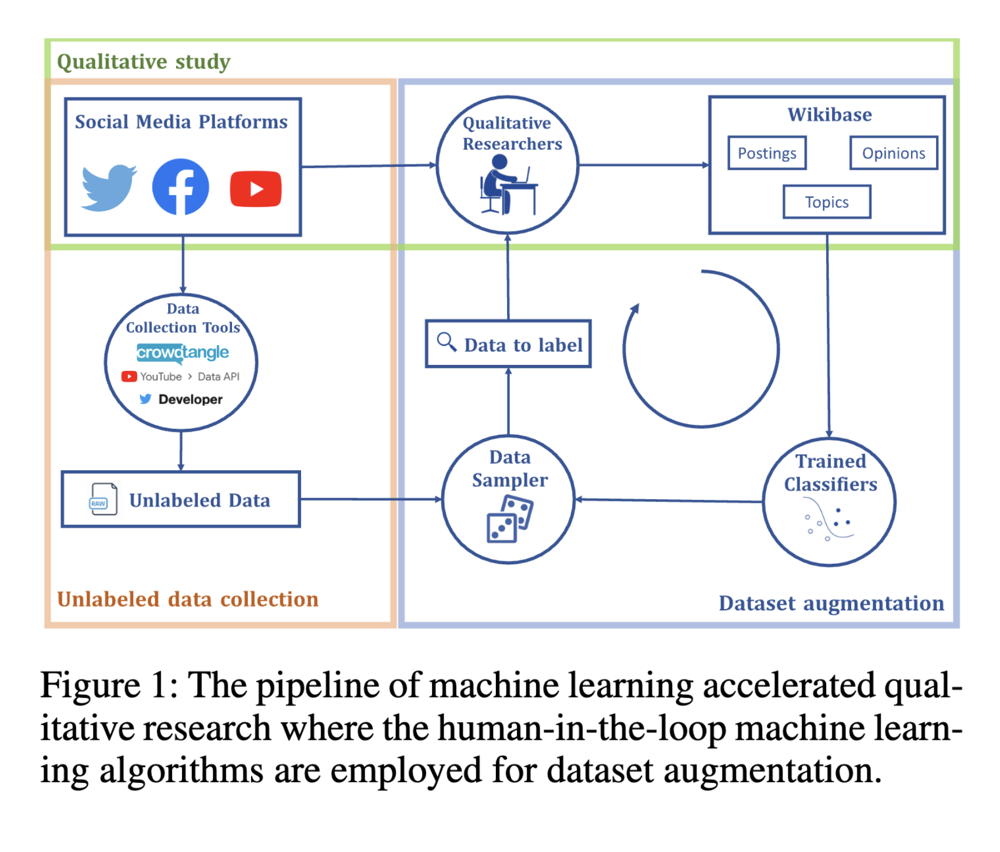
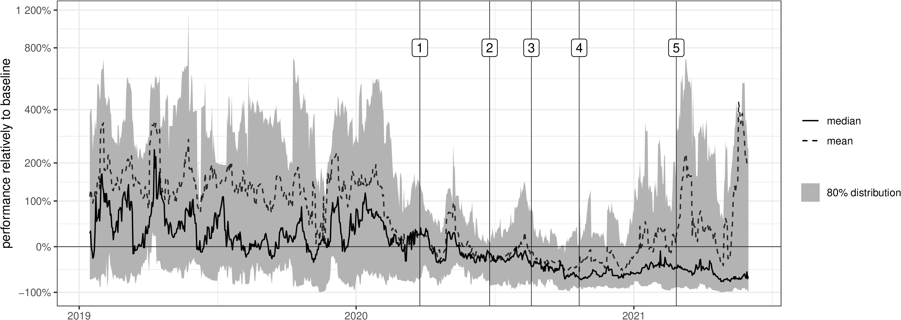
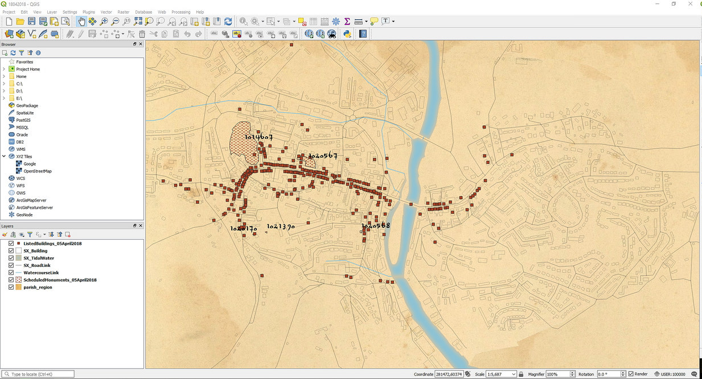

## Acknowledgement of Country

I would like to acknowledge the Traditional Owners of Australia and recognise their continuing connection to land, water and culture. The University of Sydney is located on the land of the Gadigal people of the Eora Nation. I pay my respects to their Elders, past and present.

## Who am I

**Academic Background**

- PhD in Government & International Relations (University of Sydney, 2017)
- Senior Lecturer in the School of Government and International Relations, School of Social and Political Sciences
- Co-Director, [Centre for AI, Trust and Governance](https://www.sydney.edu.au/arts/our-research/centres-institutes-and-groups/centre-for-ai-trust-and-governance.html) and Director of the [Computational Social Science Lab](https://canvas.sydney.edu.au/courses/65547)

**Research Focus**

- Intersection of digital technologies and political participation, and democratic governance
- Computational methods for understanding information systems and their societal and political impacts

**Teaching**: GOVT6139 Research Design (S2), SSPS4102/6006 Data analytics (with R, S1), GOVT3901 Digital Politics (S2) and CISS6022 Cybersecurity (S1).

You can reach me at francesco.bailo@sydney.edu.au.

# Observing behaviour

##

::: columns
::: {.column width="40%"}
This section is largely based on Chapter 2 of @salganik_bit_2018.
:::

::: {.column width="60%"}
{width="70%"}
:::
:::

## Three ways to collect data

Whatever the subject of your research, there are mainly three ways to collect data:

1. Running experiments

. . .

2. Asking questions

. . .

3. Observing behaviour $\leftarrow$

. . .

-   Observational data are collected without interfering with either
    -   the subject of the investigation or
    -   the environment of the subject of the investigation.

## The primordial way of investigating

::: columns
::: {.column width="40%"}
Observation of something or somebody is the primordial way of investigating what we are interested in (and usually the beginning of an investigation).

Using instruments and sensors to observe and record what we observe is not new.

What is new is the number of instruments and sensors that monitor and record human behaviour.
:::

::: {.column width="60%"}
{width="70%"}
:::
:::

## Big Data

The combination of *flow* and the *stock* of data produced by these instruments and sensors is often called **Big Data**.

Big data are *big* on three dimensions:

-   **V**olume
-   **V**ariety
-   **V**elocity

## Examples of Big Data

::: incremental
-   So... can you think of any example of big data or source of big data?

-   Big data are not only data generated by the online activity of users and are not only created by companies.

1.  Big data are generated online and offline every time a sensor records a human behaviour.

2.  Big data are created by companies and governments.
:::

## Big Data: Companies and Governments

> "Big data are created and collected by **companies** and **governments** for purposes other than research. Using this data for research therefore requires repurposing." [@salganik_bit_2018, p. 14]

::: columns
::: {.column width="40%"}
{width="50%"}
:::

::: {.column width="20%"}
::: {style="font-size: 2em; text-align: center;"}
$\neq$
:::
:::

::: {.column width="40%"}
{width="70%"}
:::
:::

## Ten characteristics of Big Data (1/2)

According to @salganik_bit_2018, Big Data shares ten characteristics.

::: incremental
1.  Big Data are **big**: Rare events, heterogeneity, small differences. *But* how data were created?

2.  Big Data are **always-on**: Unexpected events and real-time estimates. *But* the systems that collected the data are constantly changing (see *drifting* later)!

3.  Big Data are **nonreactive**: Measurement is less likely to change behaviour. *But* a social desirability bias persists.

4.  Big Data are **incomplete**: No demographic information, no information on behaviour on other platforms, and no data to operationalise theoretical constructs (e.g. "intelligence").

5.  Big Data are **inaccessible**: Access is controlled and conditional.
:::

## Ten characteristics of Big Data (2/2)

::: incremental
6.  Big Data are **non-representative**: Data do not come from a probabilistic random population sample.

7.  Big Data are **drifting**: Population drift, behavioural drift, system drift. Systems keep changing all the time!

8.  Big Data are **algorithmically confounded**: Engineering choices impact user behaviours. Also, performativity issues.

9.  Big Data are **dirty**: Dirty data can be created unintentionally or intentionally (e.g. bots).

10. Big Data are **sensitive**: The potential sensitivity of the data is always difficult to assess.
:::

# Network analysis

## A very short introduction

::: callout-note
### Relations, not attributes. Networks, not groups.

\[S\]ocial network analysts argue that causation is not located in the individual, but in the social structure. While people with similar attributes may behave similarly, explaining these similarities by pointing to common attributes misses the reality that *individuals with common attributes often occupy similar positions in the social structure*. That is, *people with similar attributes frequently have similar social network positions*. Their similar outcomes are caused by the **constraints**, **opportunities** and **perceptions** created by these similar network positions. [@marin_social_2011, p. 13]
:::

## Network visualisation and adjacency matrix

::: columns
::: {.column width="60%"}

:::

::: {.column width="40%"}
![... and the adjacency matrix of the left-hand network [@newman_networks_2010, p. 111].](figure/undirected_adj_matrix)
:::
:::

## Directed networks

::: columns
::: {.column width="50%"}
{width="70%"}
:::

::: {.column width="50%"}
![... and its adjacency matrix (not symmetric!) [@newman_networks_2010, p. 112].](figure/directed_adj_matrix)
:::
:::

## Network measures

::: columns
::: {.column width="60%"}
::: incremental
-   **Degree of a vertex**: number of connections
-   **Authority of a vertex**: number of important connections
-   **Closeness of a vertex**: mean distance to other vertices
-   **Betweenness of a vertex**: extent to which a vertex lies on paths between other vertices
-   **Group of vertices**
:::
:::

::: {.column width="40%"}
{width="55%"}

{width="55%"}

{width="55%"}
:::
:::

## Network measures (continued)

::: columns
::: {.column width="60%"}
::: incremental
-   **Transitivity of edges**: Alice *friend of* Bob *friend of* Cat *friend of* Alice
-   **Reciprocity of edges**: Alice *friend of* Bob *friend of* Alice
-   **Similarity of vertices**: extent to which the *neighbourhood* of vertices is similar
-   **Homophily of vertices**: tendency to associate with similar vertices
:::
:::

::: {.column width="40%"}
{width="35%"}

{width="40%"}

{width="40%"}
:::
:::

## Example: Friendship network

![Friendship network at a US high school [@newman_networks_2010, p. 221].](figure/race_network){width="55%"}

## Community detection

The goal of a community detection algorithm is simply to separate nodes into groups that have only a few edges *between* them and many edges *within*.

{width="40%"}

## Community detection exercise

How many communities do you see in this network?

{width="40%"}

## Community detection result

## Research example

::: columns
::: {.column width="60%"}

:::

::: {.column width="40%"}

:::
:::

## Tools for network analysis

### Easy, small n: Gephi ([gephi.org](https://gephi.org))

{width="65%"}

## Tools for network analysis (continued)

### Hard, big n: igraph package

igraph ([igraph.org](https://igraph.org)) in R ([www.r-project.org](https://www.r-project.org)) or Python ([www.python.org](https://www.python.org))

{width="60%"}

## Resources for network analysis

Getting started bibliography:

-   **Easy**: @scott_what_2012
-   **Important**: @marin_social_2011
-   **Hard**: @newman_networks_2010

## Tutorials for beginners

Tutorials for beginners by Katherine Ognyanova (Rutgers University):

{width="10%"}

-   Network visualisation with Gephi ([kateto.net/sunbelt2016](https://kateto.net/sunbelt2016))
-   Network visualization with R ([kateto.net/network-visualization](https://kateto.net/network-visualization))
-   Network Analysis and Visualization with R and igraph ([kateto.net/networks-r-igraph](https://kateto.net/networks-r-igraph))

# Text analysis

## Another very short introduction

Quantitative text analysis is necessary when the manual coding of documents is not feasible or acceptable.

When you face a large **corpus** of **documents**, you might want some methods to automatically:

1.  Find patterns within the documents,

2.  Compare (and maybe group) documents.

## Finding patterns

A textual pattern is as simple as `dog`.

-   Finding patterns doesn't involve any statistical analysis.

-   But you might need to use regular expressions (a.k.a. "regex") if your pattern is complex.

## Finding patterns: Example

Let's say that you want to find in your corpus all the instances of `dog` and `cat`.

::: incremental
-   **You want to find**: "I have two [dog]{.underline}s and a [cat]{.underline}" or "[Cat]{.underline}s are felines"

-   **But you don't want to find**: "the [cat]{.underline}egorization of syntactic [cat]{.underline}egories"

-   You need a regular expression like: `\b(cats?|dogs?)\b`
:::

[([link to interactive example](https://regexr.com/3oqld))]{style="font-size: 0.5em;"}

## Finding patterns: Regex basics

A few simple regex topics:

::: incremental
-   **Quantifier**: `?`
    -   `abc?` matches a string that has "ab" followed by zero or one "c"

-   **OR operator**: `|`
    -   `a(b|c)` matches a string that has "a" followed by "b" or "c"

-   **Boundaries**: `\b`
    -   `\babc\b` matches only a whole word
:::

[Exercise: Go to [regexr.com/3os9b](https://regexr.com/3os9b) (not with Explorer) and enter a regular expression to match "France" but also "French".]{style="font-size: 0.8em;"}

## Comparing documents

Comparing documents involves statistical analysis and matrix algebra (while finding patterns doesn't). It usually relies on Natural-language processing (NLP), the branch of computer science that studies the human language and its interactions with the machines.

In its most primordial application, NLP treats documents as **bag-of-words** (BoW):

-   The *position* of terms within the document is disregarded,
-   What counts is the *frequency* of the terms.

## Comparing documents: Processing steps

Let's see how we process documents in a common NLP application.

::: incremental
-   We remove from the documents all the stop-words;

-   doc1 = "drugs hospitals doctors"
    doc2 = "smog pollution environment"
    doc3 = "doctors hospitals healthcare"
    doc4 = "pollution environment water"

-   We count the frequency of each term in each document, and we produce a term-document matrix
:::

## Comparing documents: Term-document matrix

|          | doc1 | doc2 | doc3 | doc4 |
|----------|------|------|------|------|
| doctor   | 1    | 0    | 1    | 0    |
| drug     | 1    | 0    | 0    | 0    |
| environ  | 0    | 1    | 0    | 1    |
| healthcar| 0    | 0    | 1    | 0    |
| hospit   | 1    | 0    | 1    | 0    |
| pollut   | 0    | 1    | 0    | 1    |
| smog     | 0    | 1    | 0    | 0    |
| water    | 0    | 0    | 0    | 1    |

: Term-document matrix. Terms were stemmed.

## Bag of Words (BoW)

-   **Concept:** Text representation as a bag of its words, ignoring the order.
-   **Representation:** Fixed-length vectors, counting word occurrences or indicating presence/absence.
-   **Advantages:** Simple, good for specific tasks like spam detection.
-   **Limitations:** Ignores context and semantics, leading to sparse, high-dimensional vectors.

## Embeddings (used by Large Language Models)

-   **Concept:** Dense, low-dimensional vectors representing words, capturing semantic meanings.
-   **Representation:** Continuous vectors that reflect context and relationships between words.
-   **Advantages:** Captures semantics, reduces dimensionality and is versatile for various NLP tasks.
-   **Limitations:** Requires more computational resources, less intuitive.

## Tools for text analysis

-   Nvivo ([www.qsrinternational.com/nvivo](https://www.qsrinternational.com/nvivo))

-   Regular Expression ([regexr.com](https://regexr.com))

-   R ([www.r-project.org](https://www.r-project.org)) or Python ([www.python.org](https://www.python.org))

-   ChatGPT and other Large Language Models...

## Resources for text analysis

-   **Introductory**: @jockers_text_2014

-   **Introductory**: @bird_natural_2009

-   **Hard**: @manning_introduction_2008

# Ethics

## Issues with relational data

::: columns
::: {.column width="40%"}

:::

::: {.column width="25%"}

:::

::: {.column width="35%"}

:::
:::

## Ethics in the digital age: Open issues

-   Public and Private space. What about online fora (e.g. Facebook public pages?)

-   Informed consent.

-   Right to privacy. But who owns the data?

# My research on social media

## Recent publications

-   @kongSlippingExtremeMixed2022
-   @bailoRidingInformationCrises2024
-   @johnsLabellingShadowBans2024

## Slipping to the extreme

@kongSlippingExtremeMixed2022

-   This study addresses the infiltration of extreme opinions in online discussions, leveraging machine learning algorithms alongside qualitative research methods.
-   Aims to bridge the gap between depth of qualitative insights and breadth of quantitative analysis in understanding problematic online speech.

## Methodology

-   Initial qualitative study constructs an ontology of problematic speech, identifying key themes and opinions in social media posts.
-   Large-scale data collection from Facebook, Twitter, and YouTube, followed by iterative dataset augmentation using a human-in-the-loop approach.
-   Machine learning models classify and augment the dataset, expanding the initial qualitative study's findings.

## Research diagram

## Findings

-   The mixed-method approach successfully identifies and expands the dataset, revealing detailed case studies of problematic speech dynamics in specific online communities.
-   Analysis of opinion emergence and co-occurrence suggests pathways through which extreme opinions enter mainstream online discourse.

## Labelling, shadow bans and community resistance

@johnsLabellingShadowBans2024

-   Focus on the effectiveness of Meta's content moderation on Facebook during COVID-19.
-   Analysis of 18 Australian right-wing/anti-vaccination pages between January 2019 and July 2021.
-   Integration of engagement metrics, time series analysis, and content analysis.

## Sampling

-   Utilised CrowdTangle to collect data from 21 identified Australian Facebook public accounts.
-   Final analysis included 18 accounts after excluding those with less than 1% of relevant posts.
-   A total of 34,202 postings were analysed.

## Data Analysis

-   Performance analysis via CrowdTangle's 'overperforming score' and average number of shares-per-post.
-   Content and thematic analysis on comments from two overperforming public pages.
-   Latent Dirichlet Allocation (LDA) for topic modelling and exploration.

## Results visualization

## Policy Review

-   Examination of Meta's content moderation and recommendation policy announcements.
-   Focus on policies introduced from January 2020 to July 2021 relevant to Facebook.
-   Analysis juxtaposed against key policy announcements and page performance.

## Key Findings

-   Meta's content moderation systems showed partial effectiveness.
-   Identified trends in content labelling and 'shadow banning' resistance by communities.
-   Highlighted the importance and challenges of transparent and consistent moderation policies.

# Bonus: Spatial analysis

## Spatial analysis: John Snow's cholera map

::: columns
::: {.column width="70%"}

:::

::: {.column width="30%"}
Redrawing of John Snow's map of cases of cholera during the London outbreak of 1854 [@tufte_visual_2001, p. 24]
:::
:::

## Tool for spatial analysis

-   QGIS ([qgis.org](https://qgis.org))

{width="80%"}

## References

::: {#refs}
:::
