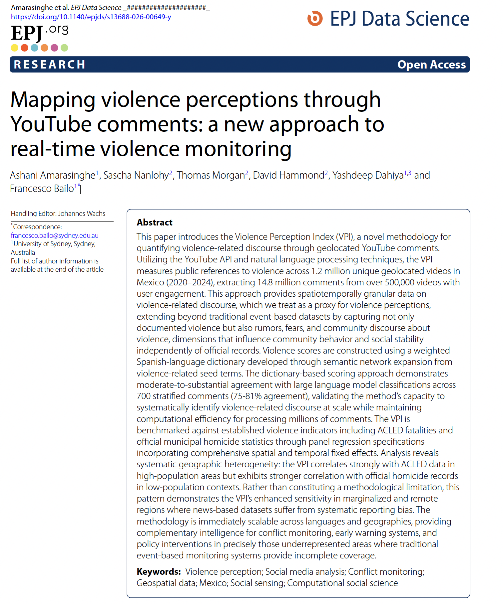
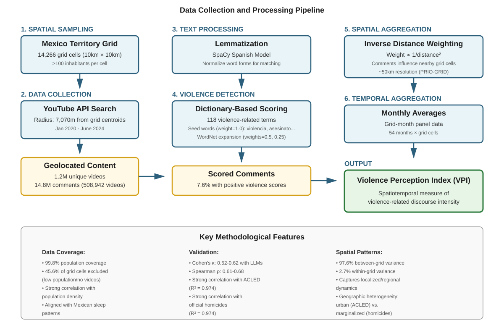

## Published in EPJ Data Science

::: columns
::: {.column width="40%"}
{width=100%}
:::

::: {.column width="60%"}

### with

Ashani Amarasinghe$^1$, Sascha Nanlohy$^2$, Thomas Morgan$^2$, David Hammond$^2$, Yashdeep Dahiya$^{1,3}$ and Francesco Bailo$^1$

**DOI:** [10.1140/epjds/s13688-026-00649-y](https://doi.org/10.1140/epjds/s13688-026-00649-y)

::: {style="font-size: 0.7em; margin-top: 1em;"}
$^1$University of Sydney | $^2$Insititue for Economics and Peace | $^3$Monash University
:::
:::
:::

## Acknowledgement of Country

I would like to acknowledge the Traditional Owners of Australia and recognise their continuing connection to land, water and culture. The University of Sydney is located on the land of the Gadigal people of the Eora Nation. I pay my respects to their Elders, past and present.

# Introduction

## The Challenge of Measuring Violence

Traditional violence datasets face critical limitations:

::: incremental
- **Event-based datasets** (ACLED, UCDP): Document *actual* violence through fatality counts
- **Cannot capture** perceptions, fear, rumors, and community discourse
- **Marginalized and remote areas** remain systematically underreported
- Yet **perceptions matter**: Fear shapes behavior, economic activity, and social stability
:::

## Research Question

::: {.r-fit-text}
**Can we systematically measure violence perceptions at scale using social media discourse?**
:::

::: incremental
- Develop a **Violence Perception Index (VPI)** from geolocated YouTube comments
- Validate against established violence indicators
- Test whether VPI captures dynamics in underrepresented areas
:::

# The Violence Perception Index (VPI)

## What Does the VPI Measure?

VPI quantifies **intensity of violence-related discourse** in geolocated comments:

::: incremental
1. **Direct experience**: Eyewitness accounts
2. **Perceived threat**: Fear and concern
3. **News circulation & rumors**: Reported and unverified violence-related discourse
4. **Historical reference**: Past violence patterns
:::

::: aside
Built from geolocated YouTube comments — vernacular "third spaces" for organic discussion. Case: Mexico (78% social media usage, high violence levels)
:::

# Methodology

## Data & Method Overview

{width=90%}

::: incremental
- **Scale**: 1.2M videos | 14.8M comments (Jan 2020–June 2024) | 99.8% population coverage
- **Dictionary-based scoring**: 118 weighted terms, validated against 4 LLMs (substantial agreement, Cohen's κ 0.52–0.62)
- **Geographic aggregation**: Inverse Distance Weighting → ~50km grid, monthly
:::

# Results

## Strong Correlation with Realized Violence

**Panel regression with comprehensive fixed effects:**

| Predictor | Coefficient | R² |
|-----------|-------------|-----|
| ACLED Fatalities | 0.0257*** | 0.974 |
| Homicides | 0.0142*** | 0.974 |

::: incremental
- Grid, year, and month fixed effects
- **37-67% increase** in VPI per 1-SD increase in violence
:::

## The Key Finding: Geographic Heterogeneity

**Split sample analysis (High vs. Low population grids):**

::: columns
::: {.column width="50%"}
**ACLED (News-based):**

- High pop: **Significant** (0.0004***)
- Low pop: **Not significant**
:::

::: {.column width="50%"}
**Official Homicides:**

- High pop: Not significant
- Low pop: **Significant** (0.0004**)
:::
:::

::: callout-important
### Critical Insight
VPI correlates with ACLED in urban areas BUT with official records in marginalized areas where news coverage fails
:::

# Conclusion

## Key Takeaways

::: incremental
1. **Violence perception is measurable** at scale through social media discourse
2. **VPI correlates strongly** with established violence indicators (R² = 0.97)
3. **Geographic heterogeneity is a feature**: VPI captures discourse where traditional datasets fail — especially in marginalized/remote areas
4. **Immediately scalable** across languages and geographies
:::

::: aside
Use case: early-warning and monitoring systems in precisely those underrepresented areas where traditional systems provide incomplete coverage
:::

# Thank You

**Questions?**

::: columns
::: {.column width="50%"}
**Paper & Data:**

- Paper (EPJ Data Science, open access): [10.1140/epjds/s13688-026-00649-y](https://doi.org/10.1140/epjds/s13688-026-00649-y)
- VPI Dataset for Mexico (OSF): [10.17605/OSF.IO/FA493](https://doi.org/10.17605/OSF.IO/FA493)
- Replication materials (Harvard Dataverse): [10.7910/DVN/C6TJ9K](https://doi.org/10.7910/DVN/C6TJ9K)
:::

::: {.column width="50%"}
**Contact:**

Francesco Bailo

University of Sydney

[francesco.bailo@sydney.edu.au]
:::
:::
