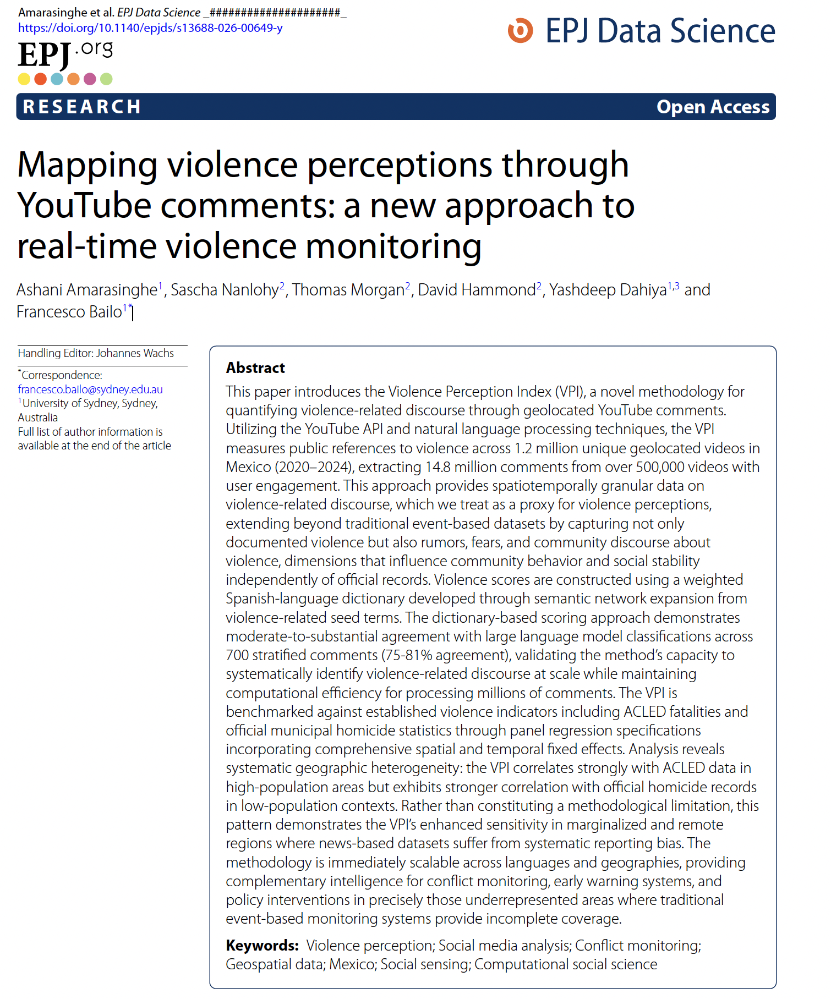
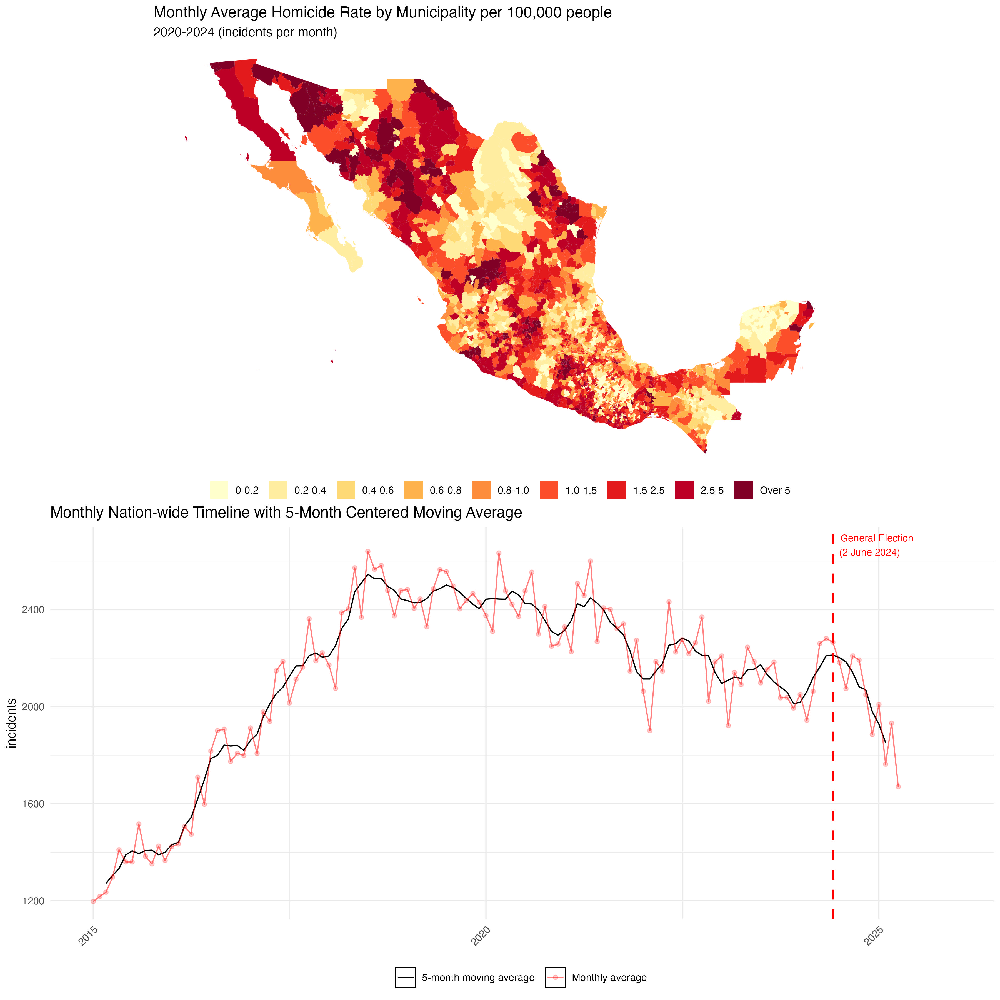
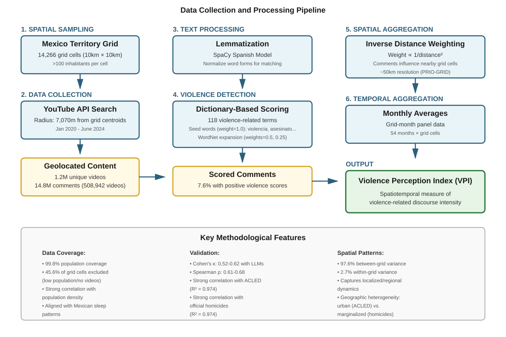
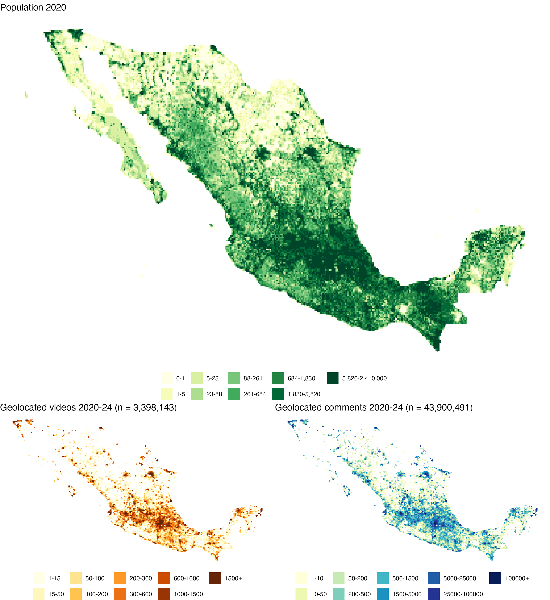
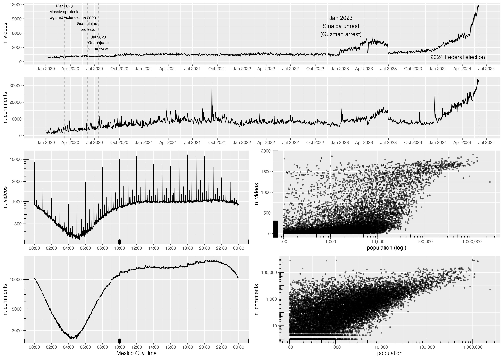
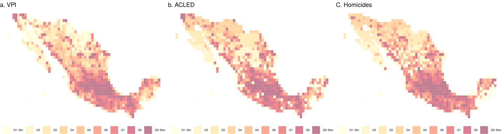
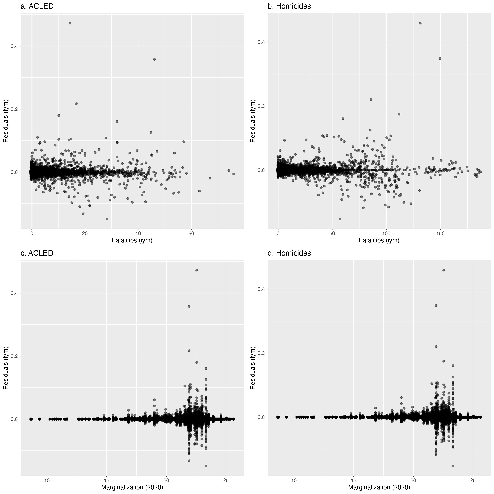
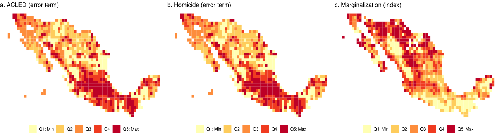
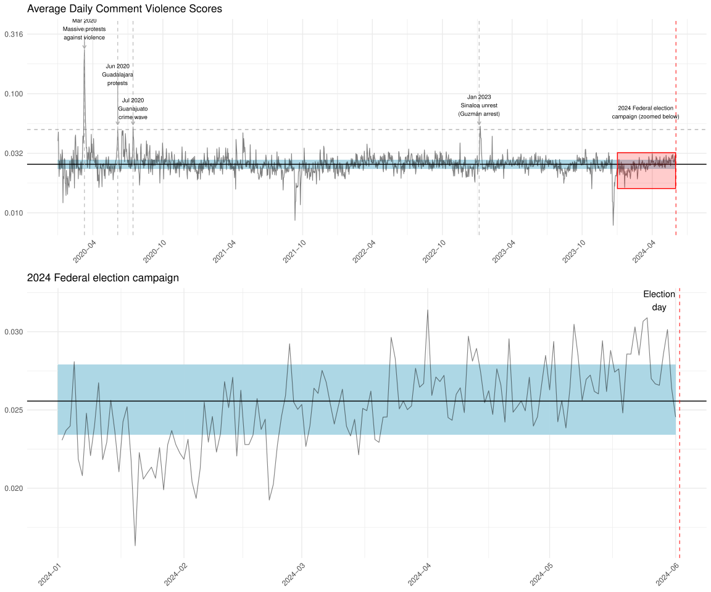

## Based on forthcoming publication with EPJ Data Science

::: columns
::: {.column width="40%"}
{width=100%}
:::

::: {.column width="60%"}

### with

Ashani Amarasinghe$^1$, Sascha Nanlohy$^2$, Thomas Morgan$^2$, David Hammond$^2$, Yashdeep Dahiya$^{1,3}$ and Francesco Bailo$^1$

**DOI:** [10.1140/epjds/s13688-026-00649-y](https://doi.org/10.1140/epjds/s13688-026-00649-y)

::: {style="font-size: 0.7em; margin-top: 1em;"}
$^1$University of Sydney | $^2$Insititue for Economics and Peace | $^3$Monash University
:::
:::
:::

## Acknowledgement of Country

I would like to acknowledge the Traditional Owners of Australia and recognise their continuing connection to land, water and culture. The University of Sydney is located on the land of the Gadigal people of the Eora Nation. I pay my respects to their Elders, past and present.

# Introduction

## The Challenge of Measuring Violence

Traditional violence datasets face critical limitations:

::: incremental
- **Event-based datasets** (ACLED, UCDP): Document *actual* violence through fatality counts
- **Cannot capture** perceptions, fear, rumors, and community discourse
- **Geographic bias**: Urban centers receive extensive coverage
- **Marginalized areas** remain systematically underreported
- Yet **perceptions matter**: Fear shapes behavior, economic activity, and social stability
:::

::: notes
Traditional approaches miss the "soft" signals that matter for understanding community responses.
:::

## What We Can't Measure, We Can't Manage

::: columns
::: {.column width="50%"}
**What Traditional Datasets Capture:**

- Documented fatalities
- Verified violent events
- Urban violence
- Media-reported incidents
:::

::: {.column width="50%"}
**What They Miss:**

- Perceived threats
- Rumors and speculation
- Remote area violence
- Community fear
- Unverified claims
:::
:::

::: callout-important
### The Gap
Violence in marginalized and remote areas remains invisible to traditional monitoring systems
:::

## Research Question

::: {.r-fit-text}
**Can we systematically measure violence perceptions at scale using social media discourse?**
:::

::: incremental
- Develop a **Violence Perception Index (VPI)** from geolocated YouTube comments
- Validate against established violence indicators
- Test whether VPI captures dynamics in underrepresented areas
:::

# The Violence Perception Index (VPI)

## What Does the VPI Measure?

VPI quantifies **intensity of violence-related discourse** in geolocated comments:

::: incremental
1. **Direct experience**: Eyewitness accounts
2. **Perceived threat**: Fear and concern
3. **News circulation**: Discussion of reported violence
4. **Rumors**: Unverified claims
5. **Historical reference**: Past violence patterns
:::

::: {.fragment}
::: callout-note
### Key Insight
All types matter for understanding community behavior—whether threats are immediate or diffuse, local or national
:::
:::

## Why YouTube Comments?

::: columns
::: {.column width="50%"}
**Platform Advantages:**

- Geolocated content
- Vernacular discourse
- "Third spaces" for organic discussion
- Complementary to news data
:::

::: {.column width="60%"}
**Mexico Context:**

- 78% social media usage (2023)
- 79% Internet as primary news source
- Robust digital engagement
- High violence levels
:::
:::

## Why Mexico?

{width=50%}

# Methodology

## Overview of Data Collection

{width=85%}

## Data Collection Pipeline

{width=45%}

::: aside
1.2M videos | 14.8M comments | Jan 2020 - June 2024
:::

## Data Scale and Coverage

{width=75%}

::: aside
99.8% population coverage | Spike during 2024 election campaign
:::

## Building the Violence Dictionary

**Semantic network expansion from seed words:**

::: incremental
1. **10 seed terms**: violencia, asesinato, homicidio, tiroteo, ataque...
2. **WordNet expansion**: 2 levels of semantic relations
3. **118 total terms** with distance-based weights:
   - Seed words: weight = 1.0
   - Distance 1: weight = 0.5
   - Distance 2: weight = 0.25
4. **Weighted scoring**: Sum of term frequencies × weights
:::

::: {.fragment}
::: callout-tip
### Scalability
WordNet resources exist for dozens of languages → cross-linguistic application
:::
:::

## From Comments to Geographic Index

**Multi-stage transformation:**

::: incremental
1. **Text processing**: Lemmatization with SpaCy Spanish model
2. **Scoring**: Weighted term frequency for each comment
3. **Geographic aggregation**: Inverse Distance Weighting (IDW)
   - Comments influence nearby grid cells
   - Weight ∝ 1/distance²
4. **Temporal aggregation**: Monthly averages at ~50km resolution (PRIO-GRID)
:::

::: aside
7.6% of comments received positive violence scores
:::

# Validation

## Validating the Dictionary Approach

**Comparison with 4 Large Language Models** (700 stratified comments):

::: columns
::: {.column width="50%"}
**Agreement Metrics:**

- Cohen's κ: **0.52-0.62**
- Raw agreement: **75-81%**
- Fleiss' Kappa: **0.80** (p<0.0001)
:::

::: {.column width="50%"}
**Correlation (continuous):**

- Spearman ρ: **0.61-0.68**
- ICC: **0.61-0.68**
:::
:::

::: callout-important
Dictionary approach shows substantial agreement with semantic LLM analysis while maintaining computational efficiency
:::

## Benchmark Datasets

We validate VPI against three established indicators:

::: incremental
1. **ACLED fatalities**: News-based conflict event data
2. **UCDP fatalities**: Armed conflict data
3. **Official homicide statistics**: Mexican government records
:::

::: {.fragment}
**Plus contextual data:**

- Population density (WorldPop 2020)
- Marginalization index (Census 2020)
:::

## Geographic Distribution Comparison

{width=85%}

::: aside
Visual correlation across southern Mexico | All variables population-weighted
:::

# Results

## Strong Correlation with Realized Violence

**Panel regression with comprehensive fixed effects:**

| Predictor | Coefficient | R² |
|-----------|-------------|-----|
| ACLED Fatalities | 0.0257*** | 0.974 |
| Homicides | 0.0142*** | 0.974 |

::: incremental
- Grid fixed effects: Time-invariant characteristics
- Year fixed effects: Temporal shocks
- Month fixed effects: Seasonal patterns
- **37-67% increase** in VPI per 1-SD increase in violence
:::

## The Key Finding: Geographic Heterogeneity

**Split sample analysis (High vs. Low population grids):**

::: columns
::: {.column width="50%"}
**ACLED (News-based):**

- High pop: **Significant** (0.0004***)
- Low pop: **Not significant**
:::

::: {.column width="50%"}
**Official Homicides:**

- High pop: Not significant
- Low pop: **Significant** (0.0004**)
:::
:::

::: callout-important
### Critical Insight
VPI correlates with ACLED in urban areas BUT with official records in marginalized areas where news coverage fails
:::

## Why This Matters

::: {layout-ncol=2}
{width=100%}

{width=100%}
:::

::: aside
Larger residuals in marginalized areas = VPI captures discourse where traditional monitoring fails
:::

## Spatial Dynamics

**Spillover analysis at different distances:**

::: incremental
- **Own-grid violence** remains significant across specifications
- **Low-population grids**: Regional spillovers dominate
  - Communities form functional economic regions
  - Violence in neighbors affects travel, markets, security
- **High-population grids**: Own-grid effects dominate
  - Hyperlocal discourse saturates information environment
:::

::: aside
VPI captures how violence perception actually operates across urban-rural continuum
:::

## Variance Decomposition

**Where does VPI variation come from?**

| Component | % of Total Variance |
|-----------|---------------------|
| Between-grid (spatial) | **97.6%** |
| Within-grid (temporal) | **2.7%** |

::: callout-note
### Interpretation
VPI primarily captures **localized/regional dynamics** rather than uniform national discourse about historical events
:::

# Discussion

## VPI as Complementary Intelligence

::: columns
::: {.column width="50%"}
**Traditional Datasets:**

- Document verified events
- Strong in urban areas
- Retrospective
- Complete event details
:::

::: {.column width="50%"}
**Violence Perception Index:**

- Captures discourse & fear
- Strong in marginalized areas
- Near real-time
- Community perspective
:::
:::

::: callout-tip
### Use Case
Early warning and monitoring in precisely those underrepresented areas where traditional systems provide incomplete coverage
:::

## Methodological Contributions

::: incremental
1. **Feasibility**: Large-scale systematic measurement of violence perception
2. **Scalability**: Dictionary-based approach works across languages
3. **Granularity**: ~50km spatial, monthly temporal resolution
4. **Validation**: Moderate-substantial agreement with LLMs and realized violence
5. **Innovation**: Captures dynamics in areas with systematic reporting bias
:::

## Limitations and Future Directions

::: columns
::: {.column width="50%"}
**Current Limitations:**

- Platform bias (digital literacy, age, urban)
- Aggregates all discourse types
- Can't distinguish local vs. national
- Vulnerable to manipulation
- 3.45% geolocation rate
:::

::: {.column width="50%"}
**Future Extensions:**

- LLM-based discourse classification
- Multi-platform integration
- Real-time monitoring systems
- Cross-linguistic implementation
- Rumor vs. fact decomposition
:::
:::

## Temporal Alignment with Events

{width=60%}

::: aside
Alignment during violence escalations | Best use: detecting localized perturbations
:::

# Conclusion

## Key Takeaways

::: incremental
1. **Violence perception is measurable** at scale through social media discourse
2. **VPI correlates strongly** with established violence indicators (R² = 0.97)
3. **Geographic heterogeneity is a feature**: VPI captures discourse where traditional datasets fail
4. **Marginalized areas gain visibility** through community-generated content
5. **Immediately scalable** across languages and geographies
:::

## Policy Implications

::: {.r-fit-text}
When communities fear violence, that fear shapes behavior—regardless of whether threats are documented
:::

::: incremental
- **Early warning systems** can integrate perception data
- **Monitoring gaps** in remote/marginalized areas can be filled
- **Community perceptions** provide actionable intelligence
- **Near real-time** detection of emerging hotspots
:::

## Final Thoughts

::: columns
::: {.column width="50%"}
**What we've demonstrated:**

- Systematic measurement works
- Dictionary approach is valid
- Complements existing data
- Addresses known biases
:::

::: {.column width="50%"}
**What comes next:**

- Multi-platform integration
- Real-time deployment
- Cross-national application
- Discourse type classification
:::
:::

::: callout-important
### The Promise
Capturing violence dynamics in precisely those underrepresented areas where traditional monitoring systems provide incomplete coverage
:::

# Thank You

**Questions?**

::: columns
::: {.column width="50%"}
**Paper & Data:**

- Paper (EPJ Data Science, open access): [10.1140/epjds/s13688-026-00649-y](https://doi.org/10.1140/epjds/s13688-026-00649-y)
- VPI Dataset for Mexico (OSF): [10.17605/OSF.IO/FA493](https://doi.org/10.17605/OSF.IO/FA493)
- Replication materials (Harvard Dataverse): [10.7910/DVN/C6TJ9K](https://doi.org/10.7910/DVN/C6TJ9K)
:::

::: {.column width="50%"}
**Contact:**

Francesco Bailo

University of Sydney

[francesco.bailo@sydney.edu.au]
:::
:::

