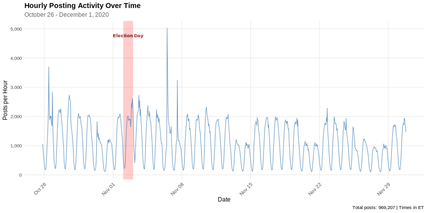

## Acknowledgement of Country

I would like to acknowledge the Traditional Owners of Australia and  recognise their continuing connection to land, water and culture. The  University of Sydney is located on the land of the Gadigal people  of the Eora Nation. I pay my respects to their Elders, past and present.

---

---

## The Challenge: Information Disorder in Democracy

Citizens face immersion in environments where coherent understanding becomes impossible

- Traditional fact-checking approach has fundamental limitations:
  - Requires establishing contested ground truths
  - Doesn't scale across millions of posts
  - Misses how contradictory *legitimate* perspectives undermine sense-making

**Key distinction**: Healthy pluralism → Chaotic pluralism

- Citizens possess **epistemic rights** to sufficient information AND competence to navigate information systems
- When undermined, consequences extend beyond confusion to degradation of democratic deliberation

---

## Our Contribution: Measuring Disorder Without Adjudicating Truth

**Framework**: Information environments as networks of semantic relationships

- **Infons** [@devlinLogicInformation1991; @floridiPhilosophyInformation2011]: discrete, meaningful units of information (individual posts)
- Relationships between infons: agreement, disagreement, or independence
- **No reference to ground truth needed** - assess mutual support/contradiction

**Information Disorder Measure**:

$$
D = \frac{|E^-|}{|E^+| + |E^-| + |E^0|}
$$

Where $E^+$ = agreement, $E^-$ = disagreement, $E^0$ = independence

Ranges from 0 (no disagreement) to 1 (complete disagreement)


---

## Methodological Innovation: Supra-Infon

**Supra-infon**: Anchoring claim outside immediate information space

::: columns
::: {.column width="40%"}

*"The election has been administered fairly so far"*

- Each infon classified as agreeing, disagreeing, or independent with respect to this reference
- Enables measurement of discourse alignment with specific positions
- **Still without adjudicating truth value**

:::

::: {.column width="60%"}

```{r echo = FALSE, dev = "svg", out.width="100%"}

library(igraph)
library(ggraph)
library(tidygraph)
library(RColorBrewer)

# Set seed for reproducibility
set.seed(42)

# =============================================================================
# Function to create a representative signed network
# =============================================================================

create_network <- function(n_nodes, 
                          p_agreement = 0.3, 
                          p_disagreement = 0.3,
                          include_supra = TRUE) {
  # Create node labels
  node_ids <- paste0("Infon ", 1:n_nodes)
  if (include_supra) {
    node_ids <- c(node_ids, "Supra")
  }
  
  n_total <- length(node_ids)
  
  # Create adjacency matrix
  adj_matrix <- matrix(0, n_total, n_total)
  rownames(adj_matrix) <- colnames(adj_matrix) <- node_ids
  
  # Generate edges between regular nodes (not supra)
  if (n_nodes > 1) {
    for (i in 1:(n_nodes-1)) {
      for (j in (i+1):n_nodes) {
        rand <- runif(1)
        if (rand < p_agreement) {
          adj_matrix[i, j] <- 1  # Agreement
          adj_matrix[j, i] <- 1
        } else if (rand < (p_agreement + p_disagreement)) {
          adj_matrix[i, j] <- -1  # Disagreement
          adj_matrix[j, i] <- -1
        }
        # Otherwise: independence (no edge)
      }
    }
  }
  
  # Add connections to supra-infon
  if (include_supra) {
    supra_idx <- n_total
    for (i in 1:n_nodes) {
      rand <- runif(1)
      if (rand < 0.35) {
        adj_matrix[i, supra_idx] <- 1  # Agree with supra
        adj_matrix[supra_idx, i] <- 1
      } else if (rand < 0.65) {
        adj_matrix[i, supra_idx] <- -1  # Disagree with supra
        adj_matrix[supra_idx, i] <- -1
      }
      # Otherwise: independent from supra
    }
  }
  
  # Create igraph object
  g <- graph_from_adjacency_matrix(adj_matrix, mode = "undirected", 
                                   weighted = TRUE, diag = FALSE)
  
  # Set node attributes
  V(g)$type <- ifelse(V(g)$name == "Supra", "supra", "post")
  V(g)$label <- V(g)$name
  
  # Set edge attributes based on weight
  E(g)$relationship <- ifelse(E(g)$weight > 0, "agreement", "disagreement")
  
  return(g)
}

# Network 1: 9 nodes (Set 1 - Partisan samples)
g_small <- create_network(n_nodes = 9, 
                          p_agreement = 0.25, 
                          p_disagreement = 0.30,
                          include_supra = TRUE)

plot_network_ggraph <- function(g) {
  # Convert to tbl_graph
  tg <- as_tbl_graph(g) %>%
    activate(nodes) %>%
    mutate(type = ifelse(name == "Supra", "Supra-infon", "Post")) %>%
    activate(edges) %>%
    mutate(relationship = ifelse(weight > 0, "Agreement", "Disagreement"),
           abs_weight = abs(weight))  # Add absolute weight for layout
  
  # Create plot - use abs_weight for layout computation
  p <- ggraph(tg, layout = "fr", weights = abs_weight) +
    # Edges
    geom_edge_link(aes(color = relationship, edge_width = relationship), 
                   alpha = 0.8) +  # Increased alpha from 0.7
    scale_edge_color_manual(values = c("Agreement" = "#2E8B57", 
                                       "Disagreement" = "#DC143C"),
                           name = "Relationship") +
    scale_edge_width_manual(values = c("Agreement" = 2.0,   # Increased from 1.5
                                       "Disagreement" = 2.0),
                           guide = "none") +
    # Nodes
    geom_node_point(aes(size = type, fill = type), 
                    shape = 21, color = "gray30", stroke = 1.5) +  # Increased stroke
    scale_size_manual(values = c("Post" = 12, "Supra-infon" = 20),  # Increased from 8 and 15
                     name = "Node Type") +
    scale_fill_manual(values = c("Post" = "#87CEEB", "Supra-infon" = "#FFD700"),
                     name = "Node Type") +
    # Labels
    geom_node_text(aes(label = name, fontface = ifelse(type == "Supra-infon", "bold", "plain")),
                   size = 5, repel = TRUE) +  # Increased from 3 to 5
    # Theme
    theme_void() +
    theme(legend.position = "bottom",
          legend.text = element_text(size = 14),        # Increased legend text
          legend.title = element_text(size = 16, face = "bold"),  # Increased legend title
          plot.title = element_text(hjust = 0.5, size = 18, face = "bold"),  # Increased from 14 to 18
          plot.margin = margin(10, 10, 10, 10))
  
  return(p)
}

print(plot_network_ggraph(g_small))


```

:::
:::


---

## Data Collection

**Source**: Facebook via CrowdTangle API (🪦 RIP)

::: columns
::: {.column width="50%"}

**Account types**:

* 749 curated lists (Local News, Politics, Metro groups, etc.)
* Republican and Democrat officials, state parties, PACs

:::

::: {.column width="50%"}

**Coverage**:

* 969,207 posts from 38,149 accounts
* October 26 - December 1, 2020
* With Election Day on 3 Nov 2020.

:::
:::


{width=100%}


---

{width=100%}

---


```{r setup, echo = FALSE}
library(tidyverse)
library(knitr)

# File paths - adjust these to your actual paths
DATA_DIR <- "/Users/fbai9728/Library/CloudStorage/OneDrive-TheUniversityofSydney(Staff)/research/2025-info-disorder-us-election-in-2020/LLM-coding/run-2/results/"
BINARY_RESULTS <- paste0(DATA_DIR, "election_coding_results_full.csv")
ENHANCED_RESULTS <- paste0(DATA_DIR, "election_coding_results_enhanced.csv")
RELIABILITY_SUMMARY <- paste0(DATA_DIR, "reliability_summary_table.csv")
KAPPA_MATRIX <- paste0(DATA_DIR, "reliability_kappa_matrix.csv")
INFON_RESULTS_DEM <- "/Users/fbai9728/Library/CloudStorage/OneDrive-TheUniversityofSydney(Staff)/research/2025-info-disorder-us-election-in-2020/LLM-coding/run-2/06_classify_infons/results/posts_sampled_democrat_results_3models_20251211_034121.csv"
INFON_RESULTS_REP <- "/Users/fbai9728/Library/CloudStorage/OneDrive-TheUniversityofSydney(Staff)/research/2025-info-disorder-us-election-in-2020/LLM-coding/run-2/06_classify_infons/results/posts_sampled_republican_results_3models_20251211_034121.csv"
INFON_RESULTS_GEN <- "/Users/fbai9728/Library/CloudStorage/OneDrive-TheUniversityofSydney(Staff)/research/2025-info-disorder-us-election-in-2020/LLM-coding/run-2/06_classify_infons/results/posts_sampled_general_results_3models_20251211_034121.csv"
```

```{r}
#| echo: false
df_infons <- 
  readr::read_csv(INFON_RESULTS_DEM, show_col_types = FALSE) %>%
  dplyr::mutate(party = "democrat") %>%
  dplyr::bind_rows(read_csv(INFON_RESULTS_REP, show_col_types = FALSE) %>%
                     dplyr::mutate(party = "general")) %>%
  dplyr::bind_rows(read_csv(INFON_RESULTS_GEN, show_col_types = FALSE) %>%
                     dplyr::mutate(party = "republican"))
```


# Overview

## Pipeline Overview

```{mermaid}
%%| echo: false
%%| fig-width: 10
%%| fig-align: center
flowchart TD
    A["Raw Data<br>(~1M Posts)"] --> B["Stage 1: Binary Classification<br>(Sample 1K posts, 10 LLMs)"]
    B --> C["Stage 2: Intercoder Reliability<br>(Large vs Small Models)"]
    C --> D["Stage 3: ML Classifier<br>(Train on LLM labels)"]
    D --> E["Stage 4: Relationship Classif.<br>(Agreement/Disagreement)<br>on sample"]
```

# Stage 1: Binary Classification

## Stage 1: Binary Classification

**Task**: Identify election-related posts using LLM ensemble

```{r}
#| echo: false
# Load binary classification results
if (file.exists(BINARY_RESULTS)) {
  df_binary <- read_csv(BINARY_RESULTS, show_col_types = FALSE)
  n_posts <- nrow(df_binary)
} else {
  n_posts <- "N/A"
  df_binary <- NULL
}
```

::: columns
::: {.column width="50%"}
**Input**

- Random sample: `r if(exists("n_posts")) n_posts else "1,000"` posts
- Seed: 42 (reproducible)
:::

::: {.column width="50%"}
**Output**

- Each post labeled by 10 models
- Labels: 0 (not election), 1 (election), -1 (error)
:::
:::

## Models Used

::: columns
::: {.column width="50%"}
### Large Models (20-32B)

| Model | Parameters |
|-------|------------|
| gemma3:27b | 27B |
| llama4:scout | ~17B |
| gpt-oss:20b | 20B |
| deepseek-r1:32b | 32B |
| qwen3:30b | 30B |
:::

::: {.column width="50%"}
### Small Models (0.6-3.8B)

| Model | Parameters |
|-------|------------|
| phi3:3.8b | 3.8B |
| qwen3:0.6b | 0.6B |
| deepseek-r1:1.5b | 1.5B |
| llama3.2:1b | 1B |
| gemma3:1b | 1B |
:::
:::

## Classification Results by Model

```{r}
#| echo: false
#| fig-height: 5
if (!is.null(df_binary)) {
  # Get label columns
  label_cols <- names(df_binary)[str_detect(names(df_binary), "_label$")]
  
  # Calculate stats per model
  model_stats <- df_binary %>%
    select(all_of(label_cols)) %>%
    pivot_longer(everything(), names_to = "model", values_to = "label") %>%
    mutate(model = str_remove(model, "_label$")) %>%
    group_by(model) %>%
    summarise(
      n_election = sum(label == 1, na.rm = TRUE),
      n_not_election = sum(label == 0, na.rm = TRUE),
      n_error = sum(label == -1, na.rm = TRUE),
      pct_election = n_election / (n_election + n_not_election) * 100,
      .groups = "drop"
    ) %>%
    mutate(
      model_size = case_when(
        model %in% c("gemma3:27b", "llama4:scout", "gpt-oss:20b", 
                     "deepseek-r1:32b", "qwen3:30b") ~ "Large",
        TRUE ~ "Small"
      )
    ) %>%
    arrange(desc(model_size), pct_election)
  
  ggplot(model_stats, aes(x = reorder(model, pct_election), y = pct_election, fill = model_size)) +
    geom_col() +
    geom_text(aes(label = paste0(round(pct_election, 1), "%")), hjust = -0.1, size = 3) +
    coord_flip() +
    scale_fill_manual(values = c("Large" = "#2166AC", "Small" = "#B2182B")) +
    scale_y_continuous(limits = c(0, 100)) +
    labs(
      title = "Percentage of Posts Classified as Election-Related",
      x = NULL,
      y = "% Election-Related",
      fill = "Model Size"
    ) +
    theme_minimal() +
    theme(legend.position = "bottom")
} else {
  cat("Data file not found. Please check the file path.")
}
```

## Error Rates by Model

```{r}
#| echo: false
if (!is.null(df_binary) && exists("model_stats")) {
  model_stats %>%
    select(model, model_size, n_error, n_election, n_not_election) %>%
    mutate(
      total = n_election + n_not_election + n_error,
      error_rate = paste0(round(n_error / total * 100, 1), "%")
    ) %>%
    select(Model = model, Size = model_size, Errors = n_error, `Error Rate` = error_rate) %>%
    kable()
}
```

::: callout-note
### Timeout Issues
Reasoning models (deepseek-r1, qwen3) required extended timeouts (600s) due to chain-of-thought processing.
:::

# Stage 2: Intercoder Reliability

## Stage 2: Intercoder Reliability

**Purpose**: Validate LLM annotations by measuring agreement between models

```{r}
#| echo: false
if (file.exists(RELIABILITY_SUMMARY)) {
  reliability_summary <- read_csv(RELIABILITY_SUMMARY, show_col_types = FALSE)
}
```

::: callout-important
### Key Question

Do large models agree with each other more than small models?
:::

## Reliability Metrics

```{r}
#| echo: false
if (exists("reliability_summary")) {
  reliability_summary %>%
    kable(digits = 3)
} else {
  cat("Reliability summary not found. Run 02_intercoder_reliability.R first.")
}
```

::: aside
**Interpretation**: Kappa > 0.61 = substantial agreement; Krippendorff's α > 0.67 = acceptable
:::

## Pairwise Cohen's Kappa

```{r}
#| echo: false
#| fig-height: 5
if (file.exists(KAPPA_MATRIX)) {
  kappa_df <- read_csv(KAPPA_MATRIX, show_col_types = FALSE)
  
  # Convert to matrix for heatmap
  kappa_mat <- kappa_df %>%
    column_to_rownames("model") %>%
    as.matrix()
  
  # Convert to long format for ggplot
  kappa_long <- kappa_df %>%
    pivot_longer(-model, names_to = "model2", values_to = "kappa") %>%
    mutate(
      model = factor(model, levels = kappa_df$model),
      model2 = factor(model2, levels = kappa_df$model)
    )
  
  ggplot(kappa_long, aes(x = model2, y = model, fill = kappa)) +
    geom_tile() +
    geom_text(aes(label = round(kappa, 2)), size = 2.5) +
    scale_fill_gradient2(low = "#B2182B", mid = "white", high = "#2166AC", midpoint = 0.5) +
    labs(
      title = "Cohen's Kappa Between Model Pairs",
      x = NULL, y = NULL,
      fill = "Kappa"
    ) +
    theme_minimal() +
    theme(
      axis.text.x = element_text(angle = 45, hjust = 1, size = 8),
      axis.text.y = element_text(size = 8)
    )
}
```

## Key Finding: Small Models Unreliable

```{r}
#| echo: false
if (!is.null(df_binary) && exists("model_stats")) {
  small_models <- model_stats %>%
    filter(model_size == "Small") %>%
    select(Model = model, `% Election` = pct_election, Errors = n_error)
  
  kable(small_models, digits = 1)
}
```

::: callout-warning
### Critical Issue

Small models (llama3.2:1b, gemma3:1b) classified **89-96%** of posts as election-related, indicating they cannot discriminate between election and non-election content.

**Decision**: Use only large model majority for ground truth.
:::

# Stage 3: ML Classifier

## Stage 3: ML Classifier Training

**Purpose**: Train traditional ML to scale classification without LLM inference cost

::: columns
::: {.column width="50%"}
### Ground Truth

- `majority_large` column
- Consensus of 5 large LLMs
:::

::: {.column width="50%"}
### Features

- TF-IDF vectors
- 5,000 features
- 1-2 ngrams
:::
:::

## Models Evaluated

| Model | Class Balancing |
|-------|-----------------|
| Logistic Regression | `class_weight='balanced'` |
| Random Forest | `class_weight='balanced'` |
| Gradient Boosting | Sample weights |

::: callout-tip
### Best Model

Selected based on ROC-AUC score on held-out test set (20%)
:::

## Performance Metrics

```{r}
#| echo: false
# Load model metadata if exists
model_metadata_path <- paste0(DATA_DIR, "ml_models/model_metadata.json")
if (file.exists(model_metadata_path)) {
  model_metadata <- jsonlite::fromJSON(model_metadata_path)
  
  tibble(
    Metric = c("Model Type", "Accuracy", "ROC-AUC", "Training Samples", "Test Samples"),
    Value = c(
      model_metadata$model_type,
      round(model_metadata$accuracy, 3),
      round(model_metadata$roc_auc, 3),
      model_metadata$training_samples,
      model_metadata$test_samples
    )
  ) %>%
    kable()
} else {
  cat("Model metadata not found. Run 03_train_classifier.py first.")
}
```

## Outcome: Classification of posts using logistic regression

```{r}
#| echo: false
#| cache: true
library(DBI)
library(RSQLite)

con <- dbConnect(RSQLite::SQLite(), 
  normalizePath("~/Library/CloudStorage/OneDrive-TheUniversityofSydney(Staff)/research/2025-info-disorder-us-election-in-2020/LLM-coding/run-2/results/posts_classified.db"))
classified <- dbReadTable(con, "classified_posts")
dbDisconnect(con)

tibble(
  Metric = c("Total posts classified", "Election-related", "Not election-related"),
  Count = c(
    format(nrow(classified), big.mark = ","),
    paste0(format(sum(classified$prediction == 1), big.mark = ","), 
           " (", round(mean(classified$prediction == 1) * 100, 1), "%)"),
    paste0(format(sum(classified$prediction == 0), big.mark = ","),
           " (", round(mean(classified$prediction == 0) * 100, 1), "%)")
  )
) |>
  kable()
```

## Temporal Window Sampling

**Goal**: Create comparable samples across partisan information environments

::: columns
::: {.column width="50%"}
### Strategy

1. **Window creation**: Group posts into 3-hour windows

2. **Weighted sampling**: Up to 20 posts per window, weighted by engagement

3. **Three environments**: Democrat, Republican, General pages
:::

::: {.column width="50%"}
### Rationale

| Choice | Reason |
|--------|--------|
| 3-hour windows | Temporal granularity with sufficient posts |
| Max 20 posts | Limits pairs: $\binom{20}{2} = 190$ |
| Share-weighted | Prioritizes high-reach content |
| Seed = 42 | Reproducibility |

:::
:::

::: callout-note
Partisan classification based on CrowdTangle list titles containing "democrat" or "republican"
:::

## Sample 3-hour window with max 20 posts

```{r echo = FALSE, dev = "svg", out.width="50%"}

library(igraph)
library(ggraph)
library(tidygraph)
library(RColorBrewer)

# Set seed for reproducibility
set.seed(42)

# =============================================================================
# Function to create a representative signed network
# =============================================================================

create_network <- function(n_nodes, 
                          p_agreement = 0.3, 
                          p_disagreement = 0.3,
                          include_supra = TRUE) {
  # Create node labels
  node_ids <- paste0("Infon ", 1:n_nodes)
  if (include_supra) {
    node_ids <- c(node_ids, "Supra")
  }
  
  n_total <- length(node_ids)
  
  # Create adjacency matrix
  adj_matrix <- matrix(0, n_total, n_total)
  rownames(adj_matrix) <- colnames(adj_matrix) <- node_ids
  
  # Generate edges between regular nodes (not supra)
  if (n_nodes > 1) {
    for (i in 1:(n_nodes-1)) {
      for (j in (i+1):n_nodes) {
        rand <- runif(1)
        if (rand < p_agreement) {
          adj_matrix[i, j] <- 1  # Agreement
          adj_matrix[j, i] <- 1
        } else if (rand < (p_agreement + p_disagreement)) {
          adj_matrix[i, j] <- -1  # Disagreement
          adj_matrix[j, i] <- -1
        }
        # Otherwise: independence (no edge)
      }
    }
  }
  
  # Add connections to supra-infon
  if (include_supra) {
    supra_idx <- n_total
    for (i in 1:n_nodes) {
      rand <- runif(1)
      if (rand < 0.35) {
        adj_matrix[i, supra_idx] <- 1  # Agree with supra
        adj_matrix[supra_idx, i] <- 1
      } else if (rand < 0.65) {
        adj_matrix[i, supra_idx] <- -1  # Disagree with supra
        adj_matrix[supra_idx, i] <- -1
      }
      # Otherwise: independent from supra
    }
  }
  
  # Create igraph object
  g <- graph_from_adjacency_matrix(adj_matrix, mode = "undirected", 
                                   weighted = TRUE, diag = FALSE)
  
  # Set node attributes
  V(g)$type <- ifelse(V(g)$name == "Supra", "supra", "post")
  V(g)$label <- V(g)$name
  
  # Set edge attributes based on weight
  E(g)$relationship <- ifelse(E(g)$weight > 0, "agreement", "disagreement")
  
  return(g)
}

# Network 1: 9 nodes (Set 1 - Partisan samples)
g_small <- create_network(n_nodes = 20, 
                          p_agreement = 0.25, 
                          p_disagreement = 0.30,
                          include_supra = TRUE)

plot_network_ggraph <- function(g) {
  # Convert to tbl_graph
  tg <- as_tbl_graph(g) %>%
    activate(nodes) %>%
    mutate(type = ifelse(name == "Supra", "Supra-infon", "Post")) %>%
    activate(edges) %>%
    mutate(relationship = ifelse(weight > 0, "Agreement", "Disagreement"),
           abs_weight = abs(weight))  # Add absolute weight for layout
  
  # Create plot - use abs_weight for layout computation
  p <- ggraph(tg, layout = "fr", weights = abs_weight) +
    # Edges
    geom_edge_link(aes(color = relationship, edge_width = relationship), 
                   alpha = 0.8) +  # Increased alpha from 0.7
    scale_edge_color_manual(values = c("Agreement" = "#2E8B57", 
                                       "Disagreement" = "#DC143C"),
                           name = "Relationship") +
    scale_edge_width_manual(values = c("Agreement" = 2.0,   # Increased from 1.5
                                       "Disagreement" = 2.0),
                           guide = "none") +
    # Nodes
    geom_node_point(aes(size = type, fill = type), 
                    shape = 21, color = "gray30", stroke = 1.5) +  # Increased stroke
    scale_size_manual(values = c("Post" = 12, "Supra-infon" = 20),  # Increased from 8 and 15
                     name = "Node Type") +
    scale_fill_manual(values = c("Post" = "#87CEEB", "Supra-infon" = "#FFD700"),
                     name = "Node Type") +
    # Labels
    geom_node_text(aes(label = name, fontface = ifelse(type == "Supra-infon", "bold", "plain")),
                   size = 5, repel = TRUE) +  # Increased from 3 to 5
    # Theme
    theme_void() +
    theme(legend.position = "bottom",
          legend.text = element_text(size = 14),        # Increased legend text
          legend.title = element_text(size = 16, face = "bold"),  # Increased legend title
          plot.title = element_text(hjust = 0.5, size = 18, face = "bold"),  # Increased from 14 to 18
          plot.margin = margin(10, 10, 10, 10))
  
  return(p)
}

print(plot_network_ggraph(g_small))


```


# Stage 4: Relationship Classification

## Stage 4: Infon Relationship Classification

**Task**: Classify semantic relationships between post pairs

::: columns
::: {.column width="33%"}
### AGREEMENT

Co-informative claims that support each other
:::

::: {.column width="33%"}
### DISAGREEMENT

Contradictory claims that cannot both be true
:::

::: {.column width="33%"}
### INDEPENDENCE

Unrelated claims with no bearing on each other
:::
:::

#### We used these three large LLMs and then majority vote

1. gemma3:27b, 27B
2. llama4:scout, ~17B
3. gpt-oss:20b, 20B 

## Pair Types

::: columns
::: {.column width="50%"}
### Post-Post Pairs

- All pairwise combinations
- Within 3-hour windows
- Measures internal coherence
:::

::: {.column width="50%"}
### Post-Supra Pairs

- Each post vs reference statement
- Supra-infon: *"The election has been administered fairly so far"*
- Measures alignment with neutral anchor
:::
:::


## Classification Prompt

::: {.callout-note appearance="minimal" style="font-size: 0.9em; max-height: 550px; overflow-y: auto;"}
You are an Information Analyst classifying the semantic relationship between two discrete items of information (infons) about the 2020 US presidential election.

CONTEXT: The 2020 US Presidential Election...

CLASSIFICATION CATEGORIES:

AGREEMENT: The infons are co-informative...

DISAGREEMENT: The infons are inconsistent or contradictory...

INDEPENDENCE: The infons are logically unrelated...

EXAMPLES:
Infon A: "Poll workers were excluded and couldn't observe the count"
Infon B: "The election has been administered fairly so far"
Classification: DISAGREEMENT
Reason: Excluding observers implies unfair administration; these claims cannot both be true
:::

## Classification Results

```{r}
#| echo: false

supra_id <- "SUPRA_ELECTION_FAIR"

overall_stats <- df_infons %>%
  mutate(pair_type = ifelse(infon_b_id == supra_id, "Post-Supra", "Post-Post")) %>%
  group_by(party) %>%
  summarise(
    `Total Pairs` = n(),
    `Post-Post` = sum(pair_type == "Post-Post"),
    `Post-Supra` = sum(pair_type == "Post-Supra"),
    `% Agreement` = round(mean(majority_relationship == "agreement") * 100, 1),
    `% Disagreement` = round(mean(majority_relationship == "disagreement") * 100, 1),
    `% Independent` = round(mean(majority_relationship == "independent") * 100, 1),
    .groups = "drop"
  )

kable(overall_stats)
```

## Relationship Distribution

```{r}
#| echo: false
posts_party <- 
  read_csv("~/Library/CloudStorage/OneDrive-TheUniversityofSydney(Staff)/research/2025-info-disorder-us-election-in-2020/outputs/UNSW RDL 2026/posts_party_timestamp.csv")
```

```{r}
#| echo: false
#| fig-height: 7
#| fig-width: 14
#| out-width: "100%"

library(zoo)
library(patchwork)

supra_id <- "SUPRA_ELECTION_FAIR"

# Disorder timeline
disorder_timeline <- df_infons %>%
  mutate(
    pair_type = ifelse(infon_b_id == supra_id, "Post–Supra-infon", "Post–Post"),
    party = factor(party, levels = c("democrat", "general", "republican"),
                   labels = c("Democrat", "General", "Republican"))
  ) %>%
  filter(majority_relationship %in% c("agreement", "disagreement")) %>%
  group_by(party, pair_type, window_3hr) %>%
  summarise(
    disorder = sum(majority_relationship == "disagreement") / n(),
    .groups = "drop"
  ) %>%
  arrange(party, pair_type, window_3hr) %>%
  group_by(party, pair_type) %>%
  mutate(disorder_roll = rollmean(disorder, k = 4, fill = NA, align = "center")) %>%
  ungroup()

# Post intensity from posts_party
post_counts <- posts_party %>%
  mutate(window_3hr = floor_date(datetime, "3 hours")) %>%
  group_by(party, window_3hr) %>%
  summarise(n_posts = n(), .groups = "drop") %>%
  pivot_wider(names_from = party, values_from = n_posts, values_fill = 0) %>%
  mutate(
    total = democrat + general + republican,
    rep_dem_diff = (republican - democrat) / (republican + democrat)  # Ranges from -1 to 1
  )

election_day <- as_datetime("2020-11-03")
election_called <- as_datetime("2020-11-07")

# Main disorder plot
p1 <- ggplot(disorder_timeline, aes(x = window_3hr, y = disorder_roll, color = party, linetype = party)) +
  geom_line(linewidth = 1) +
  geom_vline(xintercept = election_day, linetype = "dashed", color = "gray40") +
  geom_vline(xintercept = election_called, linetype = "dashed", color = "gray40") +
  facet_wrap(~pair_type, ncol = 1, scales = "free_y") +
  scale_y_continuous(labels = scales::percent) +
  scale_color_manual(values = c("Democrat" = "#0015BC", "General" = "orange", "Republican" = "#DE0100")) +
  scale_linetype_manual(values = c("Democrat" = "solid", "General" = "solid", "Republican" = "solid")) +
  labs(
    title = "Information Disorder Over Time",
    subtitle = "12-hour rolling average | Disorder = Disagreement / (Agreement + Disagreement + Independent)",
    x = NULL,
    y = "Disorder Index",
    color = "Environment",
    linetype = "Environment"
  ) +
  theme_minimal(base_size = 12) +
  theme(
    legend.position = "bottom",
    strip.text = element_text(face = "bold", size = 12),
    axis.text.x = element_blank()
  )

# Total post volume (absolute)
p2 <- ggplot(post_counts, aes(x = window_3hr, y = total)) +
  geom_line(color = "#333333", linewidth = 0.8) +
  geom_vline(xintercept = election_day, linetype = "dashed", color = "gray40") +
  geom_vline(xintercept = election_called, linetype = "dashed", color = "gray40") +
  scale_y_continuous(labels = scales::comma) +
  labs(x = NULL, y = "Total Posts") +
  theme_minimal(base_size = 10) +
  theme(axis.text.x = element_blank())

# Republican vs Democrat relative difference
p3 <- ggplot(post_counts, aes(x = window_3hr, y = rep_dem_diff)) +
  geom_hline(yintercept = 0, color = "gray60") +
  geom_area(aes(fill = rep_dem_diff > 0), alpha = 0.6) +
  geom_line(linewidth = 0.5, color = "black") +
  geom_vline(xintercept = election_day, linetype = "dashed", color = "gray40") +
  geom_vline(xintercept = election_called, linetype = "dashed", color = "gray40") +
  scale_fill_manual(values = c("TRUE" = "#DE0100", "FALSE" = "#0015BC"), guide = "none") + 
  scale_y_continuous(labels = scales::percent, limits = c(-1, 1)) +
  labs(x = NULL, y = "Dem ← → Rep") +
  theme_minimal(base_size = 10)

# Combine
p1 / p2 / p3 + plot_layout(heights = c(5, 1, 1))
```

```{r}
zoom_period <- coord_cartesian(xlim = c(as_datetime("2020-11-01"), as_datetime("2020-11-10")))

p1 <- p1 + zoom_period
p2 <- p2 + zoom_period
p3 <- p3 + zoom_period

p1 / p2 / p3 + plot_layout(heights = c(5, 1, 1))
```


## References

