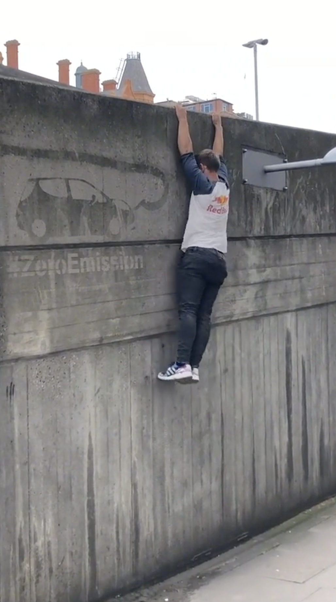

## The project

**Does casual attention to mild content push recommenders toward extreme content?**

- Testing the "manosphere pipeline" hypothesis on TikTok
- Data: ~407K timestamped video exposures from 142 participants (browser-tracing)
- Realistic download budget: **~10,000–20,000 videos** — a subset of participants, each with their full, contiguous viewing history
- Each video needs a **topic-severity label** (3-tier taxonomy, Fisher et al. 2026) to build exposure sequences for a transition model
- Ground truth: **2,414 videos already hand-coded** (Fisher et al.) — used to validate LLM labels
- **Current bottleneck is TikTok downloads, not classification** — GPU annotation is fast once videos are in hand

::: notes
Project with Micah Goldwater and Krista Fisher (Movember).
:::

## Why I need GPUs

::: columns
::: {.column width="52%"}
- Manual coding doesn't scale even to 10,000–20,000 videos — LLM annotation is what makes this feasible at all
- **Can't subsample within a participant's history**: the transition model needs each included participant's *entire, contiguous* viewing sequence
- So we select **fewer participants**, not fewer videos per participant
- Approach: **open-weight LLMs via Ollama**, zero/few-shot classification into the 3-tier taxonomy (cultural touchpoints → masculine status → degrading health)
:::

::: {.column width="48%"}
```{=html}
<figure style="margin:0;">
<svg viewBox="0 0 380 300" role="img" aria-label="Diagram: of three participants' viewing timelines, two are dropped entirely and one is kept whole, feeding its full contiguous sequence of videos into LLM annotation on Apollo, then into the transition model. No participant timeline is cut short." style="width:100%; height:auto; font-family: sans-serif;">
  <defs>
    <marker id="arrow" viewBox="0 0 10 10" refX="9" refY="5" markerWidth="6" markerHeight="6" orient="auto-start-reverse">
      <path d="M0,0 L10,5 L0,10 z" fill="currentColor" />
    </marker>
  </defs>

  <text x="4" y="16" font-size="12" fill="currentColor" font-weight="600">142 participants</text>

  <!-- Participant A: dropped -->
  <g opacity="0.35">
    <text x="4" y="42" font-size="11" fill="currentColor">A</text>
    <rect x="20" y="32" width="18" height="14" fill="currentColor" opacity="0.5"/>
    <rect x="40" y="32" width="18" height="14" fill="currentColor" opacity="0.5"/>
    <rect x="60" y="32" width="18" height="14" fill="currentColor" opacity="0.5"/>
    <rect x="80" y="32" width="18" height="14" fill="currentColor" opacity="0.5"/>
    <line x1="102" y1="39" x2="130" y2="39" stroke="currentColor" stroke-width="1.5" stroke-dasharray="2,3"/>
    <text x="134" y="43" font-size="10" fill="currentColor">dropped</text>
  </g>

  <!-- Participant B: kept, full sequence -->
  <g>
    <text x="4" y="72" font-size="11" fill="currentColor" font-weight="600">B</text>
    <rect x="20" y="62" width="18" height="14" fill="#e64626"/>
    <rect x="40" y="62" width="18" height="14" fill="#e64626"/>
    <rect x="60" y="62" width="18" height="14" fill="#e64626"/>
    <rect x="80" y="62" width="18" height="14" fill="#e64626"/>
    <rect x="100" y="62" width="18" height="14" fill="#e64626"/>
    <rect x="120" y="62" width="18" height="14" fill="#e64626"/>
    <text x="144" y="73" font-size="10" fill="#e64626" font-weight="600">full sequence kept</text>
  </g>

  <!-- Participant C: dropped -->
  <g opacity="0.35">
    <text x="4" y="102" font-size="11" fill="currentColor">C</text>
    <rect x="20" y="92" width="18" height="14" fill="currentColor" opacity="0.5"/>
    <rect x="40" y="92" width="18" height="14" fill="currentColor" opacity="0.5"/>
    <rect x="60" y="92" width="18" height="14" fill="currentColor" opacity="0.5"/>
    <line x1="62" y1="99" x2="130" y2="99" stroke="currentColor" stroke-width="1.5" stroke-dasharray="2,3"/>
    <text x="134" y="103" font-size="10" fill="currentColor">dropped</text>
  </g>

  <text x="4" y="126" font-size="10" fill="currentColor" opacity="0.6">⋮ (139 more participants)</text>

  <!-- arrow down from kept participant into pipeline -->
  <line x1="60" y1="150" x2="60" y2="180" stroke="#e64626" stroke-width="2" marker-end="url(#arrow)"/>

  <!-- pipeline boxes -->
  <rect x="10" y="184" width="100" height="34" fill="none" stroke="#e64626" stroke-width="1.5" rx="3"/>
  <text x="60" y="204" font-size="10.5" fill="currentColor" text-anchor="middle">LLM annotation</text>
  <text x="60" y="214" font-size="9" fill="currentColor" opacity="0.7" text-anchor="middle">(Apollo, Ollama)</text>

  <line x1="110" y1="201" x2="150" y2="201" stroke="currentColor" stroke-width="1.5" marker-end="url(#arrow)"/>
  <text x="130" y="195" font-size="8.5" fill="currentColor" text-anchor="middle">labels</text>

  <rect x="154" y="184" width="110" height="34" fill="none" stroke="currentColor" stroke-width="1.5" rx="3"/>
  <text x="209" y="204" font-size="10.5" fill="currentColor" text-anchor="middle">Transition</text>
  <text x="209" y="214" font-size="10.5" fill="currentColor" text-anchor="middle">model</text>

  <text x="10" y="248" font-size="9.5" fill="currentColor" opacity="0.75">Each square = one video exposure, in timestamp order.</text>
  <text x="10" y="262" font-size="9.5" fill="currentColor" opacity="0.75">Sequences are never cut mid-participant — only whole</text>
  <text x="10" y="276" font-size="9.5" fill="currentColor" opacity="0.75">participants are included or excluded.</text>
</svg>
<figcaption style="font-size:0.7em; opacity:0.7; margin-top:4px;">Selecting participants, not subsampling within a timeline</figcaption>
</figure>
```
:::
:::

## Early local test: Gemma 4

Ran 6 sample TikTok videos end-to-end (frame extraction → vision-language model → structured JSON) with `gemma4:e2b`, locally on an M1 Mac — fast enough, and annotation quality looks promising.

*Placeholder prompt for pipeline testing — not the final codebook.*

::: {style="font-size: 0.55em;"}
```json
{
  "description": "<1-2 sentence factual description of what happens>",
  "category": "<one of: dance, comedy, food, beauty, fashion, education,
                sports, music, pets, gaming, lifestyle, news_politics, other>",
  "on_screen_text": "<any visible captions/text overlays, or empty string>",
  "notable_objects": ["<short list of key objects/people/settings>"],
  "sentiment": "<one of: positive, neutral, negative>"
}
```
:::

## Sample output

::: columns
::: {.column width="42%"}
{fig-align="left"}
:::

::: {.column width="58%"}
::: {style="font-size: 0.55em;"}
```json
{
  "description": "A man performs various poses, including a
                   handstand on a concrete wall and a stretch
                   on the sidewalk, in an urban outdoor setting.",
  "category": "lifestyle",
  "on_screen_text": "",
  "notable_objects": ["man", "concrete wall", "sidewalk",
                       "street signs", "urban background"],
  "sentiment": "neutral"
}
```
:::
:::
:::

::: notes
6/6 outputs were coherent structured JSON with plausible category/sentiment/objects. This used a generic content-category codebook as a placeholder — the real run will use the 3-tier manosphere-severity taxonomy from Fisher et al. Allocation: 720 GPU hours on the Sydney Uni cluster; still working out how many videos that translates to, especially if we run 2-3 models per video for majority vote / intercoder reliability.
:::
