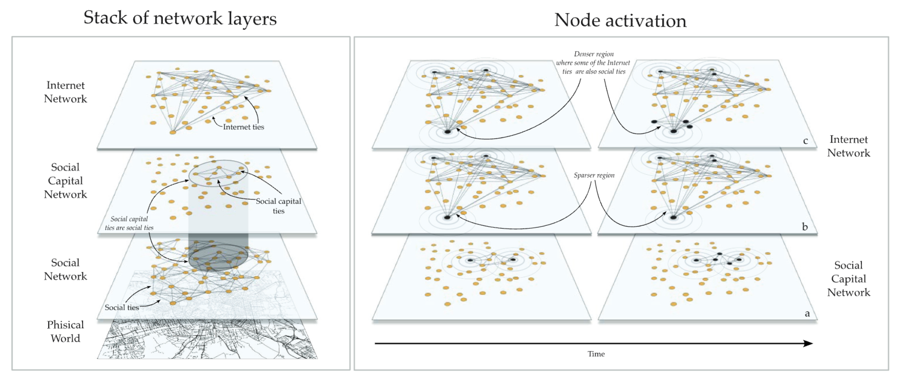
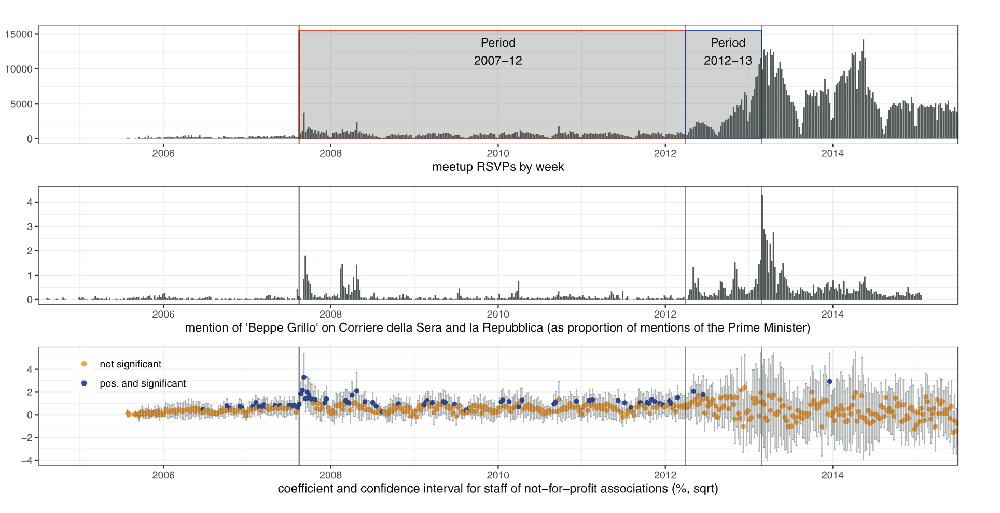

## Acknowledgement of Country

I would like to acknowledge the Traditional Owners of Australia and recognise their continuing connection to land, water and culture. The University of Sydney is located on the land of the Gadigal people of the Eora Nation. I pay my respects to their Elders, past and present.

# Introduction: Who Governs Digital Political Participation?

## Central Question {.small}

::: {.columns}
::: {.column width="50%"}
**Traditional View:**

- Citizens organise through civic associations
- Dense social networks enable mobilisation
- Geographic and resource constraints

**Digital Promise:**

- Lower barriers to participation
- Geographic independence
- Direct citizen engagement
:::

::: {.column width="50%"}
**But who really controls digital participation?**


```{r}
#| echo: false
#| fig-height: 4.5
#| fig-width: 6

library(ggplot2)

# Main hierarchy actors
hierarchy <- data.frame(
  layer = factor(c("Platform Owners", "Political Leadership", "Grassroots Actors"),
                 levels = c("Platform Owners", "Political Leadership", "Grassroots Actors")),
  y = c(3, 2, 1),
  x = c(-0.3, -0.3, -0.3),
  power_type = c("Infrastructure Control", "Organisational Control", "Limited Agency"),
  width = c(0.6, 0.7, 0.8)
)

# External actor - media
media <- data.frame(
  x = 0.6,
  y = 2,
  label = "Legacy Media",
  sublabel = "External Validation"
)

# Create the diagram
ggplot() +
  # Main hierarchy pyramid
  geom_rect(data = hierarchy,
            aes(xmin = x - width/2, xmax = x + width/2,
                ymin = y - 0.35, ymax = y + 0.35,
                fill = layer),
            color = "white", size = 1.5) +
  geom_text(data = hierarchy, aes(x = x, y = y, label = layer),
            size = 4.5, fontface = "bold", color = "white") +
  geom_text(data = hierarchy, aes(x = x, y = y - 0.15, label = power_type),
            size = 3, color = "white", alpha = 0.9) +

  # Legacy Media box (external)
  geom_rect(data = media,
            aes(xmin = x - 0.35, xmax = x + 0.35,
                ymin = y - 0.35, ymax = y + 0.35),
            fill = "#f6893d", color = "white", size = 1.5) +
  geom_text(data = media, aes(x = x, y = y + 0.05, label = label),
            size = 4.5, fontface = "bold", color = "white") +
  geom_text(data = media, aes(x = x, y = y - 0.15, label = sublabel),
            size = 3, color = "white", alpha = 0.9) +

  # Arrows from media box edge to each hierarchy layer (validation)
  geom_curve(aes(x = 0.25, xend = 0.05, y = 2.35, yend = 3),
             arrow = arrow(length = unit(0.2, "cm")),
             curvature = -0.3, color = "grey40", size = 0.8, alpha = 0.7) +
  geom_curve(aes(x = 0.25, xend = 0.05, y = 2, yend = 2),
             arrow = arrow(length = unit(0.2, "cm")),
             curvature = 0, color = "grey40", size = 0.8, alpha = 0.7) +
  geom_curve(aes(x = 0.25, xend = 0.05, y = 1.65, yend = 1),
             arrow = arrow(length = unit(0.2, "cm")),
             curvature = 0.3, color = "grey40", size = 0.8, alpha = 0.7) +

  # Label for hierarchy
  annotate("text", x = -0.3, y = 0.4, label = "Platform Ecosystem",
           size = 3.5, fontface = "italic", color = "grey40") +

  scale_fill_manual(values = c("Platform Owners" = "#e74a3b",
                                "Political Leadership" = "#4e73df",
                                "Grassroots Actors" = "#1cc88a")) +
  coord_cartesian(xlim = c(-0.9, 1.1), ylim = c(0.3, 3.6)) +
  theme_void() +
  theme(legend.position = "none",
        plot.background = element_rect(fill = "transparent", color = NA),
        panel.background = element_rect(fill = "transparent", color = NA))
```

:::
:::

## Three Layers of Power in Digital Activism [@marolla2025affording; see also @castellsCommunicationPower2009]

::: {.incremental}
**1. Platform Owners** (System Administration, Curation, Instrumentarian Power)
- Control access, rules, and content visibility
- Corporate sovereignty over digital spaces

**2. Political Leadership** (Centripetal Power)
- Use platforms to consolidate control
- Top-down communication and mobilisation

**3. Grassroots Actors** (Centrifugal Power)
- Horizontal coordination and deliberation
- Bottom-up participation
:::

## Platform Owners: Three Forms of Power

::: {.columns}
::: {.column width="50%"}
**Network-Making Power** [@zuboffAgeSurveillanceCapitalism2018]

- **Instrumentarian power**: Observe, interpret, and modify user behaviour
- Design interfaces and algorithms that shape how users interact
- Example: News feed algorithms decide what political content gets seen

**Networked Power** [@gillespieCustodiansInternetPlatforms2018]

- **Curation power**: Filter, amplify, or suppress content
- Control what becomes visible to millions
- Example: Trending topics, content recommendations
:::

::: {.column width="50%"}
**Networking & Network Powers** [@brattonStack2016]

- **System administration power**: Ultimate control over platform rules and access
- Determine who can use platform (de-platforming risk)
- Set standards for interaction (terms of service, API access)
- Example: Twitter/X banning political accounts, Facebook changing API rules

::: {.callout-important}
### Key Insight
Users surrender networking and network powers when using external platforms
:::
:::
:::

## Political Leadership: Centripetal vs Centrifugal Dynamics

::: {.columns}
::: {.column width="50%"}
**Centripetal Power** (Leadership)

- **Collective action** [@bennettLogicConnectiveAction2013]: Strategic top-down organisation
- Consolidate decision-making authority
- Broadcast messages to wide audiences
- Reinforce hierarchical structures

**Platforms that enable:**

- High **global** visibility
- High **global** associability
- One-to-many communication
- Example: Facebook, Instagram, X
:::

::: {.column width="50%"}
**Centrifugal Power** (Grassroots)

- **Connective action** [@bennettLogicConnectiveAction2013]: Decentralised horizontal coordination
- Diversify participation and influence
- Empower local actors
- Challenge hierarchies

**Platforms that enable:**

- High **local** visibility
- High **local** associability
- Many-to-many communication
- Example: Discord, Meetup
:::
:::

::: {.notes}
Key theoretical distinction: Collective action requires organisational resources and coordination; connective action leverages personalised content sharing through networks
:::

## Grassroots Actors: Limited but Real Agency

::: {.columns}
::: {.column width="60%"}
**Within Platform Constraints:**

- Can coordinate horizontally across geographic boundaries
- Build issue-based networks independent of social capital
- Challenge leadership through counter-narratives
- Organise collective action (protests, campaigns)

**Critical Limitations:**

::: {.incremental}
1. **Weak ties problem**: Internet networks lack reciprocal commitment of social capital
2. **Requires external validation**: Media attention needed to sustain mobilisation
3. **Platform dependency**: Vulnerable to algorithmic changes, de-platforming
4. **Fragmentation**: Multi-platform environment divides communities
:::
:::

::: {.column width="40%"}
::: {.callout-tip}
### Internet Capital
Stock of digital resources that enable collective action **independently** of existing social capital networks [@bailo2025breaking]

**Advantages:**

- Geographic independence
- Lower participation barriers

**Disadvantages:**

- Weaker ties than social capital
- Needs external push to activate
:::
:::
:::

## Case Study: Italy's Five Star Movement

::: {.columns}
::: {.column width="60%"}
- Founded 2009 by comedian Beppe Grillo
- "Digital-first" party - born from a blog
- Used multiple platforms: Blog, Facebook, Meetup, Forum
- Electoral breakthrough: 25% in 2013 general election
- Paradigmatic case of **extreme** digital party

**Why M5S?**

- All internal dynamics mediated through platforms
- No pre-existing organisational infrastructure
- Reveals both potential and constraints of digital mobilisation
:::

::: {.column width="40%"}
{width="40%"}


M5S's funder, Beppe Grillo.

:::
:::

## Platform Power and Governance

::: {.columns}
::: {.column width="50%"}
**Platform Owners Exercise Multiple Forms of Power** [@marolla2025affording; @castellsCommunicationPower2009]:

- **Instrumentarian power** [@zuboffAgeSurveillanceCapitalism2018]: Observe, interpret, modify user behaviour
- **Curation power** [@gillespieCustodiansInternetPlatforms2018]: Filter, amplify, or suppress content
- **System administration**: [@brattonStack2016] Control access and rules (de-platforming, terms of service)
:::

::: {.column width="50%"}
::: {.callout-important}
### Platform Sovereignty
Citizens and political organisations surrender control when using external platforms
:::

Corporate actors become **de facto governors** of political participation without democratic accountability
:::
:::

## Platform Affordances Shape Power Distribution

::: {.columns}
::: {.column width="50%"}
**Centripetal Platforms** (Top-down)

*Beppe Grillo's Blog, Facebook*

- High **global** visibility & associability
- Broadcast to wide audiences
- Amplify leadership messages
- One-to-many communication
:::

::: {.column width="50%"}
**Centrifugal Platforms** (Horizontal)

*Meetup, M5S Forum*

- High **local** visibility & associability
- Peer-to-peer interaction
- Community building
- Many-to-many communication
:::
:::

**Key Insight**: Different affordances create different power distributions between leadership and grassroots

## Multi-Platform Fragmentation

**Key Finding** [@marolla2025affording]: M5S used five platforms (Blog, Meetup, Forum, Facebook, E-voting) but users stayed siloed

::: {.columns}
::: {.column width="60%"}
- Majority active on **single platform only**
- Different platforms = different audiences
- Grassroots users (Meetup, Forum) more likely to cross over
- Leadership users (Blog, Facebook) stayed isolated

**Result**: Fragmented rather than unified movement

:::

::: {.column width="40%"}
**Implications:**

- Platform boundaries constrain integration
- Multi-platform strategy = broader reach but less coherence
- External dependencies limit autonomy
:::
:::

## Platform Governance Challenges

::: {.incremental}
**Corporate Actors as De Facto Governors:**

- Platforms mediate between citizens and political organisations
- Not accountable through democratic processes
- Ultimate control over access, rules, and content visibility

**Strategic Dilemmas:**

1. Which platforms to prioritise?
2. How to bridge platform boundaries?
3. When to build alternative infrastructure?

**Vulnerabilities**: De-platforming risk, algorithm changes, platform shutdowns
:::

# If platform ownwers govern through infrastructure control, what about the news media?

## Social Capital vs Internet Capital

::: {.columns}
::: {.column width="50%"}
**Social Capital** [@putnamMakingDemocracyWork1993]:

- Resources from dense local networks
- Strong reciprocal ties
- Civic associations as mobilisation infrastructure

**Strengths**: Sustained collective action, local validation

**Constraints**: Geographic limits, resource intensive, excludes outsiders
:::

::: {.column width="50%"}
**Internet Capital** [@bailo2025breaking]:

- Stock of digital resources enabling collective action
- Weak but geographically independent ties
- Visibility and searchability affordances

**Advantages**: Lower barriers, wider reach

**Disadvantages**: Weaker ties, **requires external validation**

:::
:::

---



*Activation through social and Internet capital [@bailo2025breaking]*

### But how does this happen in practice?


## Wave 1 (2007-2012): Social Capital Dependency

**Research Finding** [@bailo2025breaking]:

Meetup activity **strongly predicted** by:

- Density of not-for-profit associations
- Electoral turnout
- Education levels

**Geography**: Concentrated in high social capital Northern Italy

**Interpretation**: Early M5S relied on existing legacy mobilisation networks

## The Turning Point: Media Validation (2012)

**What Changed:**

- M5S local electoral successes (May 2012)
- Massive legacy media attention surge
- Strengthened collective efficacy perceptions
- Internet capital alone was insufficient -> **external validation activated mobilisation**




## Wave 2 (2012-2013): Geographic Expansion

**Transformed Geography** [@bailo2025breaking]:

- Meetup activity spread to **low social capital areas**
- Social capital no longer significant predictor
- New predictor: economically marginal areas

**Interpretation:**
Internet capital + media validation enabled breakthrough beyond legacy networks


## Electoral Impact: Only Wave 2 Mattered

**Critical Finding** [@bailo2025breaking]: Only **second-wave** (2012-13) Meetup activity predicted M5S vote

**Spatial Evidence:**

- Wave 2 meetups positively associated with vote share
- Wave 1 meetups not significant
- Controls: education, unemployment, age

**Individual Evidence:**

- Among disconnected voters, M5S supporters discussed politics significantly more


::: {.callout-important}
Internet mobilisation successfully activated disengaged voters - **but only after media validation**
:::

## Participation Inequality: Shifts But Persists

::: {.columns}
::: {.column width="50%"}
**Traditional Inequality:**

- Social capital concentrated in certain areas/demographics
- Education, time, money as barriers [@verbaVoiceEqualityCivic1995]
- Geographic exclusion from mobilisation networks

**Digital Transformation:**

- Internet can reach disengaged populations
- Lower barriers to initial participation
- Geographic independence
:::

::: {.column width="50%"}
**But New Dependencies:**

- Requires extreme discontent to overcome weak ties
- Needs media amplification for validation
- New concentration in corporate technological control
- Digital divide still matters (Internet access)

**Net Effect**: Different geography, different demographics, but still unequal
:::
:::

## Democratic Turbulence and Governance Challenges

::: {.incremental}
**Democratic Turbulence** [@margettsPoliticalTurbulenceHow2015]:

- Rapid, unpredictable mobilisation
- Outrage-driven politics (needed to activate weak ties)
- Fragmentation across platforms
- Challenge: Does lowering barriers improve democratic quality?

**Governance Question**: Who controls the infrastructure of participation when it's mediated by private corporations?

**Strategic Approaches**: Civil society must now account for platform dependencies
:::

## The Concentration Problem: Platforms → AI

**Historical Pattern:**

1. **Mass parties** (pre-1960s): Democratic control, resource-intensive
2. **Platform parties** (2000s-2020s): Corporate control, lower cost
3. **AI-mediated politics?** (2020s+): Hyper-concentrated, opaque, generative

**Each transition** = more concentrated technological control but with strong centrifugal options

**Why AI is Different:**

- Even more ownership concentration (massive compute requirements)
- Greater opacity (black-box, emergent behaviours)
- Generative capacity (can create content, simulate grassroots)


## Critical Questions for the AI Era

**Governance:**

- Who owns AI systems mediating political communication?
- What accountability mechanisms exist?
- Can regulation ensure democratic oversight?

**Strategy:**

- Can civil society build alternative infrastructures?
- How to maintain authentic participation?


## Lessons from M5S for the AI Era

::: {.incremental}
**What M5S Teaches Us:**

1. **Technology alone is insufficient** - M5S needed media validation
   - Will AI mobilisation also require legacy media?
   - Or can AI generate its own validation?

2. **Concentrated control matters** - Platforms shaped M5S possibilities
   - AI concentration is even more extreme
   - Fewer actors, less transparency, more power

3. **Weak ties need activation** - Internet capital required extreme messaging
   - AI could amplify outrage even more
   - Or could it facilitate more constructive engagement?
:::

::: {.callout-important}
**Central Concern**: As information/communication technology becomes more concentrated, civil society becomes more dependent and vulnerable
:::

## Key Takeaways

::: {.incremental}
1. **Platform governance reshapes democracy** - Corporate actors govern participation spaces without democratic accountability

2. **Power is multi-layered** - Platform owners control infrastructure; leaders use centripetal affordances; grassroots exploit centrifugal affordances

3. **Internet capital is real but limited** - Can bypass geography but requires media validation and extreme discontent

4. **Fragmentation is structural** - Multi-platform environments create divided communities

5. **Concentration is intensifying** - Mass parties → platforms → AI = increasing technological control

6. **Strategic question for civil society**: How to maintain autonomy in an era of hyper-concentrated communication infrastructure?
:::

## References

::: {#refs}
:::
